# Elementi di didattica della chimica — sbobine (Elena Di Leo)

> Conversione in Markdown di «Sbobine 2.pdf» (121 pagine) con pdf2md (pymupdf4llm). I commenti `<!-- p. N -->` danno la pagina del PDF; i blocchi «Immagine:» descrivono schemi e figure.

<!-- p. 1 -->

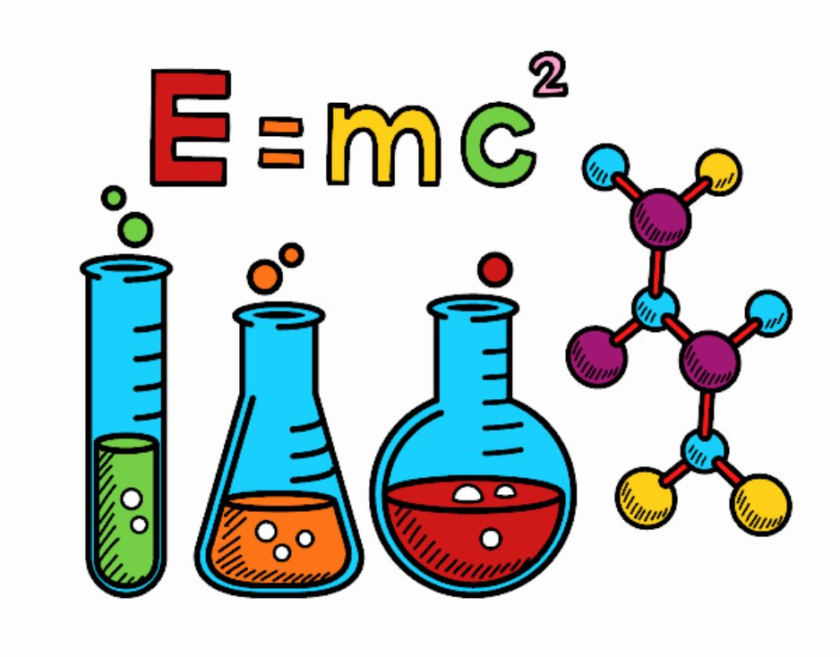

<!-- p. 2 -->

<!-- p. 3 -->

### TEST D’INGRESSO

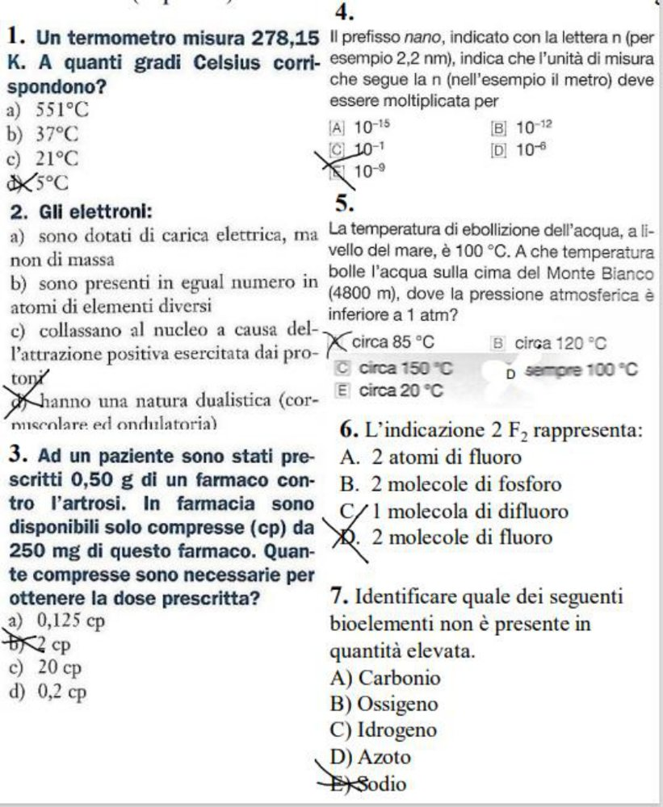

> **Immagine:** Sette quesiti a risposta multipla, con le risposte segnate con una croce. 1. Un termometro misura 278,15 K. A quanti gradi Celsius corrispondono? a) 551°C b) 37°C c) 21°C d) 5°C (croce su d). · 2. Gli elettroni: a) sono dotati di carica elettrica, ma non di massa; b) sono presenti in egual numero in atomi di elementi diversi; c) collassano al nucleo a causa dell'attrazione positiva esercitata dai protoni; d) hanno una natura dualistica (corpuscolare ed ondulatoria) (croce su d). · 3. Ad un paziente sono stati prescritti 0,50 g di un farmaco contro l'artrosi. In farmacia sono disponibili solo compresse (cp) da 250 mg. Quante compresse sono necessarie? a) 0,125 cp b) 2 cp c) 20 cp d) 0,2 cp (croce su b). · 4. Il prefisso nano, indicato con la lettera n (per esempio 2,2 nm), indica che l'unità di misura che segue la n deve essere moltiplicata per: A 10⁻¹⁵, B 10⁻¹², C 10⁻¹, D 10⁻⁶, E 10⁻⁹ (croce su E). · 5. La temperatura di ebollizione dell'acqua, a livello del mare, è 100 °C. A che temperatura bolle l'acqua sulla cima del Monte Bianco (4800 m), dove la pressione atmosferica è inferiore a 1 atm? A circa 85 °C, B circa 120 °C, C circa 150 °C, D sempre 100 °C, E circa 20 °C (croce su A). · 6. L'indicazione 2 F₂ rappresenta: A. 2 atomi di fluoro B. 2 molecole di fosforo C. 1 molecola di difluoro D. 2 molecole di fluoro (croce su D). · 7. Identificare quale dei seguenti bioelementi non è presente in quantità elevata: A) Carbonio B) Ossigeno C) Idrogeno D) Azoto E) Sodio (croce su E).

#### Domanda 1: scale

0 ° = 273 K

Le due scale sono coerenti, ma tra di loro sono sfasate.

#### Domanda 2: elettroni

Per molti fenomeni consideriamo gli elettroni nella natura **corpuscolare**, per altri prevale la natura **ondulatoria**.

Ogni elemento ha capacità peculiari di formare molecole partendo da elettroni che sono coinvolti in trasformazioni chimiche.

Cariche di segno opposto si attraggono protoni – elettroni.

<!-- p. 4 -->

#### Domanda 4: multipli e sottomultipli

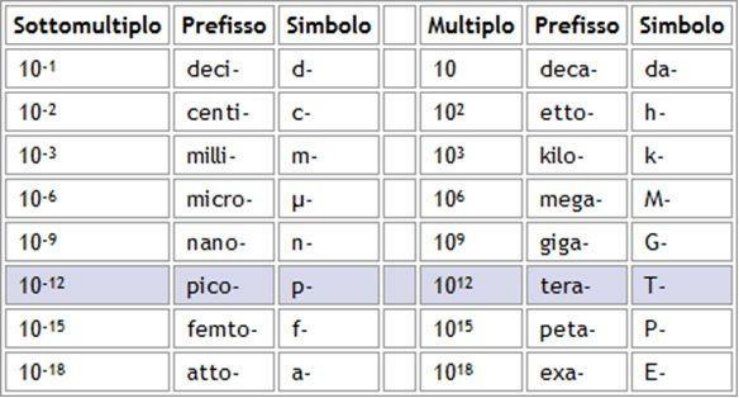

> **Immagine:** Tabella con due blocchi: Sottomultiplo/Prefisso/Simbolo e Multiplo/Prefisso/Simbolo. Sottomultipli: 10⁻¹ deci- d-; 10⁻² centi- c-; 10⁻³ milli- m-; 10⁻⁶ micro- µ-; 10⁻⁹ nano- n-; 10⁻¹² pico- p- (riga evidenziata); 10⁻¹⁵ femto- f-; 10⁻¹⁸ atto- a-. · Multipli: 10 deca- da-; 10² etto- h-; 10³ kilo- k-; 10⁶ mega- M-; 10⁹ giga- G-; 10¹² tera- T-; 10¹⁵ peta- P-; 10¹⁸ exa- E-. Corrisponde alla domanda 4 del test (multipli e sottomultipli).

#### Domanda 5: passaggi di stato e ciclo dell’acqua

A livello del mare l’acqua bolle a 100° A 4800m, con pressione < 1 atm, l’acqua bolle a circa 85°, quindi bolle prima. Con la fiamma aumenta l’energia cinetica delle molecole d’acqua e aumenta la temperatura. Nel passaggio di stato le particelle che evaporano ne incontrano delle altre all’esterno della pentola. (precisiamo che ciò che esce dalla pentola e noi riusciamo a vedere ad occhio nudo non è fumo, ma nebbia, ovvero piccole goccioline che ancora sono visibili).

A livello del mare molte delle particelle che cercano di evaporare, incontrando altre esterne vengono rigettate nella pentola, mentre in montagna dove l’aria e più rarefatta, quindi ci sono meno particelle, le molecole d’acqua non incontrando ostacoli possono passare allo stato aeriforme.

Questo avviene perché la materia è attratta verso il centro della terra, quindi allontanandosi, ovvero alzandosi di quota verso la montagna, le particelle sono meno attratte. Più grande è la distanza di un corpo dal centro della terra, minore è l’attrazione esercitata su di esso, per questo in montagna l’aria è rarefatta. La temperatura di bollizione è più bassa perché le molecole riescono a sganciarsi prima e passare allo stato gassoso. Naturalmente non può bollire a 20° perché la stessa vita è di un optimum di 36°, noi stessi non potremmo esistere se l’acqua bollisse a 20° perché anche noi bolliremmo.

#### Domanda 6: linguaggio tecnico

F= fluoro

In natura il fluoro esiste come molecola fatta da due atomi legati ovvero F2 **biatomica**. 2 F2 vuol dire che si considerano 22 molecole di fluoro.

#### Domanda 7: bioelementi

I bioelementi sono quegli elementi importanti per la vita.

Il carbonio (C) è presente in gran misura e si lega spesso con idrogeno (H) e ossigeno (O). L’elemento meno abbondante è il sodio (S)

<!-- p. 5 -->

### SERENDIPITÀ

Un elemento che Scoprire qualcosa di contraddistingue la prezioso mentre si cerca chimica è la altro. serendipità, ovvero:

Scoprire ciò che si stava cercando, ma in circostanze del tutto inopinate (cosa non prevista)

Il concetto di serendipità deriva da una storia: “Peregrinaggio di tre giovani figliuoli del re di serendippo”

si tratta di tre principi che grazie alla loro capacità di osservazione fanno tante scoperte.

Cristoforo Armeno (metà XVI secolo), scrittore e traduttore italiano di origini mediorientali, è stato il primo a tradurre nel 1548 la fiaba _Viaggi e avventure dei tre principi di Serendippo_. Il racconto è stato, poi, introdotto da Renzo Bragantini nella raccolta _Il riso sotto il velame (1987)._

_“C’era anticamente ad Oriente, nel paese di Serendippo (l’attuale Sri Lanka), un grande e potente re, chiamato Giafar, il quale aveva tre figli maschi, coltissimi perché educati dai più grandi saggi del tempo, ma privi di un’esperienza altrettanto importante di vita vissuta._

_Per provare, oltre alla loro saggezza, anche le loro attitudini pratiche, decise di allontanarli dal regno e, perché diventassero ancora più perfetti, stabilì che andassero a vedere il mondo per conoscere per esperienza diretta i diversi costumi e i modi di fare di molte nazioni che già conoscevano per averli studiati sui libri o appresi dai precettori. Durante il loro viaggio i tre fecero diverse scoperte, grazie al caso e alla loro sagacia, di cose che non stavano cercando._

_Da poco giunti nel Paese del potente imperatore Bahrām, i principi si imbatterono in un cammelliere, disperato perché aveva perduto il proprio animale. I tre pur non avendolo visto, dissero al poveretto di averlo incontrato un bel po’ avanti, lungo la strada. Per assicurare il cammelliere gli fornirono, come prova, tre elementi: il cammello perduto era cieco da un occhio, gli mancava un dente in bocca ed era zoppo. Il buon uomo, ripercorse a ritroso la strada ma non riuscì a ritrovare l’animale._

_Il giorno seguente, ritornato sui suoi passi, incontrò di nuovo i tre giovani e li accusò di averlo ingannato. Per dimostrare di non aver mentito i tre principi aggiunsero altri tre elementi. Gli dissero che il cammello aveva una soma, carica da un lato di miele e dall’altro di burro, portava una donna, e questa era incinta._

<!-- p. 6 -->

_Di fronte a questi particolari, il cammelliere diede per certo che i tre avessero incontrato il suo animale ma, vista la ricerca infruttuosa, li accusò di avergli rubato il cammello. I nobili singalesi, imprigionati nelle segrete dell’imperatore Bahrām, affermarono di aver inventato tutto per burlarsi del cammelliere ma le apparenze li inchiodavano e così vennero condannati a morte perché ladri._

_Fortunatamente un altro cammelliere, trovato il cammello e avendolo riconosciuto, lo ricondusse al legittimo proprietario. Dimostrata in tal modo la propria innocenza, i tre vennero liberati non senza una adeguata spiegazione di come avessero fatto a descrivere l’animale, senza averlo mai visto._

_I tre rivelarono che ciascun particolare del cammello era stato immaginato, grazie alla capacità di osservazione e alla sagacia. Che fosse cieco da un occhio era dimostrato dal fatto che, pur essendo l’erba migliore da un lato della strada, era stata brucata quella del lato opposto, quello che poteva essere visto dall’unico occhio buono dell’animale. Che fosse privo di un dente lo dimostrava l’erba mal tagliata che si poteva osservare lungo la via. Che fosse zoppo, poi, lo svelavano senza ombra di dubbio le impronte lasciate dall’animale sulla sabbia. Sulla spiegazione del carico i tre dissero di aver dedotto che il cammello portasse da un lato miele e dall’altro burro perché lungo la strada da una parte si accalcavano le formiche (amanti del grasso) e dall’altro le mosche (amanti del miele); aveva sul dorso una donna perché in una sosta il passeggero si era fermato ai lati della strada a urinare, e questa urina era stata odorata da uno dei principi per curiosità, venendo egli preso da un desiderio carnale che può venire solo da urine di una donna, aveva dedotto che il passeggero doveva essere di sesso femminile. Infine, la donna doveva essere gravida, perché poco innanzi alle orme dei piedi c’erano quelle delle mani, usate dalla donna per rialzarsi a fatica visto che doveva avere un corpo pesante. Le spiegazioni dei tre principi stupirono a tal punto Bahrām che decise di fare dei tre giovani sconosciuti i propri consiglieri. I tre principi in incognito offrirono così i loro servigi all’imperatore, salvandogli anche la vita, risolvendo situazioni difficili o prevedendo il futuro. “_

<!-- p. 7 -->

Nella storia un caso di serendipità riguarda la scoperta di Archimede, della cosiddetta **spinta di Archimede.**

Gerone, tiranno di Siracusa, si era fatto costruire da un orafo una corona tutta d'oro. Non sicuro però dell'onestà dell'orafo, chiese ad Archimede di scoprire se la corona fosse veramente di oro massiccio o non fosse piuttosto in parte d'argento. Archimede per volere del re doveva verificare se la corona che gli avevano fabbricato fosse completamente d’oro o solo ricoperta d’oro. La risoluzione a questo problema non fu semplice perché ad Archimede mancava la massa. Così egli decise di andare a fare un bagno per rilassarsi ed entrando nella vasca notò che la massa d’acqua spostata era pari al suo volume.

Prese allora la corona e un sacchetto d’oro della stessa massa della corona e li infilò in due bacinelle d’acqua differenti. Il volume spostato dal sacchetto era minore rispetto a quello spostato dalla corona perché l’oro ha una **densità** minore rispetto a quell’altro materiale. Così per caso scoprì il concetto di densità e la spinta di Archimede.

<u>La</u> **<u>densità</u>** <u>è direttamente proporzionale alla massa e inversamente proporzionale al volume. La sostanza meno densità è quella che a parità di massa richiede un volume maggiore.</u>

### IL BAMBINO: UNO SCIENZIATO NATO

   - "Una vita senza ricerca non merita di essere vissuta." – Platone, Apologia di Socrate

   - “L’uomo, per sua natura, anela a sapere. " – L’imitazione di Cristo

   - “Possiamo, per così dire, fare un esperimento con la fede. Vivere semplicemente come se le parole della Bibbia fossero vere. " – Anselm Grun

- “Ora voglio andare da quella parte a vedere questa grande visione e come mai il pruno non si consuma!” – Mosè

   - “Io non cerco, io trovo” - Pablo Picasso, 1881 – 1973

- “Quando un bambino sa accostarsi all’apprendimento come se avesse il compito di scoprire qualcosa piuttosto che recepirla, allora sarà propenso a lavorare con autonomia, stimolato dalla sola auto-remunerazione o, più propriamente, da quella ricompensa che risiede nella scoperta stessa.” - Jerome Bruner, pedagogista. Il Conoscere. Saggi per la Mano Sinistra

Ciò che contraddistingue il bambino è:

- curiosità

- umiltà

- gusto per la sfida

- ricerca di un senso

- felicità nell’abduzione → **abduzione**: quando formulo una soluzione non completamente corretta, ma che sia avvicina molto ad essa.

<!-- p. 8 -->

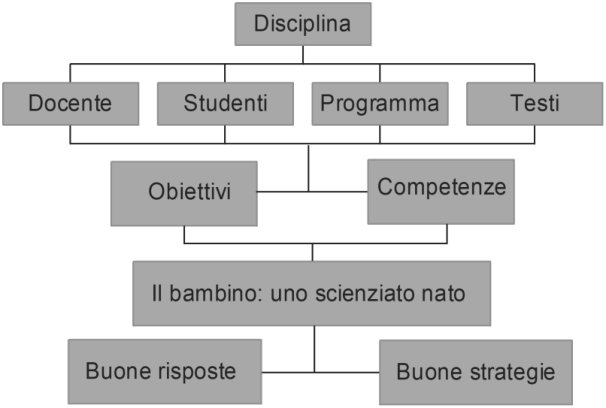

> **Immagine:** Diagramma gerarchico. Disciplina → Docente, Studenti, Programma, Testi (quattro elementi collegati) → Obiettivi e Competenze → Il bambino: uno scienziato nato → Buone risposte e Buone strategie.

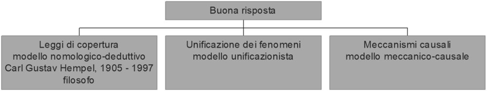

> **Immagine:** Diagramma: Buona risposta → tre rami. 1) Leggi di copertura, modello nomologico-deduttivo, Carl Gustav Hempel, 1905 - 1997, filosofo. · 2) Unificazione dei fenomeni, modello unificazionista. · 3) Meccanismi causali, modello meccanico-causale.

É importante non spegnere la curiosità del bambino riguardo nuove scoperte. Perciò è importante dare loro **risposte buone** alle domande che ci pongono.

Per fare ciò si può ricorrere a **tre tattiche**: chiamate **leggi di copertura.**

#### LEGGI DI COPERTURA

Modello nomologico – deduttivo

Carl Gustav Hempel, 1905 – 1997, filosofo

- È un modello **nomologico**, perché alla base di esso ci sono delle norme)

- È un modello **deduttivo**, ovvero si parte da una premessa più generica per arrivare a una determinata conclusione.

Dei fenomeni possono essere osservati e generano domande a cui devono seguire delle risposte generali. Ad esempio, in chimica. C’è la legge della termodinamica che si poggia su tre principi:

- **Prima legge della termodinamica**: L’energia può essere convertita da una forma in un’altra ma non può essere né creata né distrutta

- **Terza legge della termodinamica**: Allo zero assolto l’entropia vale zero,

- **Seconda legge della termodinamica**: Il calore non può spontaneamente fluire da un corpo freddo ad uno caldo, ma questo è possibile attraverso **l’entropia,** ovvero il rapporto tra il calore trasferito e la temperatura, questa crea nei corpi un disordine a livello di particelle, quindi, tutto ciò che succede in un sistema (porzione del diverso che accade) è spontaneo ed è accompagnato dal disordine a livello particellare.

Queste buone risposte sono dette **hempeliane**.

<!-- p. 9 -->

#### MODELLO UNIFICAZIONISTA

È un modello che parte dal **particolare** e cerca di spiegare come tanti eventi possono essere interpretati tramite **un’unica spiegazione**.

C’è un principio che unifica le osservazioni che noi possiamo fare. Si tratta del modello unificazionista **induttivo**.

Es. se prendiamo a martellate un materiale, esso si riscalda. C’è una serie di fenomeni che collega il moto (agitazione delle particelle che compongono un corpo, movimento degli elettroni) alla temperatura.

Sfruttiamo l’osservazione senza impartire enunciati da spiegare. Lo si può verificare nel passaggio di stato: fornisco energia alle particelle d’acqua e verifico l’ebollizione.

Allo stato liquido le particelle interagiscono in una certa misura con particelle simili. Liquidi hanno volume proprio. Gas non hanno né volume né forma, mentre i solidi hanno volume e forma propria.

#### MODELLO MECCANICO-CAUSALE

È un approccio che si **muove in orizzontale** collegando una **causa all’effetto**. Anche questo collegamento più avvalersi di un aggancio alla legge. Es. il papà si è dimenticato la birra nel freezer e si rompe. Bisogna cercare una causa collegata all’osservazione.

Bisogna rendere non dogmatico un evento. Di sicuro se la bottiglia si è rotta, il liquido all’interno ha forzato le pareti con pressione frantumandole. Il passaggio di stato si è accompagnato ad un aumento del volume, ma il contenitore riusciva a contenere il liquido, non il solido, quindi la capacità era diversa.

Un'altra domanda che può nascere è “ _perché il liquido diventando solido aumenta di volume_?” Tutta la materia è fatta da particelle invisibili e le molecole (vuol dire piccola mole) dell’acqua, allo stato liquido sono mobili e occupano un volume minore, ma se le si costringono a stare ferme (stato solido), si creano zone vuote, per cui il volume è maggiore. È come le molecole hanno stato solido fossero costrette a stare un po' distanziate e occupano volumi maggiori. “Perché il cubetto immerso nella coca cola galleggia?” Il solido ha una densità minore, per cui galleggia, allo stesso modo una paperella è meno densa dell’acqua e nella vasca galleggia. Le particelle liquide che sono nella parte immersa di un iceberg si raffreddano interagendo formando aggregati più densi rispetto all’acqua libera circostante. L’acqua solida è più densa e scende verso il basso. Altre particelle più calde vanno verso il basso e si crea un rimescolamento continuo dell’acqua libera

Può anche accadere che un vasetto di conserva scoppi (senza essere nel freezer), questo accade perché quando vado a tappare il boccaccio, all’interno entrano i gas circostanti presenti nell’aria, ma con il tempo si deve essere generato all’interno altro gas che ha provocato lo scoppio del boccaccio. Con la sterilizzazione c’è stato un processo fermentativo che ha prodotto anche CO2 (se è parecchia) che ha provocato lo scoppio.

Es. mongolfiera: le particelle si muovono in tutte le direzioni urtando contro le pareti, salvo la parte inferiore. La risultante degli urti (sommatoria) spinge nella direzione opposta alla via dalla quale le particelle possono uscire.

<!-- p. 10 -->

Questo per giungere a capire che tutta la materia è fatta da particelle.

Le ‘buone risposte’ di tipo hempeliano si basano sul: le leggi di copertura. VERO modello unificazionista. FALSO modello meccanico-causale.  FALSO le relazioni nomologiche. VERO le formule mnemoniche. FALSO

<!-- p. 11 -->

## STRATEGIA

Oltre ad offrire buone risposte, durante l’organizzazione delle lezioni bisogna ricorrere anche ad altre tattiche: strategie

**Strategia**: fissare degli obiettivi.

Nel nostro caso l’obiettivo generale è quello di ottenere un **apprendimento significativo**, che consenta di apprendere in modo definitivo, inserire non in modo arbitrario, ma inclusivo i concetti. I nuovi apprendimenti si ancorano a ciò che abbiamo appreso in precedenza.

“ _If you want to learn something, read a book. If you want to understand something, figure it out by yourself_ (crea analogie, collegamenti, cerca di immaginartelo in base a ciò che sai già).” - Richard Phillips Feynman, 1918 – 1988, fisico.

Il problema è che spesso l’esperto, nel nostro caso il maestro, non sa spiegare. Per cui egli deve cercare di entrare nella mente del bambino e capire a quale stadio della comprensione è arrivato. È tipico dei novizi cercare immediatamente un algoritmo per risolvere il problema. L’esperto, invece, ragiona per **blocchi di memoria operativa**, questo metodo è più efficiente e impegna meno il cervello. Quindi l’adulto affronta il problema a pezzi, piuttosto che impegnarsi su pezzettini.

Ci sono stato autori che hanno cercato di evidenziare un modello valido per tutti, hanno identificato gli stadi che un novizio deve affrontare per la comprensione di un problema, sfruttando **strategie euristiche**.

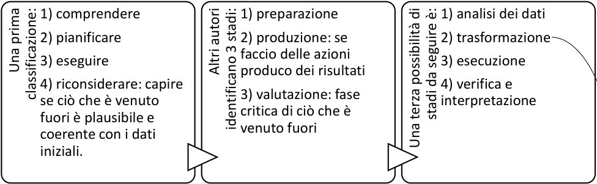

> **Immagine:** Tre riquadri affiancati. 1) Una prima classificazione: 1) comprendere 2) pianificare 3) eseguire 4) riconsiderare: capire se ciò che è venuto fuori è plausibile e coerente con i dati iniziali. · 2) Altri autori identificano 3 stadi: 1) preparazione 2) produzione: se faccio delle azioni produco dei risultati 3) valutazione: fase critica di ciò che è venuto fuori. · 3) Una terza possibilità di stadi da seguire è: 1) analisi dei dati 2) trasformazione 3) esecuzione 4) verifica e interpretazione. Una freccia parte da «trasformazione».

La **fase più significativa**, perché delle volte il problema sembra inedito rispetto a ciò che è già conosciuto, ma se per analogia o con aiuti grafici si trasformano i dati, il problema rassomiglia con situazioni già note.

Pensiamo al disegno di una particella o di altri elementi, se il bambino ha condotto uno studio mnemonico, se vede la particella disegnata diversamente non la capirà, mentre se ne ha analizzato approfonditamente le caratteristiche noterà le analogie e riuscirà a comprendere il problema.

<!-- p. 12 -->

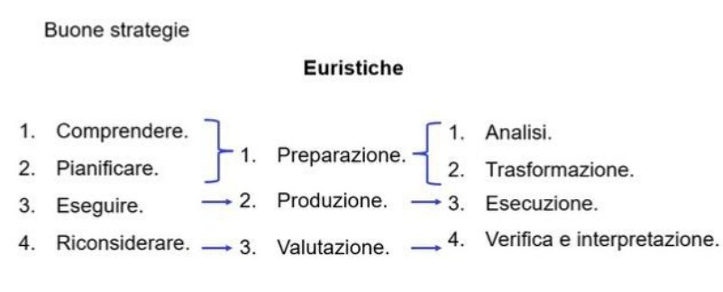

> **Immagine:** Buone strategie · Euristiche. Tre colonne: 1. Comprendere, 2. Pianificare, 3. Eseguire, 4. Riconsiderare. Centro: 1. Preparazione (graffa che raccoglie Comprendere e Pianificare), 2. Produzione (← Eseguire), 3. Valutazione (← Riconsiderare). Destra: 1. Analisi e 2. Trasformazione (graffa, corrispondenti a Preparazione), 3. Esecuzione (← Produzione), 4. Verifica e interpretazione (← Valutazione).

La migliore strategia sembra essere quella di **ALBERTO BARGELLINI** basata su:

1. **Esplorazione**: c’è una domanda a cui si deve dare una risposta. Si osserva e si formulano le prime ipotesi.

2. “ **Invenzione** ”: bisogna incanalare l’episodio educativo, attraverso un intervento del maestro che indirizza verso la giusta strada. È una fase tipica della chimica

3. “ **Scoperta** ”: il bambino scopre che c’è un collegamento tra le sue esperienze e quelle fatte in classe.

Grazie a questo principio si trovano relazioni fra idee.

Nel momento in cui si rispettano queste tre fasi si ottiene un apprendimento significativo:

**L’apprendimento significativo** è quello che realizza un Integrazione non arbitraria o non mnemonica. Crea collegamento a concetti più inclusivi, collegamento alle esperienze, coinvolgimento affettivo. Se nell’apprendimento trovo soddisfazione, sarò portato ad apprendere ulteriormente, perché mi servono e mi trasformano. La **dimensione orizzontale** è proporzionale al numero di individui nello studio a livello dell’apprendimento scolastico o che sono capaci di un apprendimento creativo. In **verticale** ci sono varie tipologie di apprendimento, all’estremo opposto

superiore troviamo ciò che vorremmo ottenere, un apprendimento significativo. Le due curve rappresentano i due sessi. I maschi si discostano dal nomale, cercano soluzioni alternative. Le femmine sono più sistematiche e metodiche, ricercano l’algoritmo.

<!-- p. 13 -->

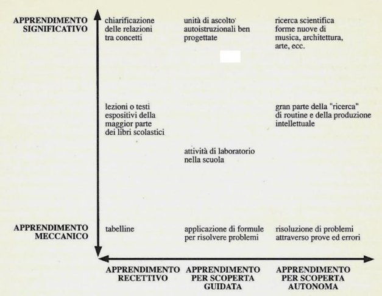

> **Immagine:** Grafico con asse y da APPRENDIMENTO MECCANICO (basso) a APPRENDIMENTO SIGNIFICATIVO (alto); asse x con tre colonne: APPRENDIMENTO RECETTIVO, APPRENDIMENTO PER SCOPERTA GUIDATA, APPRENDIMENTO PER SCOPERTA AUTONOMA. · Colonna recettivo: in alto chiarificazione delle relazioni tra concetti; a metà lezioni o testi espositivi della maggior parte dei libri scolastici; in basso tabelline. · Colonna scoperta guidata: in alto unità di ascolto autoistruzionali ben progettate; a metà attività di laboratorio nella scuola; in basso applicazione di formule per risolvere problemi. · Colonna scoperta autonoma: in alto ricerca scientifica, forme nuove di musica, architettura, arte, ecc.; a metà gran parte della "ricerca" di routine e della produzione intellettuale; in basso risoluzione di problemi attraverso prove ed errori.

**Sull’asse y:** è l’esito, ciò che si ottiene che va da un apprendimento meccanico a uno significativo

**Sull’asse x**: modelli, le tattiche di apprendimento

Un apprendimento recettivo è quello delle **tabelline**, perché vengono consegnate e imperate a memoria, per cui il risultato è un apprendimento meccanico. Un apprendimento recettivo si serve del **libro**, ma esso necessita

una interpretazione, per cui il risultato è un apprendimento più significativo, perché nell’interpretazione rientra ciò che uno sa già.

Un’altra strategia è la **TASSONOMIA DI BLOOM**

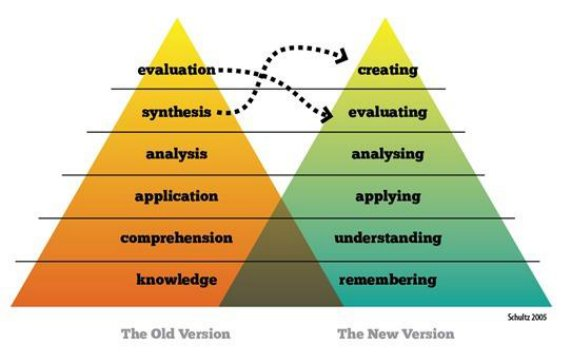

> **Immagine:** Due piramidi a sei livelli (Schultz 2005), dal basso verso l'alto. Vecchia versione (The Old Version): knowledge, comprehension, application, analysis, synthesis, evaluation. Nuova versione (The New Version): remembering, understanding, applying, analysing, evaluating, creating. Frecce tratteggiate: evaluation (vecchia) → creating (nuova); synthesis (vecchia) → evaluating (nuova). Le due piramidi si sovrappongono nei livelli bassi.

Descrive come si sviluppi l’apprendimento a partire dal semplice verso performance più complesse, ogni livello costituisce il gradino di una ascesa verso forme di apprendimento sempre più sofisticate e si deve procedere un gradino per volta e dal basso verso l’alto

Il livello 1: è scomparsa la sintesi e allo stesso livello troviamo la critica (evaluating), sfruttando la creatività.

Ad esempio, studio il rame e noto che ci sono le monetine rosso che sono di rame il livello 2 è: cerco di capire il perché. Ad esempio, perché il rame è rosso? Il livello 3: capacità di analisi.

Livello 4: è la scoperta, applico ciò che già sapevo

I primi tre livelli sono il _low order_, i livelli più accessibili.

<!-- p. 14 -->

Una tattica per far si che **l’apprendimento sia significativo** bisogna partire dallo **spazio dei problemi**, che è qualcosa di diverso dall’esercizio.

Le **questioni** possono essere:

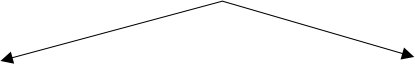

**Problemi**: una questione che richiede una spiegazione. Richiedono un impegno maggiore. La spiegazione avviene quando la persona scopre che i concetti che già possedeva sono utili a rispondere ad un fatto nuovo, ovvero il problema. Richiedono un minimo di **ragionamento per analogia** e la **capacità di prendere decisioni (** **_decision making_ )**. _High order logical skill._

**Esercizi**: spesso si risolvono in una routine, poco appassionante. Va inoltre detto che in base alla formazione di ciascuno sia più utile l’una o l’altra modalità, perché siamo tutti diversi e dipende dalle circostanze. Non bisogna sempre cercare di spiegare qualcosa, delle volte l’esercizio è utile quando già possediamo un concetto.

<!-- p. 15 -->

### PROBLEMI (PROBLEM SOLVING)

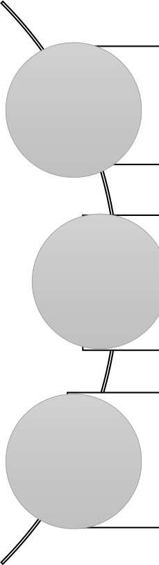

“ _Un_ **_problema_** _è una domanda che, per essere soddisfatta, richiede una teoria nuova (o una teoria non ancora conosciuta da chi si pone il problema), mentre un_ **_esercizio_** _è una domanda che presuppone già una teoria risolutiva_.”

“ _Il problema esige una_ **_scoperta da farsi_** _; l’esercizio si esegue perché una scoperta è già stata fatta. Lister_ (ha introdotto l’uso del fenolo negli ospedali riducendo le morti per cancrena) _, Semmelweis_ (ridusse la mortalità nelle sale parto) _, Koch, Pasteur e Von Behring (_ ha introdotto la sieroterapia) _hanno fatto delle genuine scoperte; i medici che sono venuti dopo di loro hanno applicato quelle scoperte_.”

_“[…] la procedura che porta ad una scoperta riuscita non è quella che conduce ad_ **_un’applicazione_** _riuscita. E benché ci possano essere delle applicazioni geniali che somigliano tanto ad una scoperta, la scoperta è frutto di una_ **_creatività_** _in genere non richiesta da chi applica la scoperta_.” Creatività è sinonimo di significatività. **Dario Antiseri**, filosofo “Insegnare per problemi” in “Riforma della scuola”.

Per esempio, **Biro** ha inventato la penna, ma dopo di lui c’è stato **Bik**, e senza di lui non ci sarebbe stata la penna a sfera che oggi utilizziamo.

La **penicillina** è stata scoperta da **Flaming**, che lasciò momentaneamente il suo lavoro

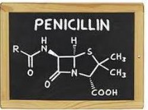

> **Immagine:** Lavagna nera con la scritta PENICILLIN e la formula di struttura della penicillina disegnata a gesso: anello a quattro atomi (β-lattamico) con N e gruppo C=O, fuso con anello contenente S, due gruppi CH₃, gruppo COOH, gruppo R-C(=O)-NH e H sui vertici.

per andare in vacanza, in quell’estate calda e piovosa, i batteri sulla piastra che stava studiando furono infettati, notando che attorno a loro ci fosse un alone di muffa e lì i batteri non riuscivano più a crescere. La cosa eccezionale fu invece il fatto che questa muffa aveva annientato tutti i Batteri circostanti. Fleming identificò la muffa come appartenente al genere _Penicillium notatum_ che

in italiano si traduce con "pennello notevole".

La scoperta fu casuale; infatti, se si fosse trattato di un altro tipo di germi, o di un altro tipo di muffa, o più semplicemente di uno scienziato più distratto, probabilmente tutto sarebbe passato inosservato.

**Antibiosi** = una vita contro un’altra vita (batteri contro muffe).

Ma passarono 13 anni prima che si potesse usare sugli uomini la penicillina, grazie ad un farmacologo e un chimico, che sperimentarono, per eliminare la tossicità di quell’elemento. Florey

<!-- p. 16 -->

e Chain hanno svolto esercizio. Quindi in questo caso è stato più importante l’esercizio. Questa applicazione è tanto geniale che somiglia ad una scoperta.

### CLASSIFICAZIONE DEI PROBLEMI SECONDO JOHNSTON

Johnston un chimico, si occupa di didattica della chimica e ha operato una classificazione dei problemi.

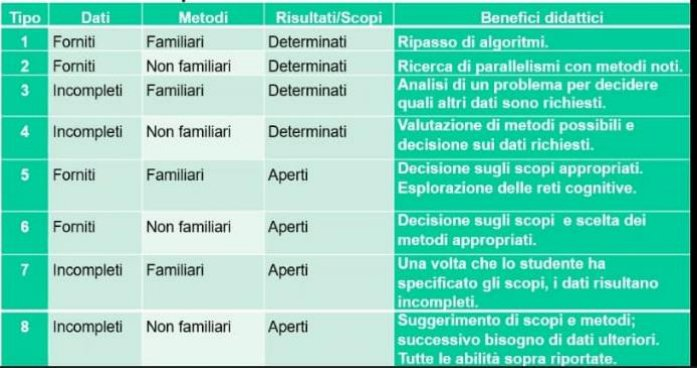

> **Immagine:** Tabella con colonne Tipo; Dati; Metodi; Risultati/Scopi; Benefici didattici. · 1: Forniti; Familiari; Determinati; Ripasso di algoritmi. · 2: Forniti; Non familiari; Determinati; Ricerca di parallelismi con metodi noti. · 3: Incompleti; Familiari; Determinati; Analisi di un problema per decidere quali altri dati sono richiesti. · 4: Incompleti; Non familiari; Determinati; Valutazione di metodi possibili e decisione sui dati richiesti. · 5: Forniti; Familiari; Aperti; Decisione sugli scopi appropriati. Esplorazione delle reti cognitive. · 6: Forniti; Non familiari; Aperti; Decisione sugli scopi e scelta dei metodi appropriati. · 7: Incompleti; Familiari; Aperti; Una volta che lo studente ha specificato gli scopi, i dati risultano incompleti. · 8: Incompleti; Non familiari; Aperti; Suggerimento di scopi e metodi; successivo bisogno di dati ulteriori. Tutte le abilità sopra riportate.

1. In realtà è un esercizio. I dati sono forniti, i metodi sono già noti e anche il risultato lo è. Ad esempio, conosco la **densità**, esiste una formula. Avendo massa e volume si può facilmente calcolare la densità. Il benefico è il ripasso della formula, l’allenamento.

2. Posso sapere quante **lenticchie** ci sono in un pacco da chilo. Naturalmente contarle una ad una sarebbe difficile. Peso una singola lenticchia e divido il peso totale per la singola. Massa è una grandezza estensiva proporzionale alla quantità di materia. Quindi l’alunno può applicare una proporzione.

3. Ad esempio, Archimede sapeva che poteva risolvere il problema conoscendo il volume della colonna, ma non aveva i dati a disposizione. Nel suo caso la serendipità lo ha portato ad elaborare un metodo non comune.

4. C’è un ulteriore salto di qualità

5. I metodi 5-6-7-8 mettono in atto **abilità superiori** perché le risposte sono aperte, non esistono risposte univoche. Appurati che i corpi hanno densità diverse e sappiamo applicare la regola della densità, questo concetto può essere usato in modi nuovi, per esempio si può elaborare una **scala di galleggiabilità**: definire se un corpo galleggia. Si può condurre uno studio dei **regoli** perché hanno volumi regolari, e si può calcolare il suo volume per capire se galleggerà

6. Posso calcolare la **galleggiabilità di una paperella**, perché essa non ha un volume regolare, non essendo una figura regolare, quindi deve ricorrere al metodo di Archimede.

7. Dopo una lezione sul fatto che anche l’aria è fatta di materia, allora **l’aria** deve avere una massa ed occupa il volume. In questo caso mancano i dati e anche il procedimento per il calcolo non si conosce. Siamo nell’ambito di problemi più impegnativi. Si potrebbe pesare il palloncino sgonfio, poi gonfiarlo e pesarlo di nuovo. Così si calcola la massa. Poi si può inserire il palloncino in una bacinella per calcolarne il volume (Archimede). Empiricamente, se gonfio un gommone, quando arrivo in acqua si sgonfia, questo accade perché la

<!-- p. 17 -->

temperatura dell’acqua è diversa da quella interna al gommone. Pressione= sommatoria degli urti delle particelle che battono contro le pareti. Effetto della temperatura sulla pressione dei gas.

8. Se considero lo zucchero e voglio studiarne la densità, se metto lo zucchero a velo nell’acqua si scioglie subito, le singole molecole reagiscono subito con quelle dell’acqua, formando una miscela, i singoli volumi non si possono sommare. Se considero le zolle di zucchero è più facile studiarne la densità perché si scioglie più lentamente.

#### ALTRE CLASSIFICAZIONI

#### Problemi

• Quantitativi e qualitativi Qualitativi: perché una mela marcisce solo nella parte esterna ma quella interna resta ancora buona. O perché un libro ingiallisce esattamente nel suo contorno. Un altro esempio, le nonne usavano la cenere per pulire gli indumenti bianchi. Questo accade che l’acqua calda diventa basica (a differenza di quella che beviamo che è neutra) e ha la capacità di trasformare lo sporco, l’unto in sapone. Il sapone è fatto proprio di sali degli acidi grassi, che appunto tali grassi si trovano sullo sporco e sull’unto. Per cui le nonne usavano gli scarti della cenere.

- Con dati mancanti o fuorvianti

- Con una sola risposta o che ammettono più risposte

- Che non possono essere risolti esattamente

- Che richiedono un esperimento, un computer o una banca dati

- Teorici o della vita reale

- Che richiedono la consultazione di testi nuovi

Un problema può anche essere portato avanti per più tempo e da più persone.

#### SPAZIO DELLE IPOTESI

Dopo lo spazio dei problemi si passa allo spazio delle ipotesi. L’importante è suscitare l’immaginazione dell’alunno.

#### CONCLUSIONI

- Il _problem solving_ è l’attività quotidiana dei chimici

- L’insegnamento nella chimica consiste per buona parte nel fornire agli allievi gli strumenti per risolvere problemi.

- Storicamente il _problem solving_ rappresenta uno degli scopi principali della didattica della chimica

<!-- p. 18 -->

### SPAZIO SPERIMENTALE

È uno **spazio necessario**, perché i bambini non hanno **capacità di astrazione**, dobbiamo fornire loro delle esperienze, altrimenti rischierebbero di annoiarsi.

Bisogna partire da esperienze particolari e nuove, che **escono dall’ordinario**, per poi mostrare loro che sono riproducibili, che fanno riferimento ad esperienze vicine.

“[…] _il curriculo scientifico deve fornire agli alunni esperienze che differiscono dalle loro esperienze ordinarie_ […]”.

_“[…] le esperienze dovranno essere eseguite direttamente dai bambini […]_ ” - Robert Karplus, 1927 – 1990, fisico teorico e pioniere in scienza dell’educazione.

**Esperimento della candela**: Se propongo ai bambini l’esperienza della candela, la accendo e mostro loro che si scioglie. La materia sembra essere scomparsa. La **materia si è trasformata** subendo una trasformazione chimica a causa dell’energia luminosa (calore). Procedo che un esperimento, prendo una **stagnola** e la tengo ad una cera distanza dalla fiamma della candela, vedo tante piccole goccioline sulla superficie della stagnola (come se fosse acqua). Questi piccoli puntini fanno pensare che dal fuoco sia uscita l’acqua. Questa esperienza è simile a quando **alitiamo** su una superficie, la

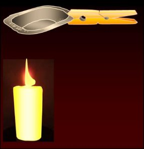

> **Immagine:** Illustrazione dell'esperimento sulla combustione: una candela accesa e, sopra, una stagnola/cucchiaino tenuto con una molletta di legno sopra la fiamma, sulla cui superficie fredda si formano goccioline d'acqua per condensazione. Nessun testo.

candela bruciando è simile a ciò che ho fatto io: si verifica la **condensazione**. Non è il vetro sul quale alito, o la stagnola che hanno prodotto le goccioline, semplicemente trovando una superficie fredda le particelle si sono rese visibili.

Ma quell’acqua sulla stagnola da dove viene? Il cambiamento della materia della candela ha generato **combustione**, la quale produce acqua ed anidride carbonica, ovvero un gas non visibile, la materia non è scomparsa, ma si è trasformata in gas non visibile.

**SPAZIO DELL’APPLICAZIONE=** il bambino può rivedere nella vita reale questo fenomeno, la benzina esce dal tubo di scappamento che per combustione è diventato gas e goccioline. Anche all’interno di noi avviene combustione, consumiamo ossigeno e produciamo acqua e gas di scarico.

**WHAT IF** = dopo aver visto l’applicazione, si generano idee, come sarebbe il mondo se non ci fosse la combustione, per esempio nelle grandi fabbriche che smettono di produrre CO2?

<!-- p. 19 -->

“[…] mettere in relazione un’esperienza insolita con l’esperienza più comune della quale la prima rappresenta un caso estremo.” - Robert Karplus, 1927 – 1990.

L’apprendimento significativo ha generato metodologie da parte di vari autori. I modelli tra di loro sono molto simili

1. Si parte da una esperienza concreta

2. Questa esperienza, verificata attraverso lo spazio sperimentale, in genere porta ad una generalizzazione (astrazione)

3. Astrazioni, nascono da un’esperienza e pongono le basi per successive esperienze.

4. Pensiero e senso comune convergono. Il vantaggio è che il senso comune è coerente con la teoria di riferimento. Appunto il docente parte dall’esperienza della candela che brucia, collega questa ad esperienze quotidiane come la benzina, alla fine si ottiene un pensiero relativo alla combustione.

<!-- p. 20 -->

## BUONE TATTICHE PER L’INSEGNAMENTO DELLA CHIMICA

Per un buon insegnamento sono importanti anche le tattiche usate, ci sono degli autori che hanno fissato dei momenti che devono fare parte dell’insegnamento della chimica.

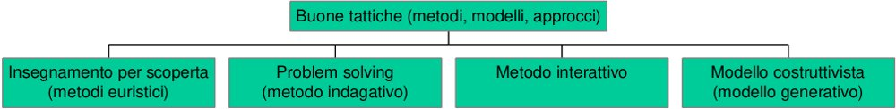

> **Immagine:** Diagramma: Buone tattiche (metodi, modelli, approcci) → quattro rami: Insegnamento per scoperta (metodi euristici); Problem solving (metodo indagativo); Metodo interattivo; Modello costruttivista (modello generativo).

Da sinistra verso destra cresce l’autonomia del bambino e diventa periferico il ruolo dell’insegnante.

#### INSEGNAMENTO PER SCOPERTA

- Lo scopo è tenere accesa la passione innata dei bambini per la scoperta.

- Il discente sviluppa l’attitudine dello **scopritore**.

- Il discente non può arrivare all’‘invenzione’ correntemente accettata.

- Metodo della ‘ **scoperta guidata’**: il bambino viene **guidato dall’insegnante** che pianifica. Il ruolo del bambino è marginale, segue un cammino già segnato.

- L’apprendimento dipende dalle conoscenze già possedute.

#### PROBLEM SOLVING

- Il discente sviluppa l’attitudine dello **scopritore.**

- Il discente non può arrivare alla soluzione correntemente accettata

- Metodo della ‘ **indagine strutturata** ’. Ci si sposta verso una maggiore autonomia. Il maestro deve solo cercare di fare le domande giuste, in modo che il bambino concepisca da solo la strada.

I bambini propongono **attività concrete** per cercare di dare risposte ai problemi, naturalmente il maestro lo aiuta a scegliere il migliore

- I problemi hanno carattere per lo più tecnologico.

- Il **problema è valido** solo se altamente **motivante**.

#### METODO INTERATTIVO

- Parte da domande formulate dagli allievi

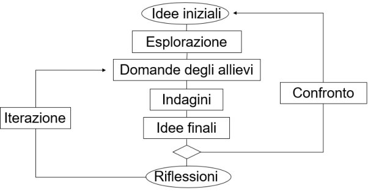

> **Immagine:** Diagramma di flusso. Idee iniziali → Esplorazione → Domande degli allievi → Indagini → Idee finali → rombo decisionale → Riflessioni. Dal rombo, freccia «Confronto» → torna a Idee iniziali. Da Riflessioni, freccia «Iterazione» → torna a Domande degli allievi.

- Può trasformarsi in ‘ **routine’**:

prevede dei **cicli iterativi**, ovvero momenti che si ripetono e si torna al punto di partenza. Il maestro sceglie all’inizio l’iter. Il rischio della routine è quello di far perdere le caratteristiche dell’insegnamento creativo.

<!-- p. 21 -->

Ciascuno dei tre metodi precedenti può essere esplicato nelle seguenti **tre fasi**: _Aller guten Dinge sin Drei_ (“Tutte le cose buone vanno a tre a tre”) proverbio tedesco

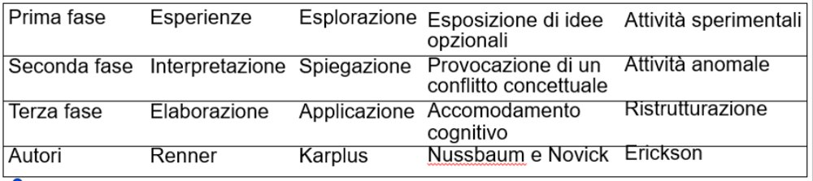

> **Immagine:** Tabella, righe per fase, colonne per autore. Prima fase: Esperienze (Renner); Esplorazione (Karplus); Esposizione di idee opzionali (Nussbaum e Novick); Attività sperimentali (Erickson). · Seconda fase: Interpretazione; Spiegazione; Provocazione di un conflitto concettuale; Attività anomale. · Terza fase: Elaborazione; Applicazione; Accomodamento cognitivo; Ristrutturazione. · Ultima riga Autori: Renner; Karplus; Nussbaum e Novick; Erickson.

Anche se gli autori cambiano, si notano sempre tra fasi molto simili tra di loro. Si nota che Bargellini si ispira a Karplus.

C’è sempre una fase di **accomodamento dei nuovi concetti**: alla fine dell’esperienza didattica il discente deve riadagiare la rete cognitiva a dei concetti nuovi. Non sempre è facile l’accomodamento, perché delle volte richiede di scardinare degli automatismi. Proprio per evitare queste fatiche di accomodamento sono nati i modelli costruttivisti

#### MODELLO COSTRUTTIVISTA

Il bambino si muove in **quasi assoluta autonomia**, e se questo non è conforme ai concetti del maestro, non deve essere sminuito. Si arriva all’estremo di contestare anche la conoscenza oggettiva dell’esperto. Può degenerare in una visione totalmente **relativista** (costruttivismo strumentalista): ‘la realtà oggettiva non esiste’.

L’obiettivo che si vuole ottenere è di **eliminare i concetti sbagliati in modo naturale**, non impositivo e fino a che non arriva a questo le idee pregresse non sono sbagliate.

L’allievo costruisce (genera) la propria conoscenza agendo su oggetti ed eventi.

- **esplorazione autonoma**: i bambini possono passare tutto il tempo che vogliono a sperimentare, per verificare se le conoscenze che ha sono corrette o da modificare.

- contesto familiare (possibilmente)

- chiarimento delle idee pregresse

- Verifica e consolidamento

- Coinvolgimento di tutto l’essere

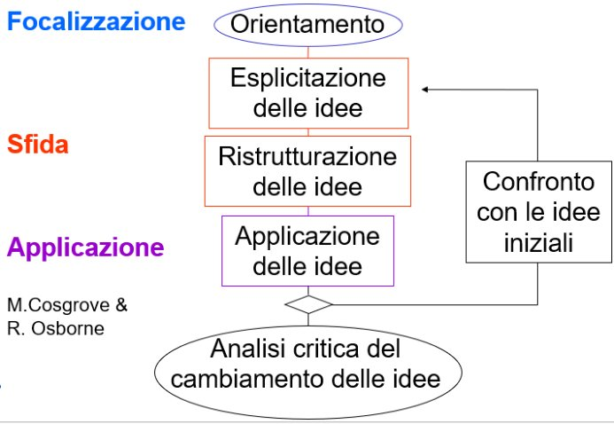

> **Immagine:** Diagramma di flusso con fasi laterali: Focalizzazione, Sfida, Applicazione (M. Cosgrove & R. Osborne). Orientamento (ovale) → Esplicitazione delle idee → Ristrutturazione delle idee → Applicazione delle idee → rombo → Analisi critica del cambiamento delle idee (ovale). Dal rombo, freccia «Confronto con le idee iniziali» → torna a Esplicitazione delle idee. Focalizzazione = Orientamento e Esplicitazione; Sfida = Esplicitazione e Ristrutturazione; Applicazione = Applicazione delle idee.

L’insegnante ha il **ruolo di facilitatore**: egli sa bene i concetti reali, conosce le idee proprie, dei discenti e degli scienziati, ma deve anche sapere quali sono i concetti che hanno i bambini, si deve mettere al loro pari, lasciandoli esplorare. Questo è lo schema del metodo costruttivista:

<!-- p. 22 -->

#### I SEI POSTULATI DEL COSTRUTTIVISMO

1. La **conoscenza** non può essere trasmessa né immagazzinata ― essa è **costruita dall’allievo** (Piaget)

2. Gli allievi hanno già delle **idee personali** (preconoscenze) (Ausubel)

3. L’allievo è il **primo responsabile** del processo di apprendimento, non più il docente

4. La conoscenza è organizzata nella mente in **reti di concetti** (strutture cognitive, collegamenti logici e linguistici)

5. Le **conoscenze preesistenti** condizionano l’apprendimento

6. L’insegnamento è più efficace se tiene conto delle **idee già possedute**

## IL MODELLO ALLOSTERICO DELL’APPRENDIMENTO

Un altro fattore importante è l’apprendimento in compagnia, apprendere insieme agli altri crea un **effetto allosterico**

||Gli**enzimi**sono**proteine**complesse formate da amminoacidi. Non agiscono in modo sempre arbitrario, devono essere**regolati**perché a volte serve che funzionino, altre volte no.|
|---|---|
|**Enzima**|Gli enzimi non agiscono sempre, devono essere regolati, per poter garantire**l’omeostasi**. Dal greco - _Allos_: diverso - _Steros_: spazio, solido La regolazione dell’attività enzimatica è regolata secondo**l’effetto allosterico**. La regolazione degli enzimi avviene su una porzione dell’enzima, diversa da quella dove avviene il rapporto tra i reagenti.|
||C’è un sito dove avviene la regolazione, questo sito serve ad accogliere una**molecola regolatrice**e quando la molecola (**effettore**) agisce con il sito**allosterico** induce una modifica momentanea della struttura|
|**Effettore**|dell’enzima che risulta più o meno attivo.|
||L’enzima possiede anche un altro sito detto**ortosterico**|
||che sarebbe quello che catalizza le trasformazioni, per effetto della**variazione allosterica**si predispone ad essere attivo e può catalizzare una reazione. Il sito|
|**Variazione allosterica**|ortosterico è più o meno accessibile in base a come si modifica il sito allosterico.|

<!-- p. 23 -->

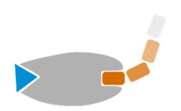

> **Immagine:** Schema dell'enzima (forma grigia con incavo sul lato destro, triangolo azzurro a sinistra) e di una catena di quattro blocchi arancioni che diventano sempre più chiari e si allontanano in alto a destra. Rappresenta la variazione allosterica che rende accessibile il sito ortosterico. Nessuna etichetta.

**Catalisi**

Dunque, gli **effettori sono dei facilitatori**, che servono a modificare l’enzima affinchè sia più accessibile per altre **reazioni** (che avvengono nel sito ortosterico). Avviene una **catalisi**, ovvero una modifica e aumento della velocità della reazione da parte dell’enzima. L’enzima è appunto detto **catalizzatore** perché rende fattibili, facilità la reazione, ma non partecipa.

È possibile trasporre questo metodo anche in ambito di apprendimento

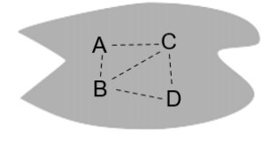

> **Immagine:** Forma grigia irregolare contenente quattro concetti A, B, C, D collegati da linee tratteggiate (A-B, A-C, B-C, B-D, C-D). Rappresenta la struttura mentale iniziale.

**André Giordan** afferma che anche nell’apprendimento si ha un fenomeno simile, quando affrontiamo un argomento in **presenza di qualcuno**. Allostericamente ci può essere una facilitazione dell’apprendimento che è facilitato, appunto, se avviene in presenza.

struttura mentale iniziale

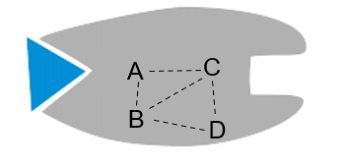

> **Immagine:** Forma grigia con triangolo azzurro a sinistra e incavo a destra, contenente A, B, C, D collegati da linee tratteggiate. Rappresenta la struttura mentale in ristrutturazione grazie agli effettori.

struttura mentale in ristrutturazione

Quando avviene la regolazione allosterica, negli enzimi, c’è una molecola detta **effettore**, che non c’entra con la reazione dell’enzima e altre molecole, ma facilita la reazione.

Tutti noi siamo effettori perché ci **predisponiamo all’apprendimento**, perché ci modifichiamo reciprocamente per accogliere qualcosa di nuovo, concetti nuovi, conoscenze…

Gli **effettori** possono essere: il contesto, i compagni, l’educatore.  Gli effettori facilitano la ristrutturazione della struttura mentale.

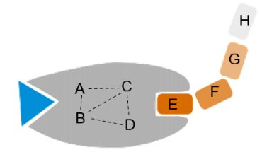

> **Immagine:** Struttura mentale con i concetti A, B, C, D collegati da linee tratteggiate in una forma grigia con triangolo azzurro e incavo; a destra quattro blocchi in fila E, F, G, H (da arancione scuro a chiaro) che si inseriscono nell'incavo. Rappresenta i nuovi saperi da apprendere (E, F, G, H) che si agganciano a quelli posseduti (A, B, C, D).

Questi effettori dell’apprendimento rendono la nostra **struttura mentale** (paragonata ad un enzima), **attiva** per apprendere nuovi saperi (paragonata all’attivazione a nuove reazioni) e i **nuovi saperi** (E, F, G…) si inseriscono più facilmente su quelli che già possediamo (A, B, C).

nuovo sapere da apprendere

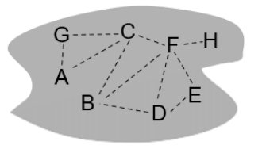

> **Immagine:** Forma grigia irregolare con otto concetti A-H collegati da linee tratteggiate: G-A, G-C, A-C, B-C, B-D, C-F, F-H, F-D, F-E, D-E. Rappresenta la struttura mentale ristrutturata dopo l'apprendimento dei nuovi saperi.

Struttura mentale ristrutturata

<!-- p. 24 -->

Anche questo effetto allosterico è un concetto **trasversale** a tutti e **quattro i modelli** (insegnamento per scoperta, Problem solving, Metodo interattivo, Modello costruttivista).

Gli autori che si sono interessati dell’insegnamento della chimica hanno definito “10

comandamenti” che devono essere rispettati:

1. Ciò che si apprende è controllato da ciò che già si conosce e si è compreso

2. Come si apprende è controllato da come già si è imparato precedentemente con successo

3. L’apprendimento è significativo se è collegato a conoscenze e abilità già esistenti

4. La quantità di informazione che può essere elaborata nell’unità di tempo è limitata

5. È necessaria la verifica e questa deve essere umana

6. È necessario tener conto degli stili e delle motivazioni individuali

7. Gli alunni devono riflettere su quanto hanno appreso

8. Problem solving

9. Gli alunni devono avere possibilità di creare, difendere, ipotizzare, sperimentare

10. Gli alunni devono insegnare

_“Un buon metodo per imparare è studiare; più efficace è ascoltare, ma l’ottimo è insegnare” -_ S. Francesco di Sales, Filotea, introduzione alla vita devota

Tre elementi essenziali per un insegnante:

**O** = originalità

**A** = appropriatezza

**S** = soddisfazione, il fattore trainante dell’apprendimento

<!-- p. 25 -->

## GLI STRUMENTI

Gli strumenti

Mappe concettuali Diagrammi a V di Gowin

Diagrammi di flusso

_“Un buon disegno vale più di un lungo discorso”._ Anonimo “Nel dubbio, disegnalo” Richard E. Dickerson, 1931 -, biochimico & Irving Geis 1908 - 1997, artista

**Epipedobates tricolor**: è una specie di rana che cammina sugli alberi. Nella sua pelle c’è una sostanza importante, utile per creare dei farmaci, attualmente in fase di sperimentazione. Il chimico per studiare una sostanza, la disegna, attraverso tecniche strumentali, definendo gli atomi. Il carbonio si lega ad altri atomi, in queto caso azoto, cloro e HN.

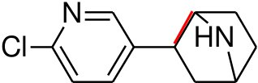

> **Immagine:** Formula di struttura bidimensionale: anello piridinico (esagono con N in alto e doppi legami alternati) con Cl a sinistra, legato a destra a un biciclo con gruppo HN (azabiciclo). Un legame è evidenziato in rosso. Etichette: Cl, N, HN.

**immagine bidimensionale**

Una molecola che poteva essere usata in medicina e in virtù della sua semplicità possiamo studiarne le caratteristiche:

- L’atomo di carbono ha tante proprietà, è in grado di legarsi con altri atomi. Inoltre, spesso condivide i suoi elettroni, questa caratteristica permette di creare tante strutture fondamentali.

- Il carbonio ha valenza 4, è detto **tetravalente,** ovvero presenta 4 elettroni liberi.

- Sappiamo che il carbonio può creare fino a quattro legami: ne abbiamo uno con N (azoto), uno con Cl (cloro), e altri con gli atomi di Carbonio.

- Nei vertici ci sono atomi di carbonio (C) che non vengono scritti perché otterremmo visivamente una figura troppo pesante

- Anche se sembra che il carbonio non abbia saturato la capacità di creare legami, in realtà l’ha fatto, laddove non c’è un segmento marcato è legato ad un **atomo di idrogeno** (H)

- Se si lega due volte si crea un legame doppio.

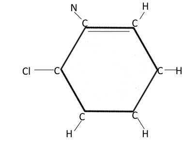

> **Immagine:** Anello esagonale con i carboni indicati ai vertici: C in alto a sinistra con N legato; C in alto a destra con H; C a destra con H; C in basso a destra con H; C in basso a sinistra con H; C a sinistra con Cl. Il doppio legame è tra i due carboni in alto. Mostra come un vertice C si satura con legami a eteroatomi o idrogeno.

Prendiamo in considerazione questa parte della molecola. Se dovessimo rappresentare visivamente in ogni vertice gli atomi di carbonio, la struttura sarebbe la seguente.

Consideriamo un C in un vertice, ad esempio quello in alto a sinistra. Come abbiamo detto esso deve essere saturato, ovvero tutti i quattro legami che esso può formare, devono essere fatti, in modo che la molecola sia stabile.

Il carbonio, infatti, si lega ad un atomo di azoto (N), con l’altro atomo di carbono alla sua destra crea due legami, come indica la doppia linea ed infine si lega al carbonio nel vertice sulla sinistra.

<!-- p. 26 -->

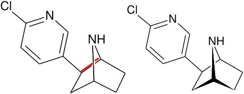

> **Immagine:** Due disegni della stessa molecola (anello con Cl, N; biciclo con NH). A sinistra prospettiva 3D con un tratto rosso e lati interrotti che indicano ciò che sta più lontano dall'osservatore; a destra la stessa molecola con legami a cuneo pieno (in nero) per rendere la profondità.

**Immagine tridimensionale**

Come si può notare nel disegno un lato è fatto da un segmento interrotto per far capire che sta più lontano dall’osservatore, perché davanti ad esso c’è il segmento verticale. Per vedere la terza dimensione che in un’immagine bidimensionale manca, possiamo anche ripassare in modo più marcato il lato che indica la terza dimensione.

Tutta la **materia è fatta di atomi** che sono neutri, però hanno un accumulo di carica negativa nelle parti periferiche e un accumulo delle parti positive nelle parti interne.

L’involucro esterno di carica negativa è come una **nuvola** che fluttua in quando le cariche elettroniche si possono spostare. Quindi gli elettroni non sono sparsi!

Mediamente si trova ad una certa distanza dal nucleo. La dimensione finale di una molecola nasce dalle dimensioni dei singoli atomi che la costituiscono.

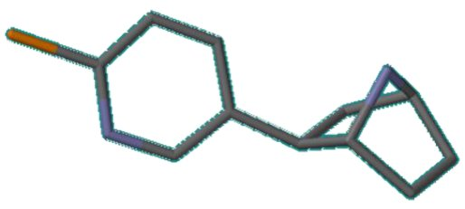

> **Immagine:** Modello a bastoncini (stick) tridimensionale: scheletro grigio, un legame arancione a sinistra (Cl) e atomi blu/viola (N) nell'anello e nel biciclo. Senza lettere, con colori convenzionali: carbonio grigio, azoto blu, cloro arancione.

Dunque, abbiamo bisogno di rendere ancora più ricca la rappresentazione. Rendiamo più semplice il disegno rimuovendo le lettere e aggiungendo dei **colori convenzionali**:

- Il carbonio è grigio

- L’azoto è blu (perché le molecole che contengono azoto hanno un comportamento basico)

- Il cloro è arancione

Un atomo diverso dal carbonio si chiama **eteroatomo**

La rappresentazione più ricca è la seguente:

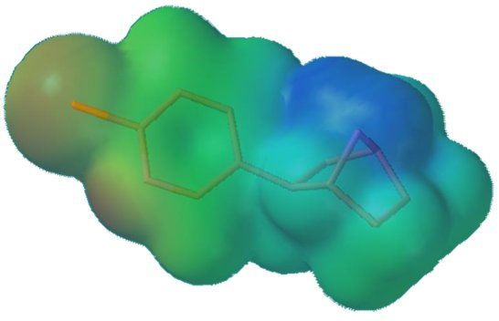

> **Immagine:** Superficie molecolare rappresentata con nuvola colorata sovrapposta allo scheletro a bastoncini: colori dal rosso/marrone (zona del Cl a sinistra) al verde, all'azzurro e al blu intenso (zona dell'azoto, in alto a destra). Mostra gli atomi come sfere e la dimensione complessiva della molecola; i colori indicano la distribuzione di carica e non seguono i colori convenzionali.

<!-- p. 27 -->

Permette di vedere che gli atomi sono delle **sfere** e che la dimensione complessiva della molecola nasce dalla disposizione e dimensione delle singole sfere di atomi.

I colori vanno dal **rosso** al **blu** passando per il **verde** e il **giallo**; questi colori sono diversi dai precedenti presi convenzionalmente. Questi indicano che il volume elettronico non è formato da elettroni uniformemente spalmanti attorno ai nuclei, ma ci sono zone con un addensamento relativo degli elettroni. Dove c’è maggiore **densità di nuvola elettronica** il colore è arancione, quelle più scoperte di elettroni sono blu.

“ _Il linguaggio della visione, la comunicazione ottica, è uno dei mezzi potenzialmente più validi sia per riconciliare l’uomo con la sua conoscenza sia per riplasmarlo in un_ **_essere integrato_** _. Le immagini integrano, il pensiero e il movimento della mano e con esse le informazioni connesse_ ”. “ _Il linguaggio delle immagini è in grado di diffondere il sapere più efficacemente di quasi ogni altro mezzo di comunicazione_ ” György Kepes, 1906 – 2001, progettista.

### MAPPE CONCETTUALI

Ci sono alcuni strumenti come le mappe concettuali che permettono di fare questa integrazione: esse mettono ordine grafico ai concetti che sono integrati nelle nostre **reti cognitive.** Sono rappresentazioni **sintetiche** utili anche per organizzare lezioni e appunti.

Il punto fondamentale è che i concetti sono organizzati in **modo gerarchico**, da concetti ampi, a concetti più piccoli e specifici, poi si termina con degli esempi.

“ _Ecco, dunque, un_ **_principio essenziale_** _: insegnare i dettagli significa portare confusione. Stabilire la relazione tra le cose, significa portare la conoscenza_ ” Maria Montessori, 1870 – 1952, pedagogista. Le mappe concettuali sono ridotte all’osso, presentano concetti e tra di essi paroline di collegamento in modo da creare una **proposizione**. Ogni concetto si collega ad un altro mediante un legame ed il suo significato deve essere compiuto, appunto formare una proposizione, come “gli esseri viventi possono essere piante” → una proposizione con un suo significato completo.

Abbiamo mappe concettuali grazie alle teorie formulate da David Ausubel, Joseph Novak, Bob Gowin.

Questa è una

**struttura**

**generale**:

<!-- p. 28 -->

- stimolano la **creatività**: delle volte possono costituirsi legami trasversali tra elementi lontani nella mappa, questo processo è un vero atto creativo.

- **soggettività e plasticità**: anche a distanza di anni, non esistono mappe universali, ognuno elabora la sua. Ma, le mappe possono essere giudicate oggettivamente, una mappa non riuscita è quella che non rispetta le gerarchie, si deve essere attenti al formalismo, all’inclusività dei concetti, alla presenza di esempi alla fine.

- favoriscono il **lavoro di squadra**

- fanno emergere i **misconcetti**

- adatte ai **bambini**

- possono essere usate come **verifica**

Vediamo un esempio:

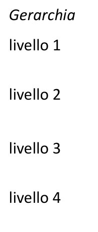

Mancano gli esempi!

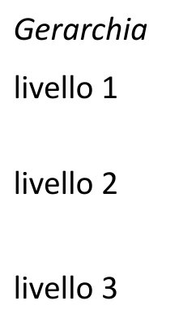

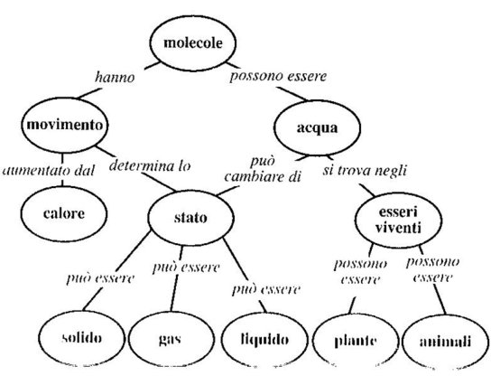

> **Immagine:** Mappa concettuale gerarchica. molecole → (hanno) → movimento; molecole → (possono essere) → acqua. movimento → (aumentato dal) → calore; movimento → (determina lo) → stato. acqua → (può cambiare di) → stato; acqua → (si trova negli) → esseri viventi. stato → (può essere) → solido; stato → (può essere) → gas; stato → (può essere) → liquido. esseri viventi → (possono essere) → piante; esseri viventi → (possono essere) → animali. Mancano gli esempi finali.

<!-- p. 29 -->

#### POSSIBILI PROCEDURE con le quali scrivere una mappa

1. **Semplice**: il docente dà i concetti e lo studente li organizza.

2. **Interattiva**: il docente dà dei concetti, li organizza e dopo c’è la spiegazione e lo studente li riorganizza.

3. **Sfida**: il docente fornisce concetti più complessi, difficilmente collegabili.

4. **Libera**: il docente fornisce il primo concetto fondante e poi sono gli studenti a scegliere gli altri.

### SPIDER

Un tipo di mappa dove non ci sono tanti livelli grafici, ma **c’è un unico livello**, con un concetto al centro che si irradia in tante direzioni, quindi c’è un solo livello gerarchico. È comunque una mappa perché i concetti sono collegati a formare proposizioni.

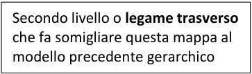

> **Immagine:** Riquadro di testo: «Secondo livello o legame trasverso che fa somigliare questa mappa al modello precedente gerarchico».

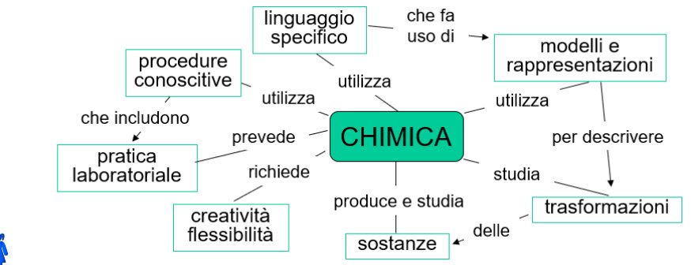

> **Immagine:** Mappa spider con concetto centrale CHIMICA. CHIMICA → (utilizza) → linguaggio specifico → (che fa uso di) → modelli e rappresentazioni. CHIMICA → (utilizza) → modelli e rappresentazioni → (per descrivere) → trasformazioni. CHIMICA → (studia) → trasformazioni → (delle) → sostanze. CHIMICA → (produce e studia) → sostanze. CHIMICA → (richiede) → creatività flessibilità. CHIMICA → (prevede) → pratica laboratoriale. CHIMICA → (utilizza) → procedure conoscitive → (che includono) → pratica laboratoriale.

### FLOW CHART

Un altro tipo di mappa concettuale serve a descrivere **processi ciclici**, come il ciclo dell’acqua, del carbonio, dell’azoto.

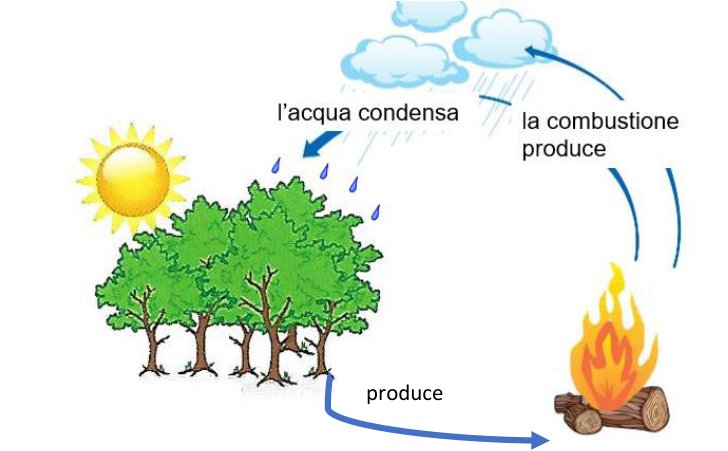

> **Immagine:** Schema ciclico con alberi, sole, nuvole con pioggia e fuoco (legna che brucia). Alberi → (produce) → fuoco/legna. Il fuoco → (la combustione produce) → nuvole. Nuvole → (l'acqua condensa) → pioggia sugli alberi. Illustra un processo ciclico tipo flow chart.

<!-- p. 30 -->

### MAPPA A SISTEMA

- C’è un ingresso e un’uscita e all’interno ci può essere un processo.

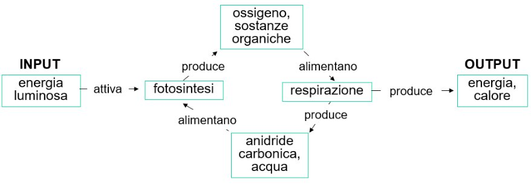

> **Immagine:** INPUT: energia luminosa → (attiva) → fotosintesi · fotosintesi → (produce) → ossigeno, sostanze organiche · ossigeno, sostanze organiche → (alimentano) → respirazione · respirazione → (produce) → anidride carbonica, acqua · anidride carbonica, acqua → (alimentano) → fotosintesi · respirazione → (produce) → OUTPUT: energia, calore. Esempio di mappa a sistema con ingresso, uscita e processo ciclico interno.

### MAPPA MENTALE (visiva, mnemonica)

Hanno una più **alta soggettività** rispetto alle mappe concettuali, i **collegamenti logici non sono esplicitati**. In questo caso invece chi le concepisce sa quali sono i collegamenti alla base. Un aiuto può essere la scelta del colore: blu per aspetto didattico e rosso disciplinare, viole è un misto.

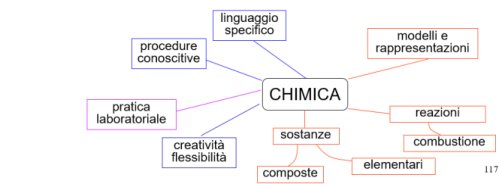

> **Immagine:** Mappa mentale con CHIMICA al centro, rami senza etichette di collegamento. Rami blu: linguaggio specifico; procedure conoscitive; creatività flessibilità. Ramo viola: pratica laboratoriale. Rami rossi: modelli e rappresentazioni; reazioni → combustione; sostanze → composte, elementari. Colori: blu aspetto didattico, rosso disciplinare, viola misto. Numero slide 117.

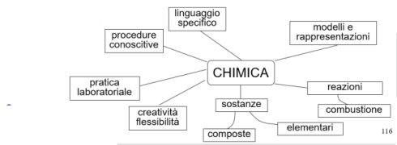

> **Immagine:** Mappa mentale con CHIMICA al centro e rami: linguaggio specifico; procedure conoscitive; modelli e rappresentazioni; pratica laboratoriale; creatività flessibilità; reazioni → combustione; sostanze → composte, elementari. Versione senza colori della stessa mappa. Numero slide 116.

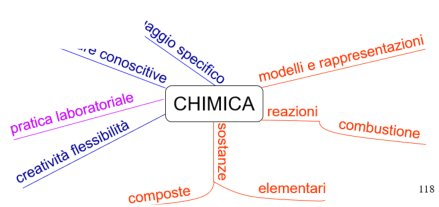

> **Immagine:** Mappa mentale con CHIMICA al centro e rami curvi con testo lungo il ramo: linguaggio specifico [parzialmente tagliato]; procedure conoscitive [parzialmente tagliato]; pratica laboratoriale (viola); creatività flessibilità (blu); modelli e rappresentazioni (rosso); reazioni → combustione (rosso); sostanze → composte, elementari (rosso). Numero slide 118.

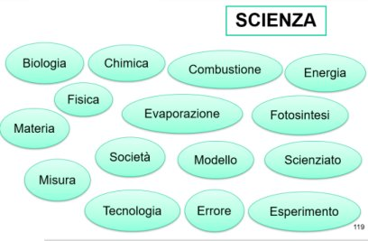

> **Immagine:** Slide 119 con titolo SCIENZA e ovali sparsi senza collegamenti: Biologia, Chimica, Combustione, Energia, Fisica, Evaporazione, Fotosintesi, Materia, Società, Modello, Scienziato, Misura, Tecnologia, Errore, Esperimento. Elenco di concetti da cui costruire una mappa concettuale.

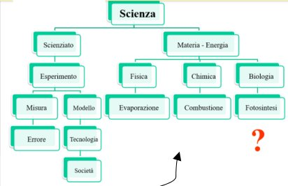

> **Immagine:** Mappa ad albero: Scienza → Scienziato → Esperimento → (Misura → Errore) e (Modello → Tecnologia → Società) · Scienza → Materia - Energia → Fisica → Evaporazione; Chimica → Combustione; Biologia → Fotosintesi. Un punto interrogativo rosso sotto Fotosintesi e una freccia nera in basso indicano collegamenti mancanti. Serve a discutere i misconcetti della mappa.

Abbiamo dei misconcetti nella mappa:

- Analizzando la parte sinistra della mappa abbiamo **l’esperimento** produce un **modello** e fin qui è accettabile, ma proseguendo, **tecnologia** e **società** sono concetti troppo ampi e non essendo esplicitato il collegamento non si può capire.

- • Nella parte destra sarebbe più intelligente collegare la scienza a fisica, chimica e biologia, in quando la scienza è studiata e compresa in quelle tre materie. Il grande errore è aver collegato la fotosintesi

   - Nella parte destra sarebbe più intelligente collegare la scienza a fisica, chimica e biologia, in quando la scienza è studiata e compresa in quelle tre materie. Il grande errore è aver collegato la fotosintesi

      - solo alla biologia, in quanto essa è collegata alla fisica, alla chimica ed anche alla biologia.

<!-- p. 31 -->

## DIAGRAMMA A V DI GOWIN

Un altro strumento grafico utile per il maestro o per certi studenti da un’età in poi. Il diagramma è utile per organizzare il necessario e definire gli obiettivi da perseguire e le azioni.

Il tutto disposto in un diagramma a V dove nella **parte centrale** c’è la **domanda** che ha scatenato la ricerca proprio.

Per pervenire alla **risposta** si risale lungo i lati scoscesi della V. Ci sono sia attività presenti a destra nel lato metodologico e teorie da usare e rispettare. La risalita lungo i versanti deve andare da una parte all’alra perché non c’è una pratica senza teoria e viceversa.

In basso definiamo gli **oggetti** che ci servono per rispondere alla domanda che ci siamo posti. Partendo da sinistra in basso ci sono **concetti già posseduti**, poi si passa a destra alla **registrazione** dei dati, si sale ancora una volta a sinistra. Il punto d’arrivo è in alto a destra, ovvero le

**formulazione di asserzioni**. Naturalmente salendo i concetti diventanto sempre più complessi.

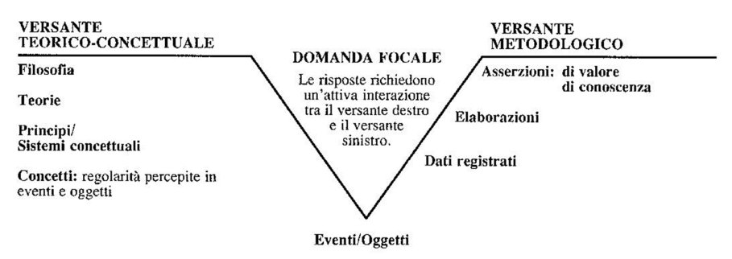

> **Immagine:** VERSANTE TEORICO-CONCETTUALE (sinistra, dall'alto): Filosofia; Teorie; Principi/Sistemi concettuali; Concetti: regolarità percepite in eventi e oggetti · Al centro DOMANDA FOCALE: le risposte richiedono un'attiva interazione tra il versante destro e il versante sinistro · Vertice in basso: Eventi/Oggetti · VERSANTE METODOLOGICO (destra, dal basso): Dati registrati; Elaborazioni; Asserzioni: di valore di conoscenza.

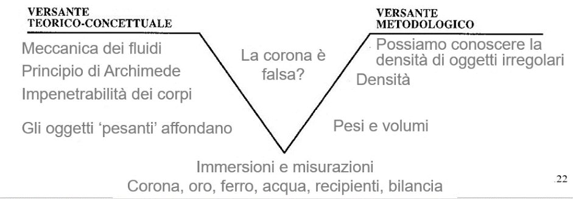

> **Immagine:** VERSANTE TEORICO-CONCETTUALE: Meccanica dei fluidi; Principio di Archimede; Impenetrabilità dei corpi; Gli oggetti 'pesanti' affondano · Domanda focale: La corona è falsa? · Vertice: Immersioni e misurazioni; Corona, oro, ferro, acqua, recipienti, bilancia · VERSANTE METODOLOGICO: Pesi e volumi; Densità; Possiamo conoscere la densità di oggetti irregolari. Esempio di V di Gowin sul problema della corona di Archimede. Numero slide 22.

<!-- p. 32 -->

## DIAGRAMMI DI FLUSSO

Secondo alcuni il diagramma di flusso non favorisce esattamente l’apprendimento, ma è utile per una ricerca, uno schema da seguire quando ci deve essere un **approfondimento**. Per esempio le figure geometriche:

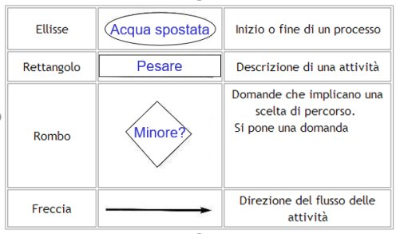

> **Immagine:** Tabella: Ellisse (esempio «Acqua spostata») → Inizio o fine di un processo; Rettangolo (esempio «Pesare») → Descrizione di una attività; Rombo (esempio «Minore?») → Domande che implicano una scelta di percorso, si pone una domanda; Freccia → Direzione del flusso delle attività.

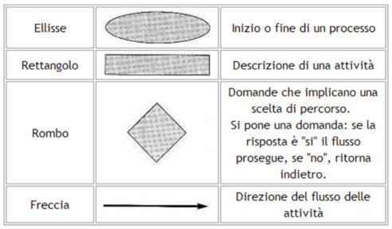

> **Immagine:** Tabella: Ellisse → Inizio o fine di un processo; Rettangolo → Descrizione di una attività; Rombo → Domande che implicano una scelta di percorso. Si pone una domanda: se la risposta è "sì" il flusso prosegue, se "no", ritorna indietro; Freccia → Direzione del flusso delle attività.

#### PATTERN RECOGNITION

Ad esempio, portando regoli di materiali e colori diversi si può cercare un criterio utile per **classificare la materia** di cui sono fatti i regoli.

- ➔ Si scelgono i **dati** caratteristici: colore, risposta al tatto (lisci o ruvidi, caldi o freddi).

- ➔ **Analizziamo** i dati: ci sono le prime ambiguità sui colori perché è un carattere soggettivo (ad esempio la differenza tra azzurro e blu), per cui scegliamo caldo/freddo e liscio/ruvido.

- ➔ Per cui torniamo indietro definendo un altro criterio: se galleggiano o no. A questo punto definiamo i **criteri di orientamento** da analizzare.

- ➔ Compilare una **matrice** di dati: verificare per ogni regolo il criterio, ovvero se il regolo galleggia o affonda. Allo stesso modo definiamo mettendo vicino ad un termosifone se il regolo rimane freddo o diventa caldo.

- ➔ A questo punto possiamo **fare previsioni**: se un regolo affonda e a contatto con il caldo diventa anch’esso caldo probabilmente è fatto di metallo.

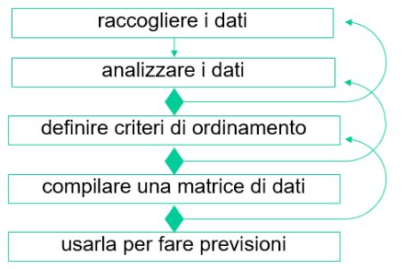

> **Immagine:** Diagramma verticale di rettangoli: raccogliere i dati → analizzare i dati → definire criteri di ordinamento → compilare una matrice di dati → usarla per fare previsioni. Tra i passaggi rombi verdi; frecce curve di ritorno verso i passi precedenti (dopo analizzare i dati torna a raccogliere i dati; dopo criteri di ordinamento torna ad analizzare; dopo matrice torna ai criteri).

<!-- p. 33 -->

Un esempio di diagramma di flusso relativo alla “paura”

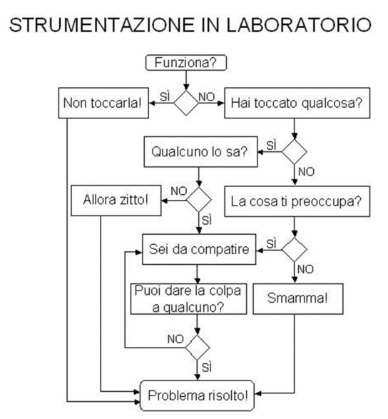

> **Immagine:** STRUMENTAZIONE IN LABORATORIO. Funziona? → SÌ: Non toccarla! → Problema risolto! · NO: Hai toccato qualcosa? → SÌ: Qualcuno lo sa? → NO: Allora zitto! → Problema risolto!; SÌ: Sei da compatire · Hai toccato qualcosa? NO: La cosa ti preoccupa? → SÌ: Sei da compatire; NO: Smamma! → Problema risolto! · Sei da compatire → Puoi dare la colpa a qualcuno? → NO: torna a Sei da compatire; SÌ: Problema risolto! Esempio di diagramma di flusso relativo alla "paura".

“ _A bad teacher forgets that he was a student. A good teacher remembers being a student. A great teacher knows he is still a student_.” Marcus Giaquinto, filosofo (?) “ _The good teacher explains. The superior teacher demonstrates. The great teacher inspires_ ” William Arthur Ward, 1921 – 1994, Scrittore

“ _La didattica non è riempire un vaso ma accendere un fuoco_ ” - Teofrasto, 371 a.C. – 287 a.C, filosofo, botanico

“ _Quando vuoi costruire una nave, non limitarti a convocare uomini per procurare il legname e distribuire i compiti e il lavoro ma insegna loro a desiderare il mare aperto_ ” - Antoine de SaintExupéry, 1900 – 1931, scrittore

“ _Lui non si laureò mai. Riuscì ad avere un diploma per insegnare alla scuola elementare: riteneva che per un bambino, in Sicilia quegli anni fossero importantissimi e formativi, tanto da diventare una sorta di assoluto. […] Quando l'Università di Messina voleva conferirgli la laurea honoris causa, Sciascia rispose "...perché? Già maestro sugnu", e questo sottolinea l'importanza delle scuole "vascie", basse, le scuole elementari._ ” - Andrea Camilleri su Leonardo Sciascia

<!-- p. 34 -->

## INVITO ALLA CHIMICA

Uno scienziato è capace di andare oltre, giungere a capire la bellezza del microscopico “La chimica non è solo disciplina scientifica, ma anche avventura ed **esperienza estetica**. I suoi seguaci cercano di trovare le **cause nascoste** ai sensi che determinano la trasformazione del nostro mondo in continuo cambiamento, di imparare l’essenza del colore della rosa, della fragranza del lillà e della robustezza della quercia, e di capire i sentieri segreti attraverso i quali la luce del sole e l’aria creano queste meraviglie” - **Cyril Norman Hinshelwood**, Premio Nobel per la Chimica 1956.

Guardando questa immagine proviamo un senso di **appagamento data dal verde**, dagli animali, dalla serenità. L’occhio umano è molto **sensibile** al verde, forse per questo guardandolo proviamo un senso di soddisfazione. La luce bianca di cui fa parte anche il colore verde che noi vediamo (essendo appunto il bianco l’insieme di tutti i colori) rappresenta solo una parte del cosiddetto spettro elettromagnetico, fatto da onde elettromagnetiche che vanno dai raggi gamma, alle onde radio. Di un lungo spettro, l’occhio umano ha concentrato la **visibilità** in un **piccolo intervallo** al cui centro c’è il verde. Per cui una persona che è uno scienziato prova appagamento perché sa che l’occhio è sensibile al verde.

I fenomeni che avvengono in corrispondenza ad **onde meno energetiche** della luce bianca, come **l’infrarosso**, non hanno un grande effetto sulle reazioni delle cellule, quindi non è utile per la nostra produzione di energia o formazione di strutture. Questi tipi di reazioni necessitano di più forti quantità di energia. Al contrario, **l’ultravioletto** (un’onda che ha lunghezza 450) ha un apporto **energetico troppo alto** per la vita, potrebbe rompere i legami tra gli atomi. Nelle onde che arrivano dal sole ci sono onde ultraviolette che provocano un’attivazione della melanina, ma esposte a lungo le cellule subirebbero un danno, come una mutazione dell’insieme genetico che potrebbe portare a fenomeni come i melanomi o tumori.

Il **fenomeno chimico altera intimamente la materia** perché riarrangia il modo in cui le molecole sono legate, mentre nel fenomeno fisico questo non accade.

“ _La felicità è l’anima alla luce del sole. In ogni cosa, cerca il pieno sole_ ” - Dugpa Rimpoce,

m. 1989 Monaco tibetano.

“ _L’occhio desidera grazia e bellezza, ma più ancora di esse il verde dei campi_ ” - Sir 40, 22

<!-- p. 35 -->

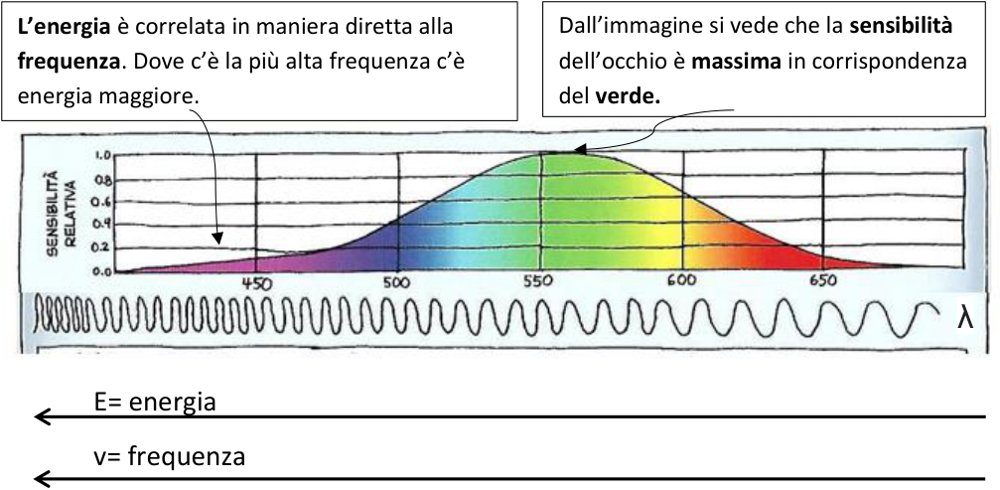

> **Immagine:** Grafico: asse y SENSIBILITÀ RELATIVA da 0.0 a 1.0; asse x lunghezza d'onda 450, 500, 550, 600, 650 (nm) con fascia dei colori dal viola al rosso. La curva a campana ha massimo (1.0) nel verde intorno a 550 nm e scende verso viola e rosso. Sotto un'onda sinusoidale con λ. Didascalie: «L'energia è correlata in maniera diretta alla frequenza. Dove c'è la più alta frequenza c'è energia maggiore.» · «Dall'immagine si vede che la sensibilità dell'occhio è massima in corrispondenza del verde.» · Frecce verso sinistra: E= energia; v= frequenza (crescono verso il viola).

Questo è lo **spettro elettromagnetico**, ovvero l’insieme di tutte le possibili frequenze della radiazione elettromagnetica).

In corrispondenza delle ascisse ci sono le **lunghezze d’onda**: la distanza tra due punti dell’onda elettromagnetica che si ritrovano nelle stesse condizioni. Detta in termini tecnici si parla della distanza tra due creste o due ventri dell’onda. A lunghezze d’onda maggiori corrispondono frequenze più basse perché la lunghezza d’onda è il reciproco della frequenza.

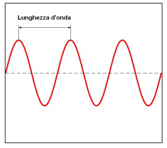

> **Immagine:** Onda sinusoidale rossa con linea tratteggiata dell'asse; una freccia indica «Lunghezza d'onda» come distanza tra due creste consecutive.

Queste conclusioni sono recenti, ma già i greci tentarono di dare una spiegazione al fatto che l’occhio percepisce nel verde l’armonia. La spiegazione fu data attraverso il mito: **il mito di Prometeo.** Nello specifico il potere magico e taumaturgico (ovvero che il verde ha una funzione curativa nei malati) è conducibile ad un evento tragico nel punto di contatto tra umani e dei, ovvero Prometeo.

**Prometeo era figlio dei titani**, ma i titani erano stati sconfitti in una grande battaglia dove Zeus ne fu vincitore. A Prometeo non andava bene e passava la sua vita a **provocare Zeus**. Una volta lo **ingannò con un sacrificio**, nascose i pezzi di **carne miglio** ri sotto un rivoltante ammasso di pelle del bue, più piccolo. Il resto, ossia le ossa e **poche frattaglie**, le nascose sotto un invitante strato di grasso. Poi invitò Zeus a scegliere per primo la sua parte. L'altra sarebbe toccata agli uomini. Ovviamente Zeus prese quello più grosso e fu ingannato perché era un cumulo di ossa, andò su tutte le furie e lanciò una **maledizione**: da quel giorno gli uomini avrebbero sacrificato agli Dei solo le parti di scarto degli animali e, da quello stesso momento, gli **esseri umani** sarebbero **diventati mortali**. In più, come ulteriore punizione, il **vendicativo** Zeus **tolse agli uomini il fuoco**, e da quel momento furono costretti a vivere nell'oscurità della notte. Prometeo per dispetto rubò la luce del sole per creare gli uomini. Zeus non poteva tollerare che un uomo si sostituisse agli Dei. Fece creare ad **Efesto, Pandora** (che significa bellissima), alla quale diede un vaso in cui si trovavano tutte le cose brutte presenti: le cattiverie, e disse di non aprirlo, allora la diedero a Prometeo (che

<!-- p. 36 -->

significa guardare avanti). Lui decise di non accettare Pandora. Allora la offrì al fratello sciocco di Prometeo, **Epimeteo** (colui che pensa dopo, affinché la sposasse e lei potesse, poi, punire il genere umano. Epimeteo, però, avvertito dal fratello **la rifiutò**. Allora Zeus, furioso, decise di farla pagare una volta per tutte al titano e agli uomini che difendeva. Così fece **incatenare Prometeo** a una roccia sulla **vetta di un monte**. Lì, ogni giorno, **un'aquila** gli avrebbe **squarciato il ventre** e dilaniato il fegato per l'eternità ma il titano era immortale e durante la notte le ferite guarivano. Nel frattempo, Epimeteo, che sperava di far cambiare idea a Zeus sulla sorte del fratello Prometeo, decise di **sposare Pandora**. La donna, bellissima e curiosa decise di aprire il vaso e da lì uscirono tutti i mali che oggi conosciamo. **L’ultimo spirito** che stava per uscire era un **uccellino verde**: la speranza. La Speranza nel passato non era vista in modo positivo, era vista come un aspettare ciò che avviene.

Dal mito è nata la convinzione che per tanti secoli ha guidato la ricerca farmaceutica nella natura. Se da una **origine** sono nate le malattie (i mali), da esse dovranno anche nascere i modi, i rimedi per poterle curare (la speranza), basta saper cogliere in essa dei segnali: **teorie delle segnature.** Se **l’edera** è attaccata al tronco delle querce e togliere loro sostentamento, dall’edera si potrà cogliere qualche principio attivo per togliere anche da noi delle sostanze, per esempio per dimagrire (questo principio non è ancora stato trovato).

I **frutti colorati**, fanno bene all’organo che coglie i colori, ovvero la vista.

Il **vischio** vive sui rami senza cadere, allora si può cogliere un principio contro l’epilessia (ma non è stato ancora trovato).

Il **gheriglio delle noci**, nella sua forma ricorda il cervello, per cui si pensa possa fargli bene. Un certo **reverendo Stones** notò che c’era questa pianta che poteva portare dolori articolari e febbre, ma la pianta non ne soffriva, assaggiò la corteccia e si accorse che era amara. Pensò che con questa sensazione amara “ci poteva lavorare” e con le varie sperimentazioni riuscì a ricavare la Aspirina. L’uso della corteccia era già noto ai greci che la consigliavano per combattere il dolore.

**Stereotipo per cui gli uomini sono attratti dalle donne bionde**: nel passato le famiglie si spostavano dalle zone centrali vicine all’equatore o verso nord o verso sud. Quindi donne scure di pelle, si spostavano in zone dove il sole era decisamente minore. Il sole è fondamentale per la vitamina D che forma il calcio nelle ossa. Se le fonti di vitamina D alimentari erano poche e anche il sole era scarso, le bambine brune crescevano rachitiche, bacino stretto, bassine, gambe storte. Per cui non crescevano di grande bellezza, quindi continuavano ad attrarre le donne che già vivevano in quelle zone ed erano bionde, alte e con i fianchi larghi.

La **bellezza della chimica** sta nel partire da eventi e fatti della **vita comune** e **scoprire le motivazioni** alle spalle. Questi esempi sono importanti per comprendere che si può scendere nelle cose e cercare una spiegazione ultima a livello di **costruzione particellare**. Però per molti anni la chimica non ha posto molta attenzione ad aspetti concreti della vita di tutti i giorni, quindi questo nozionismo passivo, senza alcuna trasversalità, la rendeva una materia arida, **lontana dalla realtà** concreta, si parla di **didattica chimica** o **_chemical education_**.

<!-- p. 37 -->

## DIDATTICA CHIMICA VS. DIDATTICA DELLA CHIMICA

### MODELLO TRIANGOLARE

La didattica chimica è la didattica tradizionale che analizzava fatti disgiunti dalla vita vera, essa seguiva il modello triangolare di Johnstone del 1993 i cui argomenti sono contenuti all’interno di questo triangolo, nei cui vertici troviamo:

- il sub-macroscopico

- macroscopico

- simboli

Per rappresentare l’incontro tra sub e macroscopico si usano simboli

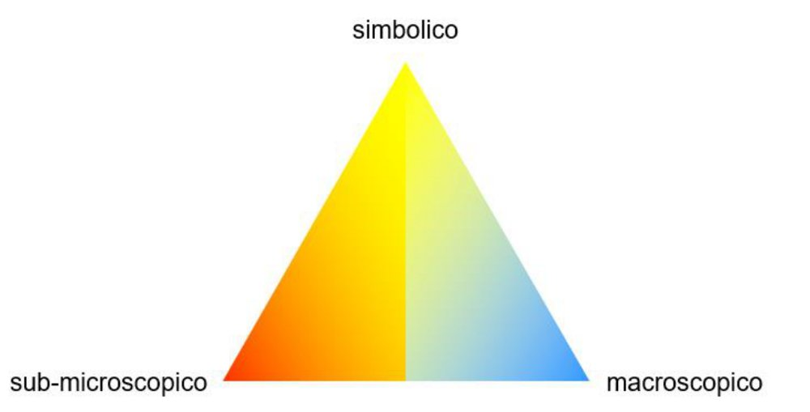

> **Immagine:** Triangolo con vertici: simbolico (alto), sub-microscopico (basso sinistra), macroscopico (basso destra). Sfumatura di colore dal rosso-arancio (sub-microscopico) al giallo (simbolico) al blu (macroscopico). Rappresenta il modello triangolare di Johnstone (1993).

Vediamo un **primo esempio**:

Perché l’olio non si mescola con l’acqua? (fenomeno **macroscopico** ) Lo analizziamo a livello **microscopico**: c’è **affinità tra i simili** e di conseguenza, viene meno il contatto con gli altri. A livello microscopico il simile scioglie il simile: **l’acqua** è una **molecola polare** e scioglie sostanze simili ad essa, forma **legami idrogeno** con altre molecole d’acqua. **L’olio** è un grasso, è **apolare**, per cui mettendo sostanze oliose a contatto con l’acqua, esse si cementeranno (uniscono) tra loro, ma non si scioglieranno nell’acqua. Per cui sulla superficie dell’acqua si creeranno goccioline dell’olio. La forma a goccia è data dalla presenza di una **superficie di separazione** segnata da dove finisce il grasso dell’olio, questa superficie entra in contatto con l’acqua. Ci sono in questa superficie delle **sostanze di confine** che non vogliono interagire con l’acqua, per cui cercano di ridurre il più possibile la **superficie di contatto** con l’acqua. Inoltre, nello **stato suddiviso** la superficie di contatto aumenta, per questo non troveremo singole goccioline di olio, ma esse tendono ad aggregarsi tra di loro. L’olio cerca di ridurre al minimo il contatto con l’acqua, non restando sparso, ma aggregandosi in gocce. La gocciolina sferica è la **minor superfice possibile** da disporre se si vuole evitare questo contatto.

<!-- p. 38 -->

Vediamo un **secondo esempio**:

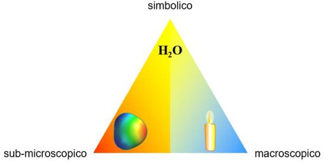

> **Immagine:** Triangolo con vertici simbolico (alto), sub-microscopico (basso sinistra), macroscopico (basso destra). Al vertice simbolico la formula H₂O; al vertice sub-microscopico una molecola stilizzata colorata; al vertice macroscopico una candela accesa. Esempio del secondo caso: candela (macroscopico) → acqua H₂O (simbolico) → molecola (sub-microscopico).

La **candela** rimanda all’esperimento fatto: abbiamo la candela dalla quale nasce l’acqua, la nube elettrica, non visibile a occhio nudo. Usando i simboli traduciamo questo concetto in **H2O** ovvero una molecola con due atomi di idrogeno che si uniscono in un rapporto ben definito con un atomo di ossigeno. Questo modello di insegnamento dava la sensazione di una **materia difficilissima da studiare**.

Gli elementi caratterizzanti questa chimica presente fino a 30-40 anni fa:

- Quantità **eccessiva di contenuti**.

- **Nozioni spesso scollegate** tra di loro: una disciplina arida perché non stimolava collegamenti, questo impedisce anche di trattare lo stesso problema da più punti di vista.

- Nozioni spesso **scollegate da quelle di altre discipline**: mancava una narrativa che potesse legare la chimica ad altre discipline, ciò rendeva l’apprendimento passivo e dogmatico.

- Nozioni spesso **scollegate dall’esperienza quotidiana**.

- Incapacità di collegare le nozioni con gli aspetti sociali.

- **Nozioni accettate acriticamente**: non ci si chiedeva il perché.

### MODELLO TETRAEDRICO di Mahaffy (2004)

Mahaffy introduce una quarta dimensione. Alla base del tetraedro c’è sempre il triangolo di Johnstone, a questa viene aggiunta la parte umana. Da questo momento si parla di didattica della chimica.

> **Immagine:** Tetraedro trasparente con base triangolare di Johnstone (vertici sub-microscopico, macroscopico, simbolico) e quarto vertice in alto: Uomo. Modello di Mahaffy (2004), che aggiunge la dimensione umana.

<!-- p. 39 -->

### MODELLO TETRAEDRICO di Sjöström, (2013)

**Sjöström** riprende il modello di Mahaffy ed introduce i livelli

> **Immagine:** Tetraedro con vertici Uomo (alto), sub-microscopico, macroscopico, simbolico. Livelli dal basso verso l'alto con frecce: base «chimica pura» (triangolo di Johnstone, lato destro); applicazioni (chimica applicata); aspetti sociali (socio-chimica); riflessione critica (chimica socio-riflessiva). Freccia verticale a destra: complessità (crescente verso l'alto). Modello di Sjöström (2013).

- **Livello 0**: la base rappresenta la **chimica pura**, si tratta di una chimica astratta, frammentata, che fa uso di modelli e simboli;

- **Livelli 1**: cerca di vedere la chimica e le sue applicazioni, inteso come un capitolo a sé stante, non necessariamente deve essere collegata ad altre discipline. È detta applicata perché la chimica si applica a fenomeni comuni;

- **Livello 2: socio-chimica**, non basta trovare dei fatti, ma ci sono collegamenti anche a livello tecnologico e ambientale. Ma questo livello porta con sé conseguenze, per esempio agricolture intensive dove sono stati introdotti aditivi, antibiotici, insetticidi, oppure all’inquinamento.

- **Livello 3**: include il piano etico, la **riflessione critica**. Ad esempio, se valga la pena introdurre farmaci costosi, oppure se è giusto inquinare l’ambiente.

#### ESEMPIO 1

Potremmo spiegare ai bambini il **fenomeno legato alla benzina**

- **Livello 0**: la benzina come sostanza;

- **Livello 1**: il cambiamento di stato della benzina, che immessa è liquida, ma quando esce è gassosa;

- **Livello 2**: un eccesso nell’uso di benzina genera inquinamento dell’aria come conseguenza le piogge acide, che quando cadono al suolo possono far sciogliere la pianta. A questo punto di potrebbe aprire un discorso su ciò che si intende con acido, prendendo spunto da oggetti quotidiani come un limone, che in piccole quantità va bene, ma in quantità eccessive può bruciare.

- **Livello 3**: ci si può occupare dell’industria chimica, se sia necessaria una produzione così massiccia.

<!-- p. 40 -->

In sostanza far capire al bambino che le piogge acide sono **precipitazioni contaminate** dall’immissione di ossidi di zolfo e di azoto nell’atmosfera. Le principali fonti di questo tipo di inquinamento atmosferico sono gli **impianti di riscaldamento**, le centrali termoelettriche e i veicoli a motore; questi immettono nell’atmosfera soprattutto anidride solforosa e ossidi di azoto, che possono venire trasportati dai venti anche per lunghe distanze.

**Esempio 2**: Si potrebbe anche parlare del **Junk food:** si parte dall’analisi chimica capendo che essi sono costituiti da combinazioni ricche di dolci, o salati o grassi che creano dipendenza. Questi stimolano i **centri del rinforzo**, della gratificazione nel nostro cercello, per cui siamo portati a mangiarne ancora. Hanno un contributo nutrizionale non molto elevato.

L’analisi del livello 3 potrebbe vertere su domande come: La chimica che si presta alla formulazione di questi cibi è corretta? Costribuisce all’obesità infantile?

**Esempio 3**: Mamma è figli sono legati: la **caseina** presente nel latte contiene la **caseomorfina**, che ha un effetto euforizzante, crea un’estasi celebrale. Al tempo stesso lo stimolo dell’assunzione crea **prolattina** nella mamma, per cui nella mamma si stimola altra produzione di latte e con questa produzione si stimola anche **l’amore materno**. Il **latte sintetico** crea nel bambino alcuni disturbi come tremore nella palpebra, per cui deve essere dato in maniera equilibrata. La chimica si limita a produrre una sostanza, e il terzo livello, quello sociale-riflessivo, ci stimola a pensare se sia corretto usare latte artificiale. Inoltre, il latte materno è ricco di anticorpi, che in quello artificiale non ci sono. L’uso del latte artificiale non rende ancora più rischiono il contatto con i batteri?

**Esempio 4**: Abbiamo delle reazioni chimiche, nel nostro oganismo, che dovremmo vedere a livello sub-microscopico. Es. Quando Tarzan che combatte contro la tigre deve scegliere se combattere o meno, qualsiasi scelta l’uomo faccia **l’organismo deve essere pronto**, a livello muscolare, a livello cerebrale, comprendere le azioni dell’avversario… per fare ciò ci sono **reazioni chimiche** perché alcune particelle vengono prodotte, ovvero i neurotrasmettitori che trasmettono stimoli a tutto il corpo: maggior attività cerebrale, blocco dell’attività intestinale, la pupilla si dilata: da una parte serve per cogliere meglio la luce, dall’altra crea un aspetto più minaccioso. Si dilatano i bronchi: più ossigeno, più combustione. La ghiandola surrenale produce l’adrenalina. La vescica si dilata per raccogliere l’urina che si produce, lo sfintere si contrae, parecchio di sangue arriva al cervello, perché il cervello deve decidere subito, tutte queste modifche sono tutte interpretabili a livello particellare.

<!-- p. 41 -->

## LA CHIMICA E LE ALTRE DISCIPLINE

> **Immagine:** Tre mappe affiancate. CHIMICA → (manipola) → sostanze macroscopiche → (realizzando eventi) → a livello microscopico → (che producono) → sostanze e conoscenza. FISICA → (utilizza) → strumenti macroscopici → (realizzando eventi) → a livello macroscopico → (che producono) → conoscenza. ASTRONOMIA → (utilizza) → strumenti macroscopici → (osservando eventi) → a livello macroscopico → (che producono) → conoscenza.

Tra queste tre materie si creano sia legami verticali che trasversali:

- Tutte e tre si occupano di sistemi e **sostanze macroscopiche**, ma la chimica è più interessata alle **sostanze**.

- La chimica e la fisica **realizzano** eventi (manipolano), mentre l’astronomia **osserva** gli eventi

- Le conseguenze delle attività della fisica e della astronomia constano nel produrre conoscenza, inoltre la chimica **trasforma la materia**, producendo sostanza e facendo ciò produce conoscenza.

> **Immagine:** Due ellissi sovrapposte (rossa CHIMICA, gialla FISICA) con area comune arancione. CHIMICA-FISICA → (utilizza) → strumenti macroscopici → (realizzando eventi) → a livello microscopico → (che producono) → conoscenza. Non si trasforma la materia.

Tuttavia, ci sono zone di sovrapposizione, al punto che esiste una disciplina: **chimica-fisica**, che usa strumenti macroscopici e li interroga a livello microscopico. In questo caso **non si trasforma la materia**. Per esempio, i passaggi di stato ci troviamo nella chimica-fisica, perché l’acqua è sempre acqua sia allo stato liquido che solido, ma all’interno di questa disciplina si analizza cosa accade tra le particelle, qual è il loro assetto.

<!-- p. 42 -->

D’altra parte, esiste anche una sovrapposizione tra chimica e biologica: **chimica-biologica**. Anche questa disciplina manipola sostanze e realizza eventi, che producono conoscenza.

La novità è che vengono prodotte anche **sostanze nuove ed entità viventi nuove**. Pensiamo alla **fermentazione** nella quale si producono sostanze nuove. Oggi modifichiamo anche il corredo genetico degli organismi: biologia molecolare, che ha creato nuove sostanze.

> **Immagine:** Due ellissi sovrapposte (rossa CHIMICA, azzurra BIOLOGICA). CHIMICA-BIOLOGICA → (manipola) → sostanze macroscopiche e entità viventi → (realizzando eventi) → a livello microscopico → (che producono) → sostanze e entità viventi; conoscenza.

La chimica si sovrappone anche ad altre discipline ed è la materia centrale rispetto:

- Alla **geologia:** relativamente allo studio di rocce e minerali. Assieme ad essa costituisce la geochimica

- **All’agraria**: per lo studio del suolo e dell’ambiente e le sostanze per il suolo

- Alla **farmacia**: molte sostanze prodotte in questo ambito prendono spunto dallo studio della natura

- All’ **ingegneria**: soprattutto per l’ingegneria dei materiali.

- Possiamo quindi dire che la chimica aiuta a gestire quella piccola parte di altre discipline.

> **Immagine:** CHIMICA al centro (cerchio giallo) circondata da sei cerchi: geologia (rocce, minerali, geochimica); fisica (termodinamica, struttura atomica, materiali); ingegneria (industria, materiali, macchine); biologia (biologia molecolare, biomateriali, biotecnologie); farmacia (farmaci, industria, medicina); agraria (suolo, pesticidi, ambiente).

<!-- p. 43 -->

## CONTENUTI E OBIETTIVI NELLA SCUOLA PRIMARIA

#### CLASSE PRIMA

|**Contenuti scientifici**|**Aspetti rilevanti dal punto di** **vista della chimica**|**Obiettivi generali e specifici**|
|---|---|---|
|Uso dei sensi per il|La classificazione dei materiali|Sviluppare capacità di|
|riconoscimento degli oggetti e|in funzione di osservabili|osservazione.|
|loro classificazione.|macroscopiche (colore, dimensione, sensazioni al tatto, odori, sapori).|Individuare differenze e similitudini tra oggetti in base a osservabili macroscopiche.|

Esempio: Anche il sale da cucina o lo zucchero possono essere usati per studiare le diverse sensibilità. O sale grosso e sale fino, per studiare che la sensazione di salato cresce man mano che si sminuzza il sale. Oppure l’aceto e il succo di limone per studiare l’acido.

#### CLASSE SECONDA

|**Contenuti scientifici**|**Aspetti rilevanti dal punto di** **vista della chimica**|**Obiettivi generali e specifici**|
|---|---|---|
|L’acqua nel quotidiano.|Osservazione e realizzazione|Comprensione degli aspetti|
|Osservazione dell’evoluzione dei viventi nel tempo|di alcuni semplici esperimenti usando l’acqua.|fondamentali del**metodo** **sperimentale**(ipotesi, verifica|
|(esempio: evoluzione dal seme alla pianta).|Osservazione e descrizione delle variabili che servono a|delle ipotesi). Individuazione dei parametri: parametri che|
|Introduzione al concetto di **trasformazione**/ cambiamento.|descrivere un cambiamento. Primo approccio al concetto di trasformazione.|variano (**variabili**) o che restano**costanti**. Sviluppo di intraprendenza e inventiva riguardo la formulazione di ipotesi e spiegazioni.|

**Esempio**: potremmo prendere un chiodo e studiarne il cambiamento, la trasformazione in un

anno. Ci sono delle **costanti** nei giorni che passano, in quanto solo dopo un anno la **variabile** “massa” varia e il chiodo avrà una massa maggiore.

#### CLASSE TERZA

|**Contenuti scientifici**|**Aspetti rilevanti dal punto di** **vista della chimica**|**Obiettivi generali e specifici**|
|---|---|---|
|Oggetti naturali e oggetti|Concetto di naturale vs.|Abilità di analisi delle|
|artificiali.|artificiale.|situazioni e dei loro|
|Acqua, miscele e soluzioni.|Interazione fra i componenti|elementi costitutivi.|
|Applicazioni di questi concetti|di una miscela e, in|Abilità cognitive.|
|nel quotidiano.|particolare, fra soluto e solvente.|Abilità di formulare semplici ragionamenti|

<!-- p. 44 -->

|Descrizione a livello|ipotetico-deduttivi.|
|---|---|
|macroscopico|Consapevolezza del proprio|
|delle soluzioni e descrizione|ruolo e del rispetto per|
|della differenza tra miscele|l’ambiente.|
|omogenee e miscele||
|eterogenee.||
|Metodi semplici di||
|separazione.||

**Esempio**: Lo zucchero a velo che si solubilizza (scioglie) più rapidamente. Si parla di proprietà

dinamiche: proprietà che variano nel tempo. Proprio lo zucchero può essere studiato man mano che si scioglie e non è più riconoscibile.

- **Miscele omogenee**: hanno caratteristiche uguali in ogni parte e non sono separabili con approcci chimici.

- **Miscele eterogenee**: visibile anche a livello macroscopico; presentano caratteristiche diverse nelle loro parti, e può avvenire una separazione.

#### CLASSE QUARTA

|**Contenuti scientifici**|**Aspetti rilevanti dal punto di** **vista della chimica**|**Obiettivi generali e specifici**|
|---|---|---|
|Le trasformazioni della materia.|Differenze macroscopiche tra solidi, liquidi e gas.|Rispetto per l'ambiente. Impiego del procedimento|
|I passaggi di stato.|Il concetto di energia e calore.|sperimentale in|
|Aria e inquinamento.|Passaggi di stato nell’acqua.|situazioni pratiche.|
|l fenomeni atmosferici.|Esperimenti in cui si evidenzi il ruolo del calore, del tempo e della temperatura. Comprensione di alcuni **fenomeni atmosferici**in relazione alle proprietà dell'acqua ed ai passaggi di stato.|Capacità di seguire uno **schema**/procedimento nella realizzazione di un **esperimento**. Capacità di descrivere in modo sequenziale un esperimento. Capacità di mettere in**grafico** i dati raccolti.|

Esempio: si studia che i solidi hanno volume e forma propria, che i liquidi hanno volume, ma non forma, mentre i gas nessuno dei due.

#### CLASSE QUINTA

|**Contenuti scientifici**|**Aspetti rilevanti dal punto di**|**Obiettivi generali e specifici**|
|---|---|---|
||**vista della chimica**||
|I**processi fondamentali**|Comprensione dell’evoluzione|Abilità cognitive. Impiego del|
|**nella vita**degli esseri viventi.|dei|procedimento speri-mentale.|

<!-- p. 45 -->

|Il**corpo umano**e le principali|viventi e del funzionamento|Capacità di argomentare e|
|---|---|---|
|funzioni dei diversi**apparati**.|delle diverse parti del corpo in|discutere con gli altri. Abilità|
|Esempio di apparato:|termini di trasformazioni che|nel collegare i dati|
|l’apparato digerente.|avvengono anche dal punto di vista chimico. Relazione tra cibo e funzioni plastiche, energetiche e regolatrici.|dell’esperienza in sequenze e schemi che consentano di prospettare soluzioni e interpretazioni, ed effettuare previsioni. Consapevolezza|
||Trasformazioni dei cibi e|dell‘ importanza di una|
||principî per una corretta|corretta alimentazione per|
||educazione alimentare.|l’individuo.|

**Esempio**: si evidenzia il ruolo centrale della chimica nel collegare aspetti familiari, con aspetti fondamentali, come per esempio che la materia è fatta da particelle.

<!-- p. 46 -->

## COMPETENZE SCIENTIFICHE

- Osservare oggetti/fenomeni, individuando differenze ed analogie.

Ad esempio, si possono osservare le **proprietà possono essere statiche o dinamiche** al fine di definirne analogie.

**Proprietà statiche**: sicuramente la massa, la forma, il volume, peso, materiale, elasticità, plasticità, rigidità, durezza, etc. di un corpo sono proprietà statiche. Dall’osservazione delle **proprietà statiche** deriva la **morfologia**: ovvero come la materia si presenta a noi. Queste proprietà statiche possono esser usate per stabilire:

- Una **classificazione**

- Uguaglianze o disuguaglianze

- ( **confronto** )

- Una **comparazione** e definire ciò che è maggiore o minore. Collochiamo la caratteristica del corpo studiato lungo una scala di comparazione. Per esempio, posso vedere dove si classifica una sostanza lungo la scala del Ph.

**Proprietà dinamiche**: sono quelle **legate ad un evento**, che **variano nel tempo** e sono più sofisticate da analizzare. Esempi di proprietà dinamiche sono la **capacità di mescolarsi**, la capacità di sciogliere sostanze, questo ovviamente vale per sostanze liquide. Mentre per le sostanze solide le proprietà dinamiche possono essere la **capacità di solubilizzarsi** in fasi immiscibili o il **comportamento di un corpo al riscaldamento**, infatti alcune sostanze rimangono invariate, mentre altre si deformano. Anche in questo caso valgono classificazione, confronto e comparazione. Potremmo prendere due regoli di uguali dimensioni, ma colori diversi, quindi decidere di combinare le proprietà ed effettuare piccoli esercizi di classificazione.

La distinzione tra le proprietà non è netta, infatti ma già parlando di **densità** ci troviamo in una zona grigia, non sappiamo bene di che proprietà si tratti. Inoltre, le **proprietà statiche** però possono **condizionare** le **proprietà dinamiche**, per esempio la forma (statica) di una palla può influenzare la capacità di rimbalzare di una palla (dinamica).

Anche in prima primaria i bambini possono avere già criteri di classificazione, per cui bisogna partire da cose semplici e smontare credenze errate.

- Acquisire capacità manuali.

- Porsi domande e individuare problemi da indagare a partire dalla propria esperienza, dai discorsi degli altri, dai media e dai libri.

- Descrivere oggetti e fenomeni.

- Individuare regolarità, formulare ipotesi sulle cause che le determinano e immaginare esperienze per verificarle; sperimentare la procedura.

- Predisporre le fasi di una procedura sperimentale.

<!-- p. 47 -->

- Distinguere i fatti (descrizioni) dalle ipotesi (possibili spiegazioni).

- Individuare possibili criteri per effettuare una classificazione.

- Utilizzare i criteri (propri o suggeriti) per classificare.

- Formulare **definizioni su base operativa**: alcuni concetti sono difficili da esprimere e si ricorre a definizioni operative che si basano su verbi, sono definizioni utili. Per esempio, la materia è tutto …È utile perché permette di distinguere la materia dalla

- Riconoscere alcune variabili su base operativa.

- Analizzare e verbalizzare le attività, sostenendo le proprie scelte con argomentazioni coerenti (comunicare i risultati).

- Leggere un testo scientifico, comprendendolo, rielaborandolo e spiegarlo con parole proprie.

- Costruire mappe concettuali.

- Assumersi ruoli e responsabilità nel lavoro di gruppo.

- Valutare ed eventualmente accettare opinioni divergenti.

- Gustare le cose che apprende.

<!-- p. 48 -->

## CHIMICA E MATERIA

La chimica studia le **proprietà della materia**. La **materia** è tutto ciò che **occupa uno spazio** e ha una **massa**. La massa possiamo misurarla con una bilancia, mentre il volume inserendo un corpo in una vasca piena d’acqua.

> **Immagine:** CHIMICA → (studia la) → MATERIA · MATERIA → (presenta) → PROPRIETÀ; (può subire) → TRASFORMAZIONI; (analizzandone la) → COSTITUZIONE · PROPRIETÀ → (possono essere) → CHIMICHE, FISICHE; CHIMICHE → (come lo) → STATO · PROPRIETÀ → (permettono di distinguere) → SOSTANZE, MISCELE · SOSTANZE → (possono essere) → ELEMENTARI, COMPOSTI · TRASFORMAZIONI → (possono essere) → FISICHE, CHIMICHE · COSTITUZIONE → (data da) → STRUTTURA, COMPOSIZIONE.

Anche **l’aria e materia** questo è visibile inserendo un bicchiere capovolto in una bacinella d’acqua e facendo entrare al suo interno l’acqua, essa arriverà fino ad un certo punto. L’acqua riesce ad entrare, perché qualcosa è uscito fuori dal bicchiere lasciando il posso ad essa: l’aria.

<!-- p. 49 -->

> **Immagine:** Tre disegni di una bacinella d'acqua: 1) una mano spinge un bicchiere capovolto verso il fondo, all'interno resta aria e l'acqua sale solo in parte; 2) il bicchiere viene inclinato e si vedono bolle d'aria uscire; 3) il bicchiere è di nuovo dritto sul fondo. Mostra che l'aria occupa spazio, quindi è materia.

Posso verificarlo anche prendendo una siringa e premendo il pistone, noterò la resistenza data proprio dall’aria.

> **Immagine:** Schema (b): siringa con aria a 5 cm³, il dito chiude il foro d'uscita dell'aria; a destra aria compressa a 2 cm³, freccia rossa sullo stantuffo. Didascalie: «il dito chiude il foro d'uscita dell'aria»; «quando si preme lo stantuffo si avverte una certa resistenza, ma esso si sposta». Mostra che l'aria è comprimibile ma oppone resistenza.

**L’aria ha un peso (massa)?**

Prendiamo due palloncini **sgonfi** e poniamoli ai margini di una sbarra, dopo di che mettiamo su un bilanciere la sbarra. Il sistema che si crea è in equilibro. Gonfio uno dei due palloncini e ricreo lo stesso sistema. Noto che il **palloncino gonfio pesa di più**, per cui l’aria introdotta nel palloncino ha un suo peso.

Deduco che l’aria ha il suo peso e come detto precedentemente occupa uno spazio: dunque è materia.

<!-- p. 50 -->

#### COSTITUZIONE: COMPOSIZONE E STRUTTURA

Procedendo nell’analisi dell’oggetto di studio della chimica, possiamo affermare che essa studia la materia analizzando le **particelle** macroscopiche alla luce della loro **costituzione** dettata dalla **composizione** e dalla **struttura**.

**Costituzione**: quante particelle ci sono e come sono messe insieme

**Composizione**: riguarda la quantità; **Struttura**: riguarda la qualità; le domande sulla composizione sono domande sulla struttura sono di di carattere quantitativo, ad carattere qualitativo, ad esempio, esempio quanti atomi di carbonio ci come sono legati tra loro gli atomi? sono?

Sali da cucina e zucchero hanno caratteristiche diverse sia qualitative che quantitative, mentre diamante e grafite pur essendo formati dallo stesso tipo di atomi, sono sostanze diverse perché quegli atomi si organizzano in strutture diverse. Stessa composizione (atomi uguali), strutture diverse (legami degli atomi).

Le proprietà, gli stati e le trasformazioni, sono interpretabili a livello di composizione e struttura delle sostanze.

#### TRASFORMAZIONI

La materia può subire delle sue **proprie trasformazioni**

**Trasformazioni chimiche:** sono dette reazione e **modificano intimamente** la materia, a livello invisibile, ovvero cambia il modo in cui gli atomi sono tenuti insieme. Solitamente le trasformazioni chimiche sono **irreversibili**.

**Trasformazioni fisiche** sono **reversibili**, la materia rimane uguale a sé stessa. Ad esempio, mettendo dei cristalli di sale sulla lingua li solubilizzo sto compiendo una reazione fisica. Se raccolgo la saliva che ho usato per solubilizzare lo zucchero su un vetrino, la lascio su un termosifone, la saliva evapora e troverò dei cristalli di sale.

<!-- p. 51 -->

#### PROPRIETÀ: SOSTANZE E MISCELE

Le proprietà sono importanti perché ci consentono di distinguere vari tipi di materia.

**Sostanza**: porzione di materia **Miscele:** porzioni di che ha **proprietà specifiche** materia formate da **più** ed **omogenee**. Dunque, la **sostanze** messe insieme e sostanza possiede che si **possono separare**. caratteristiche proprie e Le miscele si possono queste **non cambiano** a separare, delle volte prescindere dalla parte della meccanicamente, delle sostanza considerata, in volte, se è più difficile qualsiasi punto del campione. distinguere le sostanze che Analizzata in diversi punti dà le compongono come sempre gli stessi risultati a acqua, sabbia bisogna prescindere dalla scala di ricorrere a sistemi più misurazione: macroscopica, complessi. Per ebollizione microscopica o allontano l’acqua che è submicroscopica. distinguibile come sostanza pura, non è più in miscela

Non tutti i tipi di materia sono sostanze.

> **Immagine:** Freccia grigia rivolta verso il basso con la scritta «Miscele» in verticale.

> **Immagine:** Due foto: a sinistra cristalli bianchi in una ciotola scura con un riquadro; a destra ingrandimento del riquadro con cristalli di diverse dimensioni. Mostra che una sostanza in apparenza omogenea, a scala maggiore, è composta da pezzi grossi e piccoli con proprietà diverse.

Ad esempio, la seguente sostanza, analizzata più nel dettaglio ci fa notare pezzi più grossi e pezzi più piccoli, ad esempio potremmo scoprire che alcune sono dolci e altre salate, per cui, non hanno le stesse proprietà. Potremmo allora bruciare i cristalli. I cristalli piccoli bruciando imbruniscono e producono

un fumo **empireumatico**: che ha odore di carbone bruciato, tipico dello zucchero. I cristalli grossi una volta bruciati fanno diventare la **fiamma gialla**, perché uscendo il sodio fa diventare la fiamma di quel colore, quindi capiamo che si tratta di sale. Si tratta di una miscela.

**L’aria** è una miscela di sostanze che possiede **proprietà fisiche**.

**L’acqua di mare** è una **miscela**, tanto che la temperatura a cui solidifica l’acqua di mare è diversa da quella dell’acqua distillata che è una sostanza.

Infatti, riflettendo nei periodi di neve si sparge il sale sulle strade per evitare che si formino ghiaccio e neve. Questo accade perché il **cloruro di sodio** rende difficile la formazione del reticolo cristallino che dall’acqua allo stadio liquido tenta di diventare solida. Quindi la temperatura di gelo è più bassa.

Di conseguenza possiamo capire che le miscele hanno proprietà diverse dalle sostanze, una di queste è la **temperatura di solidificazione.**

<!-- p. 52 -->

**Proprietà chimiche**: infiammabilità, corrosività e reattività con gli acidi, pH di una soluzione Le proprietà possono dividersi anche in

**Proprietà fisiche**: stato (liquido, solido, gassoso) il colore di una sostanza che percepisco senza necessariamente operare una trasformazione, il sapore, temperatura di fusione, conduttività elettrica e densità. Sono quelle proprietà che colgo già con una **analisi organolettica.**

#### COLORE

Una delle proprietà organolettiche più importanti è l’aspetto visivo. Un corpo appare di un colore perché la parte che l’occhio percepisce è la **parte emergente**, quella parte della luce incidente che viene **riflessa** dall’oggetto. Sappiamo che la luce incidente è bianca, una radiazione continua di onde elettromagnetiche di varia la lunghezza.

Dunque, un oggetto appare di quel colore, perché la luce bianca ha in sé il rosso e tante altre radiazioni, che però non sono più colte dall’occhio perché sono state assorbite dal corpo. Nella mela c’è una sostanza in grado di **assorbire** le lunghezze d’onda di quegli altri colori.

La radiazione che giunge all’occhio contiene solo le lunghezze

d’onda che non sono state assorbite, cioè le **radiazioni complementari**. Se la mela sembra rossa, è perché è stata assorbita la reazione complementare data da giallo e blu. La radiazione assorbita si trasforma in buona parte in **energia termica,** cioè una leggera agitazione delle particelle nella buccia della mela.

#### Rosa dei colori o ruota dei colori

> **Immagine:** Cerchio cromatico a 12 settori, in senso orario dall'alto: giallo, giallo-arancio, arancio, rosso, magenta, magenta-viola, viola, cyan-viola, cyan, cyan-verde, verde, giallo-verde. Al centro una stella con triangolo giallo, rosso, blu e un poligono verde. Settori opposti sono complementari.

I colori complementari sono disposti in settori opposti al vertice.

Se un oggetto assorbe tutte le radiazioni visibili che riceve, appare nero. Se, invece, un oggetto non assorbe nel visibile, appare bianco.

<!-- p. 53 -->

#### Con i bambini

> **Immagine:** Grafico: asse y Amount of light absorbed; asse x Wavelength of light (nm) da circa 400 a 700 con barra dei colori dal viola al rosso. Chlorophyll a (verde scuro): picchi intorno a 430 nm e 670 nm. Chlorophyll b (verde chiaro): picchi intorno a 460 nm e 650 nm. Carotenoids (giallo-arancio): assorbono tra circa 400 e 520 nm con picchi a 450 e 490 nm. Poco assorbimento nel verde. Due foglie: una verde e una marrone (autunnale).

Le foglie cambiano il loro colore. Sulle ascisse c’è lo spettro delle onde elettromagnetiche. Quando la foglia è viva riesce a fare la fotosintesi clorofilliana, assorbe la radiazione bianca incidente (sole), sfrutta acqua e nutrienti, cattura CO2 e li usa per creare sostanze nuove

(glucosio e ossigeno).

**Le curve indicano l’assorbimento**

la **clorofilla A** assorbe la componente blu e rossa della luce bianca, lo vediamo dal fatto che la curva di assorbimento presenta dei massimi sulle lunghezze d’onda del blu e rosso. Quindi se assorbe quei colori, ciò che viene riflesso e appare al nostro occhio è il verde. Quando la foglia muore la clorofilla si trasforma in altre sostanze, in questa fase diventano importanti sostanze come i **carotenoidi**, essi assorbono abbastanza nel blu, ma non hanno assorbimento nel rosso. Quindi la luce bianca che colpisce la foglia con carotenoidi riflette il giallo arancio, ovvero ciò che appare al nostro occhio.

#### TAGLIA

L’altra cosa che guardiamo per classificare le sostanze è la **taglia**. Anche in questo caso possiamo ricorrere a degli strumenti nel caso in cui la semplice osservazione non dovesse bastare.

Delle volte per l’analisi delle proprietà dobbiamo usare strumenti sempre più complessi: il libro “The Washing Away of Wrongs” del 1235 parla di un **investigatore** che risolve delitti con le sue qualità. Un uomo viene ucciso ma non si capisce qual è la **roncola** con la quale è stato

commesso il delitto dalla semplice analisi visiva. Allora l’investigatore chiama tutti i sospettati e fa poggiare loro la roncola per terra per capire qual è l’arma del delitto. Ricerca la materia del sangue non visibili direttamente attraverso l’occhio umano, ma aspettando che le mosche si avvicinino perché esse si avvicinano alle sostanze organiche.

<!-- p. 54 -->

> **Immagine:** Sette foto di fiamme con relative etichette: sodio (fiamma giallo-arancio); bario (verde); potassio (viola); calcio (arancio); litio (rosso); stronzio (rosso); rame (verde-azzurro). Mostra le emissioni di colore caratteristico di elementi diversi.

Esempi che si possono fare in classe sono quelli dove le **proprietà** delle sostanze possono essere stimolati creando le **condizioni giuste**, come sottoponendo alcune sostanze ad una **fonte di energia** (fiamma). Alcuni elementi come il sodio, emettono onde elettromagnetiche di alcune frequenze che poste vicino ad una fiamma l’occhio percepisce come giallo. Allontanando il cotton fioc su cui c’è il sodio, esso rimane solo sodio, senza alcun colore. Il calcio, se avvicinato ad una fiamma emette onde elettromagnetiche che l’occhio percepisce come rosso-arancione e così via.

Le proprietà fisiche, però, potrebbero non bastare, quindi si ricorre a reazioni chimiche. « _Tutte le cose sono fatte di atomi ― piccole particelle che si muovono in modo incessante, e che si attraggono quando si trovano a piccole distanze le une dalle altre, ma che si respingono quando vengono schiacciate l’una sull’altra_.»

#### ETIMOLOGIA

Quasi tutte le ipotesi si riconducono all’Egitto allora nota come terra di **Chamie** che vuol dire terra nera, in quanto la terra era di questo colore a causa delle esondazioni del **Nilo**, che rendeva fertile grazie al limo. Chamie è l’arte della terra d’Egitto, molto diffusa ad Alessandria d’Egitto dove furono elaborate le prime concezioni sulla materia.

Un’altra ipotesi sempre legata all’Egitto, perchè qui per la prima volta si sviluppò la metallurgia, la disciplina che permette di ricavare il metallo dalle pietre, quasi “spremuti dalle rocce”. Scienza esoterica conosciuta da pochi, potremmo dire che la metallurgia: arte che permette di prendere il succo dalle rocce e versarlo negli stampi. Il libro che riportava i segreti della metallurgia era detto kema.

- **Kema**: libro dei segreti dell’arte egizia

- ▪ **Chimos**: succo

- **Cheo**: versare il liquido

<!-- p. 55 -->

### LE SCALE DI MISURA

Le misure che interessano la chimica viaggiano all’interno di due estremi: in relazione alla terra parliamo di **chilometro**, in relazione all’atomo dobbiamo usare un **angstrom**, decimo di nanometro. In mezzo ci sono oggetti di dimensioni macroscopicamente rilevabili. L’ultimo oggetto percepibile ad occhio nudo è l’acaro della polvere.

> **Immagine:** Scala nanometrica riferita al diametro di diverse forme di materia: da un atomo d'idrogeno al pianeta Terra. Asse in nm con valori e unità: Atomo d'idrogeno 0,1 nm = 1 Å · Molecola d'acqua 0,2 nm = 2 Å · Nanotubo 1,0 nm = 1 nm · DNA 2,0 nm = 2 nm · Ribosoma 20,0 nm = 20 nm · Batterio E. Coli 500,0 nm = 0,5 µm · Globulo rosso 3.000,0 nm = 3 µm · Acaro della polvere 300.000,0 nm = 300 µm · Moneta da 1 Euro 23.000.000,0 nm = 2,3 cm · Pallone da calcio 220.000.000,0 nm = 22 cm · Pianeta Terra 12.740.000.000.000.000,0 nm = 12.740 km. Un riquadro rosso evidenzia gli oggetti dall'atomo d'idrogeno al batterio E. Coli (scala micro/nanoscopica); ogni voce ha un disegno o una foto dell'oggetto.

> **Immagine:** Quattro cerchi numerati su sfondo beige: il cerchio 1 è molto grande (testa di spillo vista da vicino), il cerchio 2 è piccolo (acaro della polvere), il punto 3 è un puntino minuscolo (globulo rosso), il punto 4 è ancora più piccolo [illeggibile il significato del 4 dal solo disegno]. Illustra le proporzioni relative tra testa di spillo, acaro e globulo rosso descritte nel testo.

#### Grandezze a confronto

Guardo la testa di uno spillo da vicino e mi sembra grosso come il cerchio più grande 1.

L’acaro della polvere presente sulla testa dello spillo mi apparirebbe come il cerchio 2, mentre il globulo rosso sarebbe come un puntino 3.

Se il cerchio grande 1 fosse un globulo rosso. Il 2 sarebbe il batterio, il

3 sarebbe il virus che non si riuscirebbe a vedere con l’occhio.

Se l’1 fosse un virus, il 2 sarebbe DNA, il 3 sarebbe nanotubo, il 4 una molecola d’acqua.

#### L’ATOMO

- “ _Noi diciamo dolce, diciamo amaro, diciamo caldo, parliamo del freddo e del calore ma in realtà non esistono che gli atomi e il vuoto_ ” Democrito

Democrito arriva anche ad ipotizzare che esistono atomi diversi: l’atomo è **una particella che non si può tagliare ulteriormente.** Ciò che sappiamo della teoria atomistica ci arriva tramite **Epicuro**, ma soprattutto grazie ad un poeta latino **Lucrezio**, il quale scrisse opere con concetti di Epicuro, Democrito e **Leucippo**, al contrario degli autori greci che non diedero molto credito alle teorie atomistiche

“ _Con una varietà infinita nei loro pesi e nella loro forma, gli atomi possono costituire ogni specie di corpo. Gli uni sono sferici, cubici o ellissoidali; gli altri conici, cilindrici o piramidali […]._ **_Mobili_** _per la_

<!-- p. 56 -->

_loro stessa natura, gli atomi sono in movimento per tutta l’eternità, animati da_ **_velocità diverse_** _e spinti nelle direzioni dove il caso li trascina in ogni senso, in seno al vuoto infinito_.” Epicuro. Attualmente questa definizione nella sua parte iniziale non è esatta perché gli atomi sono infiniti e non sono sferici.

**MOLECOLA**: piccola porzione di materia formata da atomi tenuti insieme.

Oggi usando il **microcopio ad effetto tunnel** possiamo vedere gli atomi avvolti dalla nube elettronica. È impossibile vedere gli direttamente gli atomi, bisognerebbe investirli con una radiazione, che però è troppo energica e rischierebbe di distruggere la materia, con la tecnica a tunnel si risolve questo problema. Ecco come appaiono silice e silicio:

> **Immagine:** Due immagini di microscopia a effetto tunnel con didascalie: "silice" (a sinistra, immagine piatta verde con punti luminosi bianchi disposti in reticolo su fondo scuro, cioè i picchi di aggregazione di elettroni) e "silicio" (a destra, rappresentazione tridimensionale a rilievo di linee nere con creste e avvallamenti, colorata di azzurro). Mostrano l'aspetto degli atomi visti con la tecnica a tunnel.

La **silice** è un minerale Una **molecola** fatta solo da **atomi di silicio** formato da **silicio** e appare con avvallamenti proporzionali alla **ossigeno**. dimensione degli atomi di silicio, dove c’è un picco c’è un’aggregazione di elettroni, alla valle c’è un vuoto elettronico.

#### Elemento/Sostanza elementare:

- Sostanza che **non può essere scissa** in alcuna sostanza più semplice (es. He)

- Specie chimica costituita da **atomi dello stesso tipo** (He, H2).

- Concetto immateriale che rappresenta la parte costante e peculiare di una determinata specie chimica sia essa nella forma di singoli atomi (H), isotopi (2 H e3 H), molecole (H2). Spiegato in altri termini: è una categoria in cui rientrano specie fisiche che però hanno una **essenza comune**: tutte hanno lo stesso **numero di protoni** e sono individuate dello **stesso simbolo.**

> **Immagine:** Foto di cinque sostanze elementari con etichette in italiano: zolfo (cristalli gialli), rame (ramificazione metallica rossastra), bromo (liquido rosso-bruno in una beuta con tappo), iodio (granuli scuri in una capsula), mercurio (goccia metallica su vetro da orologio). Esempi di elementi/sostanze elementari.

Questi sono tutti **elementi** perché sono composti da atomi tutti uguali

**Composti**:

- Sostante fatte da atomi diversi

- Gli atomi sono uniti da precisi rapporti

H2O due tipi diversi di atomi uno che appartiene all’elemento H e uno all’elemento O. Un altro esempio è NaCl il sale da cucina.

<!-- p. 57 -->

## IL GERGO CHIMICO

Il linguaggio della chimica fa largo uso di simboli con un continuo richiamo tra livello macroscopico e livello microscopico, le lettere e i numeretti sono state introdotte da **Berzelius.**

> **Immagine:** Foto di cinque sostanze elementari con etichette in italiano: zolfo (cristalli gialli), rame (ramificazione metallica), bromo (liquido rosso-bruno in beuta con tappo), iodio (granuli scuri in una capsula), mercurio (goccia su vetro da orologio). Stessa foto di p. 56, in dimensione maggiore.

> **Immagine:** Stessa foto di zolfo, iodio, mercurio, rame e bromo, con etichette sostituite dai simboli chimici: S (zolfo), Cu (rame), Br (bromo), I (iodio), Hg (mercurio). Associa sostanza elementare e simbolo.

> **Immagine:** Cerchio bianco con bordo nero, senza testo; usato come segno di colore accanto a un elemento nella tabella dei simboli (probabilmente associato all'idrogeno) [associazione non leggibile nell'immagine].

> **Immagine:** Cerchio grigio-azzurro chiaro, senza testo; segno di colore accanto a un elemento nella tabella dei simboli [elemento non leggibile nell'immagine].

> **Immagine:** Cerchio blu scuro, senza testo; segno di colore accanto a un elemento nella tabella dei simboli [elemento non leggibile nell'immagine].

> **Immagine:** Cerchio rosso vivo, senza testo; segno di colore accanto a un elemento nella tabella dei simboli (nel testo il rosso è legato all'ossigeno) [associazione non leggibile nell'immagine].

|H – Idrogeno|Dal greco “hydor”_acqua_e “ghennao”_generare_vuol dire elemento che “genera l’acqua”.|
|---|---|
|C – Carbonio|Dal latino “carbo”_carbone_, formato in prevalenza da carbonio.|
|N – Azoto|Dal greco_a-_(alfa privativo) e_zotikós_, “che dà vita”: “non produttore di vita”; il nome fu coniato da Lavoisier; il simbolo è invece tratto da “nitrogeno”, dal greco_nítron_, “nitro”, e_ghennáo_, “generare”: “generatore di nitro”, nome proposto da Chaptal. Ciò che contiene azoto (basico) si comporta in maniera opposta a ciò che contiene ossigeno (acido).Mentre gli acidi fanno aumentare ioni H+, le basi fanno diminuire la concentrazione di ioni H+. Il colore blu deriva dal colore della cartina tornasole in ambiente basico.|
|O – Ossigeno|Dal greco_oxýs_, “acido”, e_ghennáo_, “generare”: “generatore di acidi”. Il colore rosso deriva da: • Il colore della cartina tornasole in ambiente acido; • Il colore della fiamma, dato che nella reazione chimica di combustione, che comporta l’ossidazione di un combustibile, si genera il fuoco.|

<!-- p. 58 -->

> **Immagine:** Tabella con colonne: colore, simbolo-elemento con foto, etimologia. Righe: F – Fluoro (cerchio azzurro; foto di gel blu): dal latino fluere, "scorrere"; la fluorite, il materiale che diventa fluoro, se scaldata diventa fluido e quindi scorre · P – Fosforo (cerchio arancione; foto di lucine blu in un cimitero): dal greco phôs, "luce", e -phoro, "che porta": "apportatore di luce", con riferimento alla sua estrema reattività, in virtù della quale, combinandosi con l'ossigeno emette una tenue luminescenza (es. ciò che avviene nei cimiteri) · S – Zolfo (cerchio giallo; foto di cristallo giallo): dal latino sulphur, "zolfo", di origine prelatina · Cl – Cloro (cerchio verde; foto di cellule verdi): dal greco khlorós, "verde-giallo", per il suo colore. Allo stato elementare esiste come molecola biatomica, ed è un gas dal colore verdegiallo · I – Iodio (cerchio viola; foto di iodio con vapori viola): dal greco "ioles" che vuol dire violetto, infatti mettendolo in un contenitore sublima e i vapori sono colorati di viola · Cu – Rame (nessun cerchio; foto di rame): viene da Cipro, che era la maggiore esportatrice di metallo · Br – Bromo (nessun cerchio; foto di bromo liquido): in greco vuol dire "che puzza".

<!-- p. 59 -->

|Hg – Mercurio|In greco indica l’argento vivo/liquido, infatti ha la stessa lucentezza, e tra l’altro le palline di mercurio sfuggono via|
|---|---|
|Sr – Stronzio|Da stronzia, villaggio della Gran Bretagna dove è stato scoperto|
|Na – Sodio|Da “_nadium_” che vuol dire sola|
|Ba – Bario|Dal greco “_balis”_, vuol dire pesante|
|K – Potassio|_Kalium_che vuol dire potassio|

### PROBLEMI RELATIVI AL GERGO CHIMICO

**Rappresentazione e modelli**: molti studenti pensano che i modelli siano una rappresentazione realistica della realtà.

Es.: ‘Gli atomi sono delle sfere’. Questa affermazione è plausibile solo se consideriamo le sfere come dei modelli, strumenti per semplificare la realtà. In molto libri possiamo ritrovare l’idrogeno rappresentato con una sfera bianca, perché genera l’acqua. Il carbonio associato al carbone grigio e così via. Altri studenti pensano che i modelli siano inutili.

> **Immagine:** Titolo H₂O. Quattro rappresentazioni della molecola dell'acqua su sfondo verde acqua, da sinistra: "Spoke and ball" (palline bianche per H e rossa per O unite da bastoncini, angolo evidente), "Space filling" (sfere compenetranti, due bianche e una rossa grande), "Potential surface (transparent)" (superficie colorata del potenziale elettrostatico trasparente con il modello a bastoncini dentro), "Potential surface (solid)" (superficie solida del potenziale con gradiente blu-verde-giallo-arancio). Confronta modelli diversi della stessa molecola.

Molti studenti sono confusi dalla molteplicità dei modelli.

Ogni tipo di rappresentazione è corretta, ma nessuna riproduce esattamente la realtà. Dipende da ciò che vogliamo osservare in modo immediato.

1. **_Spoke and ball_**: la prima è una rappresentazione che permette di mettere in risalto i legami ci fa vedere che un atomo di ossigeno richiede due collegamenti con idrogeno. È una molecola angolare, con un angolo di 107°.

<!-- p. 60 -->

2. **_Space filling_**: la seconda rappresentazione restituisce un’immagine spaziale, del volume di una molecola. La mezza sfera più grande è l’ossigeno che è penetrata dalle altre due mezze fere di idrogeno. Questo ci fa capire che esse condividono uno spazio.

3. **_Potential surface (trasparente)_**: abbiamo, sotto, la prima rappresentazione elementare della molecola, la nube attorno è la nube elettronica distribuita intorno agli atomi.

4. **_Potential surface (soldia)_**: l’ultima è una rappresentazione a 4 dimensioni, in cui la quarta dimensione è il colore, che si usa per aiutarsi convenzionalmente

   - **Rosso**: addensamento di elettroni

   - **Blu**: penuria di elettroni

#### Nuove parole

Un problema è proprio quello di legare i simboli alle parole, esistono numerose **parole nuove**, poco comuni. Esempi:

- **catalizzatore**: una specie che rende facile qualcosa

- **enzima**: proteina con funzione di catalizzatore. Molte reazioni hanno bisogno di temperature altre per avvenire, ma il nostro organismo non può superare di molto i 37° che è la sua temperatura ottimale. Non possiamo far arrivare la temperatura interna a 50° o anche 100° perché tutte le nostre strutture interne cambierebbero; dunque, per permettere che una reazione avvenga intervengono gli enzimi (catalizzatori biologici).

- **Lipofilo**: che non si mescola con l’acqua, come l’olio.

- **Idrofilo:** che si mescola con l’acqua, lo sono l’acqua, il sale.

#### Parole comuni con un nuovo significato chimico

Alcune parole comuni hanno un **significato diverso nel contesto chimico**. Esempi:

- **Sciogliere**: bisogna prestare attenzione al **linguaggio delle scienze** in quanto **è artificiale**, delle volte un termine può essere usato nel linguaggio naturale, ma il significato è diverso. Ad esempio, sciogliere, può essere usato per dire che i ghiacci sciolgono, ma in chimica sciogliere vuol dire solubilizzare e non fondere come in relazione ai ghiacci.

- **Complesso**: aggregato di atomi.

- **Soluzione**: uno stato disperso omogeneo in cui distiguiamo un disperdente (solvente) e il disperso (soluto).

- **Errore**: incertezza che accompagna qualsiasi misurazione.

- **Incertezza**: caratteristica che condiziona qualsiasi misura.

#### Somiglianza tra le parole

Numerose parole sono molto simili tra loro, ad esempio: solfato e solfito variano per una sola vocale, ma indicano composti molto diversi per le proprietà fisiche e chimiche

#### Parole complesse

Molte parole sono oggettivamente piuttosto difficili.

<!-- p. 61 -->

Il linguaggio della chimica è un gergo integrato di tipo linguistico/matematico (numeri che indicano i rapporti)/grafico: parole, immagini, schemi, diagrammi, equazioni, formule

Se non abbiamo termini per indicare qualcosa **non riusciamo più a parlare**, come accade in Alice attraverso lo specchio. Stava divagando a questo modo quando giunse alle soglie del bosco; aveva l’aspetto di un bosco freddo e molto ombreggiato. “Bene, in ogni caso è un gran conforto”, cominciò tra sé, portandosi sotto gli alberi, “dopo tanto caldo arrivare in questo… in questo…” “In questo coso!” continuò alquanto sorpresa di non riuscire a ricordarsi la parola. “Volevo dire per arrivare sotto l’al… sotto l’al… sotto questo coso!” aggiunse, appoggiando una mano sul tronco dell’albero. Come si chiamerà? Credo che non abbia nessun nome… certo sicuramente non ne avrà!”

#### NUMERI

Oltre alle lettere, nella chimica rientrano i numeri, dai molto piccoli ai molto grandi, per cui ricorriamo a dei modi per scriverli. Il 10 moltiplicato per un fattore moltiplicativo. Inoltre, è importante collegare ogni numero ad una **unità di misura.** Ed in più bisogna considerare la misura dell’incertezza, ovvero dell’attendibilità, che deve essere unito alla misura vera e propria.

> **Immagine:** 1 = 10⁰ · 0,1 = 1/10 = 10⁻¹ · 0,01 = 1/(10×10) = 10⁻² · 0,001 = 1/(10×10×10) = 10⁻³ · 0,0001 = 1/(10×10×10×10) = 10⁻⁴ · 0,00001 = 1/(10×10×10×10×10) = 10⁻⁵ · 0,000001 = 1/(10×10×10×10×10×10) = 10⁻⁶. Mostra come le potenze negative di 10 corrispondono ai decimali.

> **Immagine:** 1.000.000.000 = 10×10×10×10×10×10×10×10×10 = 10⁹ · 100.000.000 = 10⁸ · 10.000.000 = 10⁷ · 1.000.000 = 10⁶ · 100.000 = 10⁵ · 10.000 = 10×10×10×10 = 10⁴ · 1.000 = 10×10×10 = 10³ · 100 = 10×10 = 10² · 10 = 10 = 10¹. Ogni riga espone il prodotto di 10 ripetuto (per 10⁹ a 10⁷ nove, otto, sette fattori).

Esempi: 66900000 = 6,69 x 107 0,00583 = 5,83 x 10-3 12001 = 1,2001 x 104 -0,00008207 = -8,207 x 10-5 -3141000 = -3,141 x 106

> **Immagine:** Tabella con colonne Multiplo, Prefisso, Simbolo e Sottomultiplo, Prefisso, Simbolo. Multipli: 10¹² tera T; 10⁹ giga G; 10⁶ mega M; 10³ chilo k; 10² etto h; 10¹ deca da. Sottomultipli: 10⁻¹ deci d; 10⁻² centi c; 10⁻³ milli m; 10⁻⁶ micro µ; 10⁻⁹ nano n; 10⁻¹² pico p; 10⁻¹⁵ femto f; 10⁻¹⁸ atto a.

Un vantaggio della notazione esponenziale è che in questo modo è possibile incorporare la notazione nell’unità di misura, aggiungendo a quest’ultima un **prefisso moltiplicativo convenzionale**.

<!-- p. 62 -->

### SI: Sistema Internazionale

Senza un aggettivo, una specificazione che fa riferimento ad una unità di misura, non avrebbero senso i numeri che pronunciamo. Nelle discipline scientifiche ci riferiamo alle **grandezze fisiche**: intese come **proprietà fisiche misurabili**, per misurarle bisogna confrontare la grandezza sotto esame (l’oggetto della nostra osservazione) quella una **grandezza standard** di riferimento.

Esistono

**grandezze estensive**: dipendono dalla quantità di sostanza che sto analizzando, ad esempio la massa. Hanno la **proprietà di additività**, ovvero un campione qualsiasi posso suddividerlo in porzioni (aliquote). Ad esempio, la somma della massa delle porzioni mi da la massa originale.

**grandezze intensive**: non dipendono dalla quantità di sostanza. Se suddivido un campione in più parte, ciascuna parte ha la stessa quantità di grandezza intensiva del campione totale. Ad esempio, la temperatura dell’acqua; se divido una bottiglia in ciascun bicchiere, ognuno avrà la stessa temperatura.

La grandezza intensiva può derivare dalla manipolazione di due grandezze estensive. Consideriamo massa e volume che sono due grandezze estensive, ma il rapporto massa su volume, ovvero la **densità** è una grandezza intensiva 𝑚 = 𝑑 . 𝑉

La **concentrazione** (grandezza intensiva) è la quantità di materia presente in una fase disperdente, questa nasce dal rapporto tra la massa del soluto e il volume (grandezze estensive).

### LE UNITÀ DI MISURA FONDAMENTALI

Il **Sistema Internazionale di Misura** è l'insieme di sette unità di misura fondamentali, riferite alle rispettive sette grandezze fisiche di riferimento. Queste 7 unità di misura fondamentali ci permettono di operare il confronto con le grandezze fisiche sotto esame e di conseguenza ci permettono di misurarle. Il **sistema** si dice **coerente** perché qualsiasi **unità di misura derivata** si aggancia a quelle fondamentali.

> **Immagine:** Tabella con colonne: grandezza fisica; nome dell'unità di misura; simbolo. Righe: lunghezza, metro, m · massa, kilogrammo, kg · intervallo di tempo, secondo, s · temperatura termodinamica, kelvin, K · intensità di corrente elettrica, ampere, A · intensità luminosa, candela, cd · quantità di sostanza, mole, mol. Sono le 7 unità fondamentali del Sistema Internazionale.

<!-- p. 63 -->

#### TEMPERATURA

La **temperatura** viene espressa attraverso 2 scale: Celsius, di uso più comune (C°) e Kelvin (K).

> **Immagine:** Due termometri affiancati. Celsius: punto di ebollizione dell'acqua 100, punto di congelamento dell'acqua 0. Kelvin (zero assoluto): 373 in corrispondenza dell'ebollizione, 273 in corrispondenza del congelamento. Per entrambe l'intervallo tra i due punti è di 100 gradi. Mostra che le scale hanno uguale ampiezza dell'intervallo ma origine sfasata di 273.

Le due scale sono coerenti perché nello stesso intervallo hanno lo stesso numero di sotto-intervalli. Inoltre, hanno entrambe uno 0, però sono **sfasate**: da 0°C a 100°C e da 273K E 373K. Abbiamo un intervallo di 100 gradi K, ciò che cambia è l’origine: lo 0 della scala Celsius corrisponde a 273 della Kelvin. Questo significa che la scala Kelvin non ha valori negativi, a differenza della Celsius.

#### QUANTITÀ DI SOSTANZA (MOLE):

- è l’unità di misura cara ai chimici

- **quantità di sostanza** che contiene lo stesso numero di particelle ( **numero di Avogadro= 6.0221415 x 10****23** ) elementari di quello contenuto in 0,012 kg di carbonio12 (IUPAC).

- è una unità di misura che facilita i calcoli, lavorando sulle specie chimiche usando strumenti di cui si dispone, come la bilancia, anche se le singole particelle sono minuscole.

- rappresenta il passaggio dalle unità di massa atomiche ai grammi ed evita di contare le particelle. L’obiettivo è di spostare una scala impraticabile su una scala praticabile.

- Ci permette di capire quante particelle ci sono in una certa quantità di materia.

Esempio:

> **Immagine:** Un dado (a sinistra) e un bullone (al centro) con freccia verso a destra, dove il dado è avvitato sul bullone. Analogia del ferramenta: per combinare dadi e bulloni in numero uguale si lega numerosità e massa, come per gli atomi con la mole.

Si può ragionare sul **rapporto di combinazione**: come si mettono insieme gli atomi pesando quantità opportune. Un ferramenta deve confezionare una busta dove ci sia lo stesso numero esatto di dadi e bulloni. Bisogna collegare la **numerosità** alla massa complessiva, sarebbe l’ideale sapere quanto pesa un dado e un bullone. La sua bilancia non è sensibile. Sapendo quando pesa un dato, ci mette una serie di dadi fino a che non arriva ad un peso multiplo della massa del singolo dado, poi divide la massa totale per la massa del singolo, in modo da sapere il **numero di dadi** che voleva. Ripete lo stesso procedimento per i bulloni. Peso separatamente dadi e bulloni, peso le quantità multiple della singola massa del singolo bullone e del singolo dado, a questo punto continuerò ad avere questo rapporto ponderale.

In che **rapporto ponderale** devo metterli per avere la certezza di un rapporto 1 ad 1.

<!-- p. 64 -->

### GRANDEZZE DERIVATE e SOTTOMULTIPLI DELLE GRANDEZZE

|**Grandezza**|**Unità**|**Simbolo/Abbreviazione**|
|---|---|---|
|Area|metroquadrato|m2|
|Volume|**metro cubo**|1 m3 Il m3per il chimico è scomodo, questa unità di misura è in un rapporto con il litro: →1 m3= 1000 dm3 → 1dm3=1 l → **1 dm****3****= 1 l**= 1000 cm3= cc → **1 cm****3****= 1 ml**|
|Densità|chilogrammo per metro cubo|kg m-3 → g/l = mg/ml|
|Massa molare|chilogrammo per mole|kg mol-1|
|Volume molare (volume che corrisponde a 1 mole)|metro cubo per mole|m3mol-1|
|Concentrazione molare (materia presente nell’unità di volume)|mole per metro cubo|mol m-3 →mol x l→1000 moli x ml|
|Lunghezza|Angstrom|A 1 x 10-10m|
|Volume|litro|l|
|Forza|dina|Din 1 x 10-5N|
|Energia|erg|Erg 1 x 10-7J|
|Energia|elettronvolt|eV 1,602189 x 10-19J|
|Energia|**caloria**|Cal 4,184 J|
|Pressione|atmosfera|Atm 101325 Pa|
|Pressione|millimetri di mercurio|mmHg 133,322 Pa|
|Pressione|Torr|torr|
|Massa|**unità di massa** **atomica**nella scala unificata|u|
|Temperatura|grado centigrado °C (o Celsius)|°C|
|Pressione|pascal|Pa|
|Energia,lavoro,calore|joule|J|

<!-- p. 65 -->

### ENERGIA

L’energia né si distrugge né si crea, ma può essere trasferita. l’energia in transito sottoforma di **calore** viene trasferita da un corpo all’altro.

> **Immagine:** Due riquadri arrotondati: a sinistra "95°C" con sotto la scritta "Temperatura"; a destra "20°C" con sotto "Temperatura"; tra i due una freccia blu con la scritta "Calore" diretta da sinistra a destra. Mostra che il calore passa dal corpo più caldo a quello più freddo.

Il calore è una forma di energia cinetica (ovvero l’energia di movimento), perché la temperatura dipende dallo stato di agitazione delle particelle. Per cui il calore si trasferisce da un corpo più caldo ad uno più freddo.

Per comprendere l’energia pensiamo ad un phon che asciuga i nostri capelli:

1) La fonte prima è la **corrente elettrica**, che è una forma di energia cinetica, in quanto ci sono elettroni fortemente agitati, e passano attraverso i **fili di rame**, per poi giungere al phon.

> **Immagine:** Disegno di un asciugacapelli in sezione con etichette: "aria fredda" (entra a sinistra), "resistenza" (spirale rossa all'interno), "aria calda" (esce a destra); frecce curve indicano parti del phon collegate a punti del testo (fili con connessioni colorate, cavo). Illustra la trasformazione dell'energia elettrica in calore nell'esempio del phon.

3) **L’aria si scalda** a sua volta, ovvero prende un po’ dell’energia cinetica degli elettroni nella resistenza. Questa energia viene trasferita in parte all’acqua sui nostri capelli che si riscalda, entrano in agitazione i suoi atomi, abbandonano il capello che si asciuga.

2) Parte di questa energia cinetica serve per muovere la ventola e parte si trasferisce all’aria che si muove nel cilindro del phon e rende incandescenti le **resistenze** del phon, esse diventano **incandescenti** perché gli elettroni impattano e trasferiscono a quegli atomi energia cinetica riscaldando il metallo delle resistenze che saranno di colore più rosso.

<!-- p. 66 -->

> **Immagine:** Freccia grigia verso l'alto a sinistra con testo "Energia (calorie, cal)". Riquadro arrotondato con due colonne: sinistra "Proprietà della materia di compiere lavoro. Per esempio, l'energia cinetica degli elettroni mette in moto l'elica del phon (lavoro), riscalda la resistenza (lavoro). Infatti, l'energia cinetica è la più facile da esaminare."; destra "Energia che può essere sprigionata quando si formano o rompono dei legami. L'energia non viene mai distrutta, ma si trasferisce, al più si degrada in energia termica." Freccia grigia verso il basso a destra "Energia potenziale-chimica".

#### UNITÀ DI MASSA ATOMICA

L’unità di massa atomica è la dodicesima parte del carbonio 12. Scegliamo il carbonio per definire la massa atomica (A = p + n) di tutti gli elementi della tavola periodica perché è stabile, per cui la massa dell’idrogeno è 1 e quella dell’ossigeno è 16 perché messi a confronto con il carbonio. La scala si dice relativa perché è agganciata ad una quantità relativa, ovvero la dodicesima parte del carbonio 12. Il 12 è la somma di protoni e neutroni, dunque il carbonio ha 6 protoni e 6 neutroni. Prendendo 6 protoni dobbiamo moltiplicarli per 1,007. Prendendo 6 neutroni dobbiamo moltiplicarli per 1,009. Dalla somma di queste operazioni dovremmo ottenere un numero maggiore di 12, dunque dovremmo ottenere una massa maggiore, ma noi ritroviamo solo 12. Questo fenomeno, definito difetto di massa atomica, fu spiegato da Einstein: quando si formano gli atomi, questi sono tenuti insieme da un’energia forte e ciò vuol dire perdere un po’ di massa, quindi la sommatoria del contributo delle singole particelle nucleari vale un po’ di meno, in quanto hanno dovuto unirsi. La perdita di massa sta ad indicare che il nucleo è stabile, perché è presente un’energia di interazione forte che ha dovuto sacrificare parte di quella massa che si trasforma in energia uscente. Tuttavia, sulla tavola periodica troviamo 12,01. Sappiamo che in natura esiste il carbonio più abbondante 12, meno abbondante 13 (deuterio) e raro 14 (trizio). Dunque, il valore che troviamo sulla tavola periodica è dato dalla media ponderata che ha vita dal contributo dei vari isotopi. (* questo argomento lo tratteremo in seguito con Rutherford).

<!-- p. 67 -->

## ERRORI

> **Immagine:** Tre cerchi sovrapposti: "sistema" (rosso), "strumento" (azzurro), "operatore" (giallo); l'intersezione centrale bianca è "misura". Etichette esterne: sistema, "e. di metodo"; strumento, "e. dovuti a difetti in strumenti, reattivi e reagenti"; operatore, "e. operativi, e. personali". Mostra che la misura nasce dalla relazione tra sistema, strumento e operatore e che ciascuno introduce errori.

Una misura è data dalla relazione tra sistema, strumento e operatore/osservatore. Oltre alla misura viene prodotto sempre un errore

- ➢ Relativamente al **sistema** gli errori che si ottengono sono di **metodo**.

- ➢ Per quanto riguarda **l’operatore**, gli errori possono essere **operativi**, se sbaglia una procedura o **personali** se non è in grado di svolgere un lavoro.

- ➢ Per quanto riguarda gli **strumenti** gli errori possono riguardare dei **difetti dello strumento stesso**, ad esempio, se i pesi della bilancia sono corrosi o possono riguardare **reattivi e reagenti.** Reagenti: sostanze che si trasformano. Reattivi: sostanze che partecipano alla trasformazione e la facilitano

**Errore**: non è una sciattaggine, ma è la **differenza tra valore sperimentale e valore ‘vero’**. Questo valore vero non si ottiene mai, ma ci possiamo avvicinare abbastanza per poterci fidare di quel valore. L’errore penalizza l’accuratezza, fa sì che la misura si discosti dal vero.

**Accuratezza**: **corrispondenza** tra una **misura e il valore ‘vero’** (= correttezza)

**Incertezza** (deviazione): corrisponde alla **inattendibilità di una misura.** Qualsiasi misura, anche ottenuta con lo strumento migliore è sempre accompagnata da una incertezza, dunque la **misura** è vera all’interno di un **intervallo di variazione**, segnata dal ± . Bisogna sempre indicare l’incertezza. Ad esempio, la glicemia umana è normale se il tasso glicemico è tra 70 e 110. Se ho un glucometro che da come valore della glicemia 100, ma nella scheda illustrativa viene spiegato che il numero ha una incertezza di ± 20, capisco che il 100 che ottengo potrebbe anche essere 120. Ho bisogno di un glucometro migliore, perché l’incertezza è troppo alta, quindi la rilevazione della glicemia non è attendibile e non possi fidarmi di quel 100 che ho ottenuto.

<!-- p. 68 -->

**Precisione**: capacità di avere valori molto vicini, quando ripeto la stessa esperienza. È la concordanza tra misure ripetute. Sinonimi di precisione, ma con una sfaccettatura di differenza sono:

- **Ripetibilità** = la concordanza dei risultati di misura ottenuti mantenendo le stesse condizioni, ed effettuando la serie di misure in un breve periodo.

- **Riproducibilità** = è il grado di concordanza tra una serie di misurazioni che vengono effettuate cambiando una o più condizioni. Ad esempio: modificando il metodo di misurazione; sostituendo l'operatore; sostituendo lo strumento di misura; spostandosi in altro luogo;

   - **Errori sistematici**: incidono sull’accuratezza, ed incidono sempre nello **stesso verso**; possono essere individuati ed **eliminati introducendo**

   - **opportune correzioni**. Ad esempio, se usando

   - la bilancia ottengo sempre pesi più alti, capisco che ottengo sempre un errore, a prescindere dal campione pesato. Si risolve cambiando i pesi della bilancia.

**Errori casuali**: sono a detrimento della precisione; agiscono delle volte in maniera **diminutiva** e delle volte in maniera **maggiorativa**. Possono essere **attenuati** ripetendo gli esperimenti, per esempio, ripetendo più volte la misura e prendendo la media.

### ACCURATEZZA E PRECISIONE

“Un episodio singolo e minimo non sostiene deduzioni conclusive”.

> **Immagine:** Grafico a punti con asse verticale che passa per Xv (valore vero) e asse orizzontale in %. Tre righe: a, cinque punti raggruppati attorno a Xv con media X̄a vicino a Xv; b, cinque punti raggruppati a sinistra di Xv con media X̄b spostata a sinistra; c, quattro punti a destra di Xv molto dispersi e uno a sinistra, con media X̄c a destra di Xv. A: preciso e accurato; B: preciso ma con errore sistematico; C: impreciso ma media più vicina al vero.

Esempio di tre operatori che hanno fatto una serie di misurazioni ravvicinate. Ogni misura è colpita da errore. Il valore Xv è considerato come il valore “vero”: tanto più vicina è la misura degli operatori, tanto più piccola è la misura dell’errore. L’operatore A ha effettuato 5 misurazioni con buona ripetibilità ( **alta precisione** ), inoltre è stato anche **accurato** perché la media Xa dei valori sperimentali che ha desunto sono vicini al valore Xv.

<!-- p. 69 -->

Anche **l’operatore B** ha fatto misurazioni precise e ripetibili, ma c’è un **errore sistematico** perché tutte le misure sono lontane da quella reale.

**L’operatore C non** è stato **preciso**, ma la legge della probabilità ha annullato le sue imprecisioni e con la media delle sue misurazioni si ottiene un valore Xc più simile a quello reale, rispetto alle misure prese da B.

#### Secondo esempio

> **Immagine:** Tre bersagli con riga "tipo di errore": primo (nessuna indicazione), fori vicini al centro; secondo "sistematico", fori ravvicinati spostati in alto a destra; terzo "casuale", fori sparsi lontani dal centro. Righe: precisione: buona, buona, scarsa; accuratezza: buona, scarsa, scarsa.

- **Primo bersaglio**: i fori sono ravvicinati (precisione) e il baricentro è vicino alla misura “vera” (collocata nel centro del bersaglio), dunque è una misura accurata.

- **Secondo bersaglio**: i punti per quanti ravvicinati, sintomo di precisione, sono poco accurati perché sono spostati in alto a destra, c’è un errore sistematico.

- **Terzo bersaglio**: scarsa precisione perché i punti sono tutti distanti fra di loro e scarsa accuratezza, in quanto i fori sono tutti lontani dal centro.

#### Altri esempi

<!-- p. 70 -->

### ERRORI SISTEMATICI

Bisogna cercare di trovare un metodo di analisi tale che l’esattezza del risultato dipenda il meno possibile dall’abilità dell’operatore (ovvero eliminare errori casuali) e, dopo averlo scelto, bisogna considerare attentamente quali sono i fattori inevitabili che possono introdurre degli errori nel risultato, e se questi errori saranno in difetto o in eccesso. _Berzelius_

Consideriamo il grafico: la **linea nera** è l’insieme dei punti originati dal **valore vero** e dal **dato sperimentale**, nel caso ideale i punti si dovrebbero allineare lungo la **bisettrice del quadrante**.

> **Immagine:** Grafico con asse verticale "dato sperimentale" e asse orizzontale "valore vero". Legenda: nero "assenza di errori" (retta inclinata dall'origine, bisettrice), blu "errori proporzionali" (retta dall'origine con pendenza maggiore), arancione "errori additivi" (retta parallela a quella nera che parte sopra l'origine), fucsia "errori proporzionali ed additivi" (retta che parte sopra l'origine con pendenza maggiore, la più lontana dalla retta ideale).

<!-- p. 71 -->

> **Immagine:** Errori sistematici → (si dividono in) → Additivi (costanti): incidono sempre con la stessa entità, a prescindere dalla quantità di campione. Lo scostamento del dato sperimentale dal dato vero è costante, infatti la linea rossa è parallela alla linea nera · Errori sistematici → (si dividono in) → Proporzionali: aumentano sempre di più. Man mano che cresce il campione analizzato, aumenta anche la distanza dal dato reale, infatti la distanza tra la retta blu e la retta nera aumenta sempre di più.

Se i **due errori si sommano**: la retta non parte dall’origine e si discosta man mano sempre di più dal valore vero (retta fucsia)

### ERRORI ACCIDENTALI

Sono casuali, indeterminati e indeterminabili. Quanto più numerose sono le osservazioni e quanto meno esse differiscono l’una dall’altra, tanto più i loro risultati si avvicinano al vero. Questo accade se comunque ho eliminato errori sistematici.

Riprendiamo un esempio: determinazione della densità del materiale di cui è fatta la corona di Gerone. Archimede si è affidato a due tecnici che devono capire se il materiale della corona è vicina alla densità dell’oro o di una semplice lega.

Partiamo dall’assunto che

> **Immagine:** ρ_oro = 15.5 g/cm³ · ρ_lega = 13.8 g/cm³. Sono i due valori di riferimento per la corona di Gerone.

L’operatore A rileva che la densità della corona è di **15.0**  **1.5 g/cm****3** . L’intervallo di fiducia (range di attendibilità) va da 13.5 a 16.5. Ovvero, se l’errore è di tipo sottrattivo il valore si avvicina a 13,5, se l’errore dell’operatore e in senso additivo, il valore si avvicina a 16,5.

> **Immagine:** Esperto A: 15.0 ± 1.5 g/cm³. Segmento con estremi 13.5 (sinistra) e 16.5 (destra), punto centrale 15. Intervallo di fiducia ampio, che comprende sia 13.8 (lega) sia 15.5 (oro).

L’esperto B sostiene che il valore vero sia 13,9, con un errore di 0,2, dunque **13.9**  **0.2 g/cm****3** **.** Il range di attendibilità è più ristretto, di solo 0,2.

> **Immagine:** Esperto B: 13.9 ± 0.2 g/cm³. Segmento molto corto con estremi 13.7 e 14.1, punto centrale 13.9. Intervallo ristretto, che non raggiunge 15.5 (oro).

<!-- p. 72 -->

Se guardo il valore migliore fornito dall’esperto B capisco che la corona è in lega. Se considero la misura dell’esperto A, la corona dovrebbe essere in oro.

La risposta dell’esperto A non risolve il problema, perché secondo la sua stima la corona potrebbe essere sia una lega, sia di oro, perché nell’intervallo di variazione comprende sia il valore della lega che il valore l’oro, c’è sia il valore 13,8, che 15,5. Il valore 15 che lui fornisce è semplicemente una media, ma essendo ampia la stima non posso essere certa che non si tratti di oro. Nell’esperto B noi guardiamo l’incertezza, dove tutti i punti collassano sul 13,8, posso escludere con certezza che la corona sia fatta d’oro, perché il valore della lega, pur considerando l’errore, non viene mai toccato.

<!-- p. 73 -->

### CIFRE SIGNIFICATIVE

> **Immagine:** Righello graduato in millimetri (etichette 0, 10, 20, 30, 40, 50) con una matita appoggiata sotto la scala, con la punta che termina poco oltre i 35 mm, circa 36 mm. Illustra la misura 36,0 ± 0,5 mm e l'incertezza di lettura.

Vogliamo misurare la lunghezza della matita. Siamo vicino ai 36mm, ma dobbiamo considerare una incertezza, 36,0 ± 0,5 mm

> **Immagine:** Scala semicircolare in volts numerata da 0 a 10; la lancetta indica un valore poco oltre il 5 (tra 5 e 6, circa 5,3). Illustra la misura 5,3 ± 0,1 V, in cui la cifra dei decimi è incerta.

Usiamo uno strumento che misura la differenza di potenziale, il **voltametro**. Sicuramente la misura è meno di 5,5, per cui indichiamo come valore 5,3 ± 0,1 V

La cifra dopo la virgola, dunque i decimi è la cifra che potrebbe variare in più o in meno, dunque è incerta, mentre l’unità 5 è una cifra certa. Il 3 è incerto, ma ha un **significato fisico,** solo le cifre con un senso verificabile noi dobbiamo riportare.

Come faccio a capire quali cifre sono significative:

- sono significative tutte le **cifre diverse da 0** → 0,00 **29** 0

- sono significativi gli **0 posti tra altre cifre diverse da 0** → 3 **0**,20

- sono significativi gli **0** nei numeri in cui compare la **virgola** e sono presenti a **destra**, ma bisogna escludere il primo 0 dopo la virgola, perché serve per “poggiare” la virgola, ovvero serve solo a dare la dimensione del numero → 0 ~~,002~~ 9 **0**

- **non** sono significativi gli 0 che nei numeri con la **virgola,** sono posti a **sinistra**, perché sono usati solo per indicare la dimensione del numero → ~~0,~~ 00290

- **non** sono significativi gli **zeri** alla **fine del numero** che non presenta virgole → 209 ~~00~~

<!-- p. 74 -->

#### Esempio: 0,00290 e 29000: quante cifre significative?

> **Immagine:** Cartina del Salento con il mare Ionio (I) a sinistra e l'Adriatico (A) a destra; sopra è scritto il numero 0,00290 con una linea bianca che parte da sinistra (lato Ionio) e cancella gli zeri iniziali (0,00), e una parentesi blu sotto le cifre 290. Mnemonico: con la virgola si parte da sinistra (Ionio), gli zeri iniziali non contano; 3 cifre significative.

**0,00290**

Se ho un numero con la virgola inclusa (I), parto dallo Ionio che si trova a sinistra (I), tutti gli zeri non valgono, fino a che non incontro una cifra significativa. Dunque, le cifre significative sono **3**

> **Immagine:** Cartina del Salento (Brindisi, Lecce) con Ionio (I) a sinistra e Adriatico (A) a destra; sopra è scritto 29000 con una linea blu che parte da destra (lato Adriatico) e attraversa gli zeri finali, e una parentesi blu sotto 29. Mnemonico: senza virgola si parte da destra (Adriatico), gli zeri finali non contano; 2 cifre significative.

**29000**

Se un numero non comprende la virgola, parto dall’adriatico (A), quindi parto da destra, non valgono tutti gli zeri, fino ad arrivare ad una cifra significativa. Dunque, le cifre significative sono **2**

### ARROTONDAMENTO

Delle volte la calcolatrice ci restituisce cifre ridondanti, quindi dobbiamo arrotondare.

Se la cifra da eliminare è un 5 seguito da nessuna cifra o da 0, si arrotonda 1,65 → 1,6 alla più vicina cifra pari ovvero, uso la regola del pari, se a sinistra del 5 c’è 1,55 → 1,6 una cifra dispari, la incremento di 1, se è pari, la lascio com’è. Se il 5 è seguito da una cifra qualsiasi diversa da 0, si arrotonda alla cifra 1,651 → 1,7 immediatamente superiore.

771  135 → Il numero che indica l’errore non **può essere mai 770**  **140** → **770**  **14 espresso con 3 cifre**, massimo con 2 cifre, che nell’insieme devono **arrivare massimo al 29**. Per cui l’errore non è 135, ma diventa 140.

<!-- p. 75 -->

|Inoltre, la cifra meno significativa della misura, deve avere la stessa incertezza della cifra meno significativa dell’errore (se ho l’incertezza fino alle decine nell’errore, anche la misura deve arrivare fino alle decine, possiamo dire che “il peso” è sulle decine), per cui se ho 140, non posso avere 771, ma diventa 770||
|---|---|
|65,910,1→10 Nell’errore non ho diritto a 3 cifre, quindi 10,1 diventa 10 Nella misura non posso avere 65,9 , ma avrò 66|**66****10**|
|e-(646 69)/_T_ Osservo l’esponente, parto dall’errore che da 69 diventa 70. Essendo 70 il peso è sulle decine, per cui anche l’arrotondamento della misura dovrà essere sulle decine. Passo a considerare la misura, che diventa 650.|**e****-(650****70)/****_T_**|
|1.790.78 Nell’errore notiamo che dopo la virgola c’è un numero maggiore di 29 (che sappiamo essere il massimo numero accettato come errore), dunque l’8 dobbiamo eliminarlo affinché si abbia un numero compreso tra 3 e 29. L’arrotondamento diventa 0,8 Anche la misura deve avere una sola cifra dopo la virgola e diventa 1,8|**1.8****0.8**|
|e(8450 850)/_T_ Nell’errore non ho diritto né allo 0 né al 5, quindi diventerà 800. Allo stesso mood anche nella misura la prima cifra significativa devono essere le centinaia, arrotondando diventa 8400|**e****(8400****800)/****_T_**|
|(1.44880.0290) x 10-46 Noto nell’errore una cifra non significativa dopo il 9, ovvero lo 0, per cui lo elimino. Anche nella misura, le cifre dopo la virgola devono essere 3, tale che diventano 449|**(1.449****0.029) x 10****-46**|
|-19.99980.100842 Nell’errore devo conservare due cifre dopi la virgola. Nella misura avrò sicuramente diritto a conservare il 19, più altre due cifre dopo la virgola, ma arrotondando divento degli|**- 20.00****0.10**|
|zeri, che devo conservare! Si ottiene 20,00||

<!-- p. 76 -->

### ADDIZIONI E SOTTRAZIONI

> **Immagine:** Addizione in colonna: 142,7?? + 0,081 = 142,7?? (i ? sono cifre sconosciute). Due frecce dal risultato puntano alle due cifre incerte con le annotazioni «8 + ?» (sotto le centesime) e «1 + ?» (sotto le millesime). Freccia verso il risultato arrotondato: 142,8. Mostra che nella somma il numero di decimali è quello dell'addendo con meno cifre dopo la virgola.

La regola corretta per esprimere il risultato di addizioni e sottrazioni è di riportare **tante cifre dopo la virgola** quante sono quelle **dell’addendo o del sottraendo che ne ha di meno**. Anche se ottengo più cifre, esse si elidono rispettando le regole dell’arrotondamento.

In altri termini, si riporta il risultato con il numero di cifre decimali massimo possibile purché sia ancora **garantita la significatività**. Per verificare questo bisogna togliere tutte le cifre decimali che nascono dalla somma di cifre e di valori assenti.

Il primo addendo è nell’ordine dei decimi, cioè ha una sola cifra significativa dopo la virgola. Nel secondo addendo centesimi e millesimi originariamente hanno significatività, ma ora nella somma si perde significatività.

Siccome non so cosa c’è dopo il 7 del primo addendo, questa incertezza si proietta sui centesimi e millesimi del secondo addendo.

La somma dovrà avere una sola cifra significativa dopo la virgola.

### MOLTIPLICAZIONI

> **Immagine:** Operazione: 18,04 × 0,00513 × 26,683 = 2,469384.

> **Immagine:** Annotazioni a fianco della moltiplicazione: 18,04 (4 cifre significative); 0,00513 (3 cifre significative); 26,683 (5 cifre significative); 2,469384 (risultato della calcolatrice). Il risultato va espresso con 3 cifre significative.

Nelle moltiplicazioni e divisioni si esprime il risultato con un **numero di cifre significative** complessivo **pari a quello del fattore che ne ha di meno**. Non si considerano solo le cifre a destra della virgola.

Nell’esempio notiamo che il fattore che ha meno cifre significative è il secondo, che presenta 3 cifre significative, quindi il valore del risultato finale deve avere 3 cifre.

<!-- p. 77 -->

## VETRERIA DA LABORATORIO

Nel gergo chimico ci sono anche i nomi che rappresentano la vetreria

> **Immagine:** Tabella a 3 colonne · Beker: contenitore graduato per misurare volumi, in maniera grossolana (scala 20-100, 100 ml) · Beuta: contenitore un po' svasato graduato, misura in modo più preciso i volumi (500 ml) · Cilindro graduato: canna di vetro con tacche ravvicinate per misurazioni più accurate. La precisione cresce da sinistra verso destra.

La precisione cresce da sinistra verso destra.

L’errore relativo alla misura dei volumi è detto **errore di parallasse**, cioè quando l’operatore legge il pelo del liquido rispetto alla tacca compie un errore in base alla posizione in cui si mette: se si posiziona troppo in alto leggerà un volume minore, se si posiziona troppo in basso leggerà un volume maggiore.

L’osservatore non riesce a posizionarsi perfettamente in corrispondenza, ma questo errore diventa minore se osservo un **menisco piccolo** (conca superficiale di un liquido, cioè il punto in cui il volume termina) presente nel cilindro. Dunque, devo usare una vetreria sempre più piccola per avere un errore di parallasse minore.

> **Immagine:** Tabella 2×3 · Vetrino di orologio: serve per contenere e pesare le polveri · Imbuto: serve per convogliare i liquidi da un contenitore all'altro · Spatole: attrezzi per pesare i solidi · Pinza di legno: serve per afferrare e portare oggetti alla fiamma (foto di una provetta tenuta sulla fiamma) · Contagocce o tettarelle: pipetta di vetro con tettarelle di gomma · Bottiglia con tappo (tappo rosso, graduata).

<!-- p. 78 -->

> **Immagine:** Tabella · Provetta da saggio: ha un taglio regolare con lo stesso diametro lungo tutto lo sviluppo verticale; si può portare alla fiamma · Provetta da centrifuga: estremità chiusa rastremata verso il basso, pareti più spesse e resistenti; serve per centrifugare e non si può portare alla fiamma · Crogiolo: contenitore di porcellana con pareti sottili · Mortaio con pestello: contenitore con pareti più spesse, dentro cui si frantumano i solidi con il pestello · Spruzzetta: serve per erogare quantità di acqua · Bunsen: serve per avere una fiamma · Occhiali protettivi: proteggono gli occhi · Cappa aspirante · Centrifuga: macchinario utile a separare i solidi dai liquidi, sfrutta la gravità per spingere le particelle solide verso il fondo · Pipetta Pasteur: serve per prelevare gocce di liquido, con tettarella all'estremità per aspirare; modo corretto di impugnarla: stringerla con pollice e indice, avvolgendo completamente con la mano (disegni barrati in rosso mostrano i modi sbagliati).

<!-- p. 79 -->

## L’ATOMO

#### GIANBATTISTA VAN HELMONT

Le **teorie atomistiche moderne** nascono nel **1600** in virtù delle **aree** che si sprigionavano nel processo della **combustione**; infatti, **Gianbattista Van Helmont** si accorse che dopo la combustione ciò che rimaneva aveva una massa inferiore rispetto al materiale originario. Inoltre, notò che ciò che si liberava, da lui chiamati **“spiriti”** aveva un comportamento caotico, il termine “caos” in fiammingo suona come “ **gas** ”.

Secondo Stahl quando un metallo perde flogisto normale perde peso, mentre il flogisto negativo quando viene perso il materiale acquista peso.

#### GEORG ERNST STAHL

Uno degli autori più recenti che cercò di dare risposte grazie ai **modelli della fisica dei fluidi** fu **Georg Ernst Stahl**. Egli affermò che il fenomeno della combustione era possibile in corpi che contengono **flogisto** (un tipo di fluido). Questa ipotetica sostanza si **liberava** nel momento della **combustione** e si

**trasferiva all’aria**. Solo i corpi che contengono flogisto sono in grado di bruciare, come la legna, e bruciando perdono massa. Ma, egli notò che quando un metallo cede il flogisto (si ossida) pesa di più. Per ovviare dovette ammettere due tipi di flogisto:

- **flogisto normale**: quando un corpo lo perde, perde peso

- **flogisto negativo**: quando un corpo lo perde, acquista peso

#### ANTOINE-LAURENT DE LAVOISIER

**Antoine-Laurent de Lavoisier** (1743 – 1794), un ricco studioso, più tardi, verificò che le **sostanze** si trasformavano in altre dal **peso esattamente uguale**, ma **aspetto completamente diverso** e risposte alla contraddizione di Stahl: non si tratta di un processo di fluidazione.

Non c’è spostamento di fluido.

Lavoisier, nel XIX secolo, partendo dalla teoria del flogisto fece avvenire la **combustione sotto una campana di vetro** e vide che l’aria non poteva essere un recipiente che conteneva e accoglieva il flogisto; infatti, nella campana il flogisto non poteva disperdersi. Capì che la materia si **trasformava intimamente**, capì che il metallo arrugginendo prende peso perché è l’aria, nello specifico l’ossigeno contenuto nell’aria, che si fissa sul metallo e quindi non è il flogisto che viene portato via, ma è l’ossigeno che si unisce.

Notò inoltre, che carbone e diamante presi in quantità uguali, producono la stessa quantità di gas.

<!-- p. 80 -->

#### LEONARDO DA VINCI

Lavoisier arriva a conclusione di un processo già avviato da **Leonardo da Vinci**: sotto una **campana** di vetro la **combustione avviene con difficoltà**, tant’è che una candela posta sotto la campana si spegne. Inoltre, un

**animale** tenuto sotto una campana di vetro dopo un po' sviene. Dunque, c’era qualcosa **nell’aria** di necessario per la **fiamma** e qualcosa di **necessario per la vita**.

#### JOHN MAYOW

Dopo Leonardo, tra gli studiosi ancor più vicini a noi troviamo **John Mayow** (1641 – 1679) che ripetette gli esperimenti mettendo sotto la campana di vetro

contemporaneamente la candela e il topo. Notò che quando si

spegneva la candela, anche il topo sveniva: dunque c’è un costituente dell’aria necessario per la combustione e la respirazione

#### JOSEPH PRIESTLY

Infine, **Joseph Priestly** (1733 – 1804) che ebbe tanti meriti, tra cui presumibilmente quello di aver inventato la gazzosa.

Priestly inserì una **candela singola** sotto la campana, aspettò che si spegnesse,

avendo la certezza che si fosse consumata quell’ “aria vitale” sotto la campana. A questo punto mise sotto la campana una piantina di menta che continuava a vivere normalmente, come se non risentisse della carenza di aria. Mettendo poi, il topolino assieme alla piantina, esso riusciva a sopravvivere

Per ultimo aggiunse la candela sotto la stessa campana, nonostante questa aggiunta, la piantina e il topino sopravvissero.

<!-- p. 81 -->

Concluse che nell’aria c’è una sostanza fondamentale per la vita e per la combustione e la pianta è in grado di produrre questa sostanza presente nell’aria.

Questa **sostanza** nell’aria, che egli chiamò **aria deflogisticata**, cioè che accoglie il flogisto (oggi diremmo che l’aria è il comburente, come vedremo più avanti si tratta dell’ossigeno) e rende possibili le combustioni. Questa area deflogisticata lui la **ottenne** anche da un **minerale**: dall’ossido di mercurio (HgO), quindi l’area deflogisticata era fissa nelle sostanze solide.

#### LA CHIMICA PNEUMATICA

Ci troviamo nell’era d’oro della chimica pneumatica, da pneuma che vuol dire respiro vitale, perché c’era ancora una **zona di grigio**, di credenze di flussi che potessero dare e togliere la vita. La chimica pneumatica parte da **osservazioni chimiche abbastanza empiriche**, fino ad arrivare a capire che **l’aria** che noi respiriamo è una **miscela di sostanze.**

Ogni autore aggiunge un proprio contributo restando pur sempre nello stesso ambito:

- **Joseph Black** (1728 – 1799): **aria fissa** (CO2)

È detta aria fissa perché è incastonata in un **minerale** detto **magnesia alba** (carbonato di magnesio MgCO3), **riscaldando** queste pietre si **perde peso** perché si **sviluppa** un’aria che lui chiamò appunto **area fissa** (ciò che noi oggi chiameremmo anidride carbonica). Questa aria fissa può essere nuovamente fissata nei minerali per reazione con ossido di magnesio e calcio. Si tratta di un **processo reversibile** che all’interno di una trasformazione chimica perché rompo le reazioni

- **Joseph Priestly** (1733 – 1804):

   - aria acida (HCl ciò che noi oggi chiamiamo acido cloridrico)

   - aria nitrosa (NO ossido di azoto)

   - aria deflogisticata (O2): quell’aria che non presentando flogisto è libera di accoglierlo ed effettuare la combustione

- **Carl Wilhelm Scheele** (1742 – 1786): **aria di fuoco** (O2) È un altro modo di chiamare l’area deflogisticata (ciò che chiamiamo ossigeno), cioè quell’aria che permette la combustione, accoglie il flogisto.

- **Daniel Rutherford** (1749 – 1819): **aria flogistica** (N2) Fu allievo di Priestly e arrivò ad isolare **l’area flogisticata** (quella che noi oggi chiamiamo azoto) la quale è così ricca di flogisto che non può permettere combustioni perché da sola sopprime la combustione.

- **Antoine-Laurent de Lavoisier** (1743 – 1794): ossigeno (O2), azoto (N2) Come si è visto, egli **isola la stessa area deflogisticata**, perché è priva di flogisto, dunque ne può accogliere, e per la prima volta la chiama **ossigeno.**

   - Lavoisier scoprì inoltre, che l’ossigeno non solo facilita la combustione, ma **genera acido** (οξύ, oxý in greco vuol dire acido). Lui vide che l’ossigeno che respiriamo fa avvenire delle **trasformazioni nel nostro corpo** per cui si trasforma in un altro tipo di gas che è possibile far reagire con una base e diventa un acido.

Allo stesso modo anche **azoto**, questa volta grazie a Priestly, ha questo nome perché deriva dal greco _azōtikós_ che significa **non produttore di vita**.

<!-- p. 82 -->

Il concetto fondamentale è che l’aria che respiriamo, che loro intendevano come qualcosa di vuoto da riempire con il flogisto, ha al suo interno già tante aree (l’aria fissa, l’aria flogisticata, l’aria deflogisticata). Ciò che ci appare come **uniforme** è la risultate di cose che non vediamo, la **somma di tante componenti.**

Le deduzioni di Lavoisier portarono ad affermare che una affermazione poco precedente di Robert Boyle fosse possibile: “ _Non sembra assurdo ipotizzare che i corpi siano divisi in piccole particelle di varie specie e dimensioni_.”

“ _Non è impossibile che queste minute particelle si associno in grappoli con le loro vicine_.” E Lavoisier nelle trasformazioni notò che era possibile misurare la massa dei reagenti e dei prodotti, vedendo che la massa nelle trasformazioni chimiche si conserva.

“In ogni reazione chimica, la massa dei reagenti è uguale **PRIMA LEGGE PONDERALE** alla massa dei prodotti” - **Lavoisier** _Pondus_ = peso

Lavoisier notò anche che le reazioni delle volte non **arrivavano a completezza**, poteva ad esempio, capitare che non tutto il carbone utilizzato si trasformava in aria per poi scomparire. Affinché le reazioni arrivassero a completezza era necessario che nella campana ci fosse la giusta quantità di aria, o se esagerava con la quantità di carbone, non tutto scompariva.

Questo indicava che il rapporto tra l’aria imprigionata nella campana e la quantità di carbone pesata da lui non era liberamente configurabile, ma dovevano esserci rapporti ben definiti tra i reagenti.

“Gli elementi che costituiscono un composto sono **SECONDA LEGGE PONDERALE** presenti secondo **rapporti costanti e definiti** ” Joseph-Louis **Proust** (1754 – 1826)

In questo periodo **Joseph Louis Gay-Lussac** e **Amedeo Avogadro** studiarono i **rapporti di combinazione tra i gas**. Studiarono i rapporti tra idrogeno e ossigeno, notando che tra i due gas non avveniva un’azione arbitraria, ma per ottenere acqua, le quantità di idrogeno e ossigeno devono essere messe insieme in rapporti definiti, esprimibili con numeri semplici.

Nello specifico sono necessari

2L di H e 1L di O affinchè si ottengano 2L di vapore acqueo H2O. Il **rapporto di combinazione** è **2:1**

**TERZA LEGGE PONDERALE**

“Le quantità di peso di un elemento che si combinano con la stessa quantità di un altro elemento per formare **composti** diversi, stanno tra loro in **rapporti** esprimibili con **numeri interi e semplici** ”. John Dalton (1766 – 1844)

<!-- p. 83 -->

La cosa più complessa è capire come si fa, partendo tra 3 volumi, ad ottenerne 2. L’unico modo è di ammettere che all’interno di ognuno dei tre litri iniziali ci siano tante **particelle** che durante la trasformazione si **riorganizzano** in modo che le **particelle finali siano meno numerose.** Ma la sommatoria delle masse rimane invariata, è rispettata la legge di Lavoisier.

> **Immagine:** Schema con palloncini: due palloncini grigi (idrogeno) + un palloncino rosso (ossigeno) → due palloncini blu (acqua). Rappresenta i rapporti volumetrici 2 : 1 → 2 della reazione di formazione dell'acqua: da 3 volumi iniziali se ne ottengono 2.

Possiamo immaginare che l’idrogeno sia dato da coppie di dadi attaccati con della colla (nei primi due palloncini notiamo che in ognuno ci sono due dadi), mentre l’ossigeno sia dato da una coppia di bulloni a doppia filettatura (terzo palloncino).

Nella reazione si rompe questo assetto, i dadi si comportano come singoli e anche i bulloni si dissociano diventando entità indipendenti. Un bullone avvita due dadi e si forma il primo palloncino e nello stesso modo di compone il secondo. La somma di dadi e bulloni e dadi è la stessa, ma c’è stato un **riarrangiamento**, il numero di particelle iniziali era tre, mentre quello finale è di due particelle.

> **Immagine:** Schema: due palloncini con «2 dadi = due atomi di idrogeno» ciascuno + un palloncino con «2 bulloni = due atomi di ossigeno» → due palloncini «Due molecole di Acqua» (ciascuno con dado-bullone-dado). Sotto i reagenti: «3 particelle»; sotto i prodotti: «2 particelle». Analogia: la reazione è un riarrangiamento in cui le particelle finali sono meno numerose, ma la massa totale si conserva.

#### Più in generale

Nel momento in cui le particelle si legano, lo fanno secondo **rapporti semplici, ma fissi**, costanti e il rapporto macroscopico tra volumi è l’immagine del rapporto che avviene a livello submacroscopico (invisibile), ovvero tra le particelle che si legano.

   - **Livello submacrocopico**: un bullone lega due dati.

   - **Livello macroscopico**: un volume di bulloni lega due volumi di dadi.

- Queste osservazioni portarono anche ad un’altra conseguenza: è necessario che **volumi uguali**, contengano lo stesso numero di particelle.

<!-- p. 84 -->

> **Immagine:** Stesso schema di dadi e bulloni con le masse: primo palloncino di idrogeno con dadi 1 e 1, secondo palloncino con dadi 1 e 1, palloncino di ossigeno con bulloni 16 e 16 → due palloncini di acqua, ciascuno con massa 18. Somma iniziale 2 + 2 + 32 = 36 = 18 + 18: conservazione della massa e rapporti di massa fissi.

Queste osservazioni furono cristallizzate proprio nella seconda legge ponderale di Proust. Poniamo che nel disegno precedente ogni dado ha massa di 1g, per cui essendoci nel primo palloncino (primo volume) due dadi, la massa è di 2g (H2). Ho anche l’altro palloncino che nuovamente avrà massa due. Il palloncino con i bulloni (terzo volume) ha massa 32g, 16 per ogni singolo bullone. Da questo ricaviamo che il rapporto ponderale tra idrogeno e ossigeno è di 2 a 16, cioè **1:8**. In altre parole, ci cogliono 2g di idrogeno per far reagire completamente 16g di ossigeno e ciò porta a 18g di acqua.

#### Esercizio1:

Se ho solo 1g di idrogeno e 16g di ossigeno, la reazione avviene? Si avviene, tutto l’idrogeno si consuma, coinvolgendo la metà dell’acqua, ovvero 8g e si produce la metà dell’acqua, cioè 9g, con un **residuo** di 8g di ossigeno che rimane non reagito.

L’idrogeno è reagente in difetto, detto **reagente limitante**, perché non ce n’è abbastanza per soddisfare il fabbisogno dell’ossigeno, per cui la reazione non avviene a completezza.

#### Esercizio 2:

Immaginiamo di avere H= 10g, O=40g, quanta acqua si forma al massimo?

Il rapporto con cui essi reagiscono è sempre 1:8.

Io ho a disposizione solo 5 porzioni di ossigeno perché i miei grammi sono 40 e devo sempre considerare che nel rapporto con l’idrogeno, l’ossigeno ha valore di 8. Dunque, 40 diviso 8 è 5.

H      O       H2O 1   :   8 →    9

Per cui si riescono a formare, conservando il rapporto, solo **5 molecole di acqua**, con un residuo di 5g di idrogeno, perché in questo caso **l’agente limitante è l’ossigeno**.

Si formano 45g di acqua, in quanto 5 porzioni moltiplicate per 9 che è il rapporto ponderale.

L’idrogeno può reagire con l’acqua per formare anche un altro composto detto acqua ossigenata, dove la proporzione è

H:O=1:16

Il rapporto tra l’ossigeno nel primo e nel secondo composto è nel rapporto 1:2, essendo uno la metà dell’altro.

<!-- p. 85 -->

Alla **teoria di Dalton mancava qualcosa** che gli permettesse di esprimere la massa giusta degli atomi, perché gli mancava la teoria degli isotopi. Non sapeva inoltre che gli atomi di ossigeno non esistono in natura come specie singole, ma formano molecole biatomiche, lo stesso vale per l’idrogeno. Dunque, sfuggendogli questo concetto di molecola, considerava atomi singoli, ed otteneva risultati inspiegabili.

Per giungere a risultati attendibili avrebbe dovuto usare **particelle subatomiche** (nucleoni). Ma con Dalton si chiude un cerchio che già Anassagora (V sec. A. C.) 22 secoli prima aveva affermato “ _nulla si crea e nulla si distrugge, tutto ciò che esiste è soltanto l’unione o la separazione di oggetti che esistevano già prima_ ”.

Gli atomi non possono essere né creati né distrutti ma si trasferiscono interi da un composto all’altro

Dalton fu un grande scienziato, al punto che l’unità di massa atomica può anche essere indicata con Da (appunto Dalton). Nell’ultima fase della sua vita fu affetto da un problema agli occhi detto discromatopsia oggi è detta **daltonismo** proprio in suo ricordo.

<!-- p. 86 -->

### LA NATURA ELETTRICA DELLA MATERIA

La prima **particella subatomica** ad essere scoperta è stata **l’elettrone**, esso si chiama così, perché i greci avevano scoperto l’esistenza di una **resina fossile** (minerale) che si chiama **amba** e fregandola era in grado di **attirare** le pagliuzze.

Ambra in greco si chiama **_elektron_**, noi abbiamo derivato il nome di elettrone ed elettricità.

> **Immagine:** Due foto: una penna strofinata contro la manica di un maglione di lana, poi avvicinata a piccoli pezzetti di carta sul tavolo che vengono attratti e si attaccano alla penna. Mostra l'elettrizzazione per sfregamento.

Ciò che avevano visto i greci, lo può vedere qualsiasi bambino alla scuola primaria: sfregando la **penna contro un maglione**, essa diventa **carica**, ed è in grado di attirare piccoli pezzettini di carta, che hanno una

- carica diversa.

Questo esperimento banale indica che la **materia** nella sua **natura intima è elettrica**, ovvero presenta delle cariche di cui noi non ce ne accorgiamo, perché ci sono due **cariche** di **segno opposto**, e se sono nella **stessa quantità si annullano.**

Pensiamo di fare un giuro in una giornata secca e di avere accanto a noi qualcuno su una biciletta. Toccandoci **prendiamo la scossa**, perché lo sfregamento della nostra superficie corporea operata dal vento, ha creato la stessa cosa che crea la penna contro il maglione. Poi il fatto che la bicicletta ha le gomme, fa si che le cariche create non si disperano nel terreno, quindi rimangono in noi e se ci tocchiamo prendiamo la scossa.

> **Immagine:** Tre disegni con mani che tengono strisce di plastica: due strisce gialle A e A tenute per un capo si respingono (divergono) · due strisce verdi B e B si respingono · una striscia A e una B vicine si attraggono e si avvicinano fino ad unirsi. Cariche uguali si respingono, cariche diverse si attraggono.

Un altro esperimento che si può fare è di prendere due **strisce di celluloide** usate per i vecchi ludici per proiettare a lezione:

queste fra di loro si respingono. Allo stesso modo prendiamo altre **due strisce di plastica** tagliate dalle buste traforate adibite a contare documenti: fra di loro si respingono. Si tratta in entrambi i casi di strisce di plastica, ma di una plastica diverse. Notiamo che accostando striscia A e B, esse si attraggono. Capiamo che la materia è elettrica ed esistono due tipi di elettricità, se i due tipi sono diversi si attraggono.

<!-- p. 87 -->

Già **Berzelius** aveva postulato la **presenza di cariche diverse** nella materia e queste cariche sono il motore che porta le sostanze ad interagire.

> **Immagine:** Tre riquadri con barrette appese a fili · barrette rosse con segno + entrambe: si allontanano, «cariche di segno uguale si respingono» · barrette verdi con segno − entrambe: si allontanano, «cariche di segno uguale si respingono» · una verde (−) e una rossa (+): si avvicinano, «cariche di segno opposto si attirano».

### LA SCOPERTA DELL’ELETTRONE

La evidenza dell’esistenza dell’elettrone si ottenne quando furono creati dei **tubi con atmosfera rarefatta**. Si tratta di tubi di vetro all’intero dei quali si applicava un **vuoto** e all’interno dei quali si disponevano **due lamine**, collegate tramite un **circuito elettrico** ad un **generatore di tensione** (pila). Benché ci fosse uno spazio vuoto tra le lamine, il **circuito si chiudeva**, era possibile registrare il **passaggio di corrente elettrica**, perché evidentemente c’erano particelle che portavano la carica da una lamina (catodo) all’altra (anodo).

> **Immagine:** Schema di un tubo di vetro con atmosfera rarefatta: pila «alto voltaggio» con polo − collegato al catodo (a sinistra) e polo + collegato all'anodo (a destra); all'interno elettroni (e⁻) rappresentati come sfere con freccia che si muovono dal catodo verso l'anodo; dal basso «collegamento alla pompa a vuoto». Etichetta A.

Si riuscì addirittura mettere in evidenza questo flusso portatore di cariche, in seguito, attraverso un **perfezionamento** del sistema ad opera di **William Crookes** (1832 – 1919) che rese il vuoto ancora più spinto e introdusse uno schermo ricoperto di **zinco solfuro** che ha la capacità di **mettere in evidenza il flusso** di particelle portatrici di carica. Il flusso solitamente si muove con moto rettilineo, ma può essere **deflesso** con l’effetto di un **campo magnetico** (come attraverso l’uso di una calamita), oppure attraverso l’uso di un **campo elettrico**.

<!-- p. 88 -->

Già allora si sapeva che fenomeni elettro-magnetici erano collegati e ciò dimostrava che il **flusso** di particelle portatrici di carica, **doveva avere carica**, visto che rispondeva all’attrazione di un campo magnetico.

> **Immagine:** Foto (etichetta B) di un tubo di vetro con elettrodi ai due capi collegati con cavi, con un fascio verde luminoso (fluorescenza) su uno schermo interno; una mano avvicina una calamita dall'alto e il fascio risulta deviato (curvato). Mostra che i raggi catodici rispondono a un campo magnetico, quindi portano carica.

Utilizzando i tubi di Crookes, **Joseph J. Thomson** (1856 – 1940) arrivò addirittura a **misurare la massa di queste particelle portatrici di carica** (che oggi chiamiamo elettroni). È possibile imporre una deflessione al fascio, ed essa può essere più o meno spinta in base **all’intensità** del campo magnetico, dunque invece di usare un **magnete** che crea un campo magnetico fisso, egli usò una **spirale** che permettesse di **modulare il passaggio di corrette**, così ottenne un campo magnetico variabile. Con una serie di esperimenti ottenne la massa di ogni particella.

Si trattava di particelle perché altrimenti non si poteva spiegare la fluorescenza sul solfuro di zinco, lambito da questo flusso, non si poteva spiegare la fluorescenza su uno schermo posto sul davanti. Dunque, c’era qualcosa che impattava sul solfuro di zinco e lo rendeva fluorescente (queste particelle).

> **Immagine:** Schema di tubo di Crookes/Thomson: pila «alto voltaggio» (− al catodo, + all'anodo); il catodo emette elettroni (e⁻) attraverso una fenditura, in un fascio che viene deviato da due piastre: «piastra negativa» (sopra) e «piastra positiva» (sotto), il fascio curva verso la piastra positiva; bobine ai lati; «collegamento alla pompa a vuoto». Didascalie: «Il rapporto carica/massa dell'elettrone si determina misurando la deflessione dei raggi.» · «Lo schermo ricoperto con solfuro di zinco rileva la «scia» dei raggi catodici.»

C’è un’esperienza molto bella che si può effettuare nelle scuole: si usa una **campana di vetro** che permette di creare **un’atmosfera rarefatta**, all’interno della quale c’è un mulinello a cui sono appese tante lamine di un metallo lucente (ad esempio argento). La luce incidente fa girare il mulinello, oppure può essere fatto girare (previa variante costruttiva) se viene posto fra le lamine di un sistema a circuito come quello usato da Thompson.

<!-- p. 89 -->

### MODELLO ATOMICO DI THOMPSON (1904)

Thompson notò che se dal catodo si riusciva a tirare via delle particelle, attraverso la differenza di potenziale che ha creato, la materia che appare molto variegata, doveva essere fatta anche di altro, non sono sufficienti solo particelle negative.

Gli elettroni doveva averli tirati fuori da qualcosa di più importante (l’atomo) che doveva essere necessariamente neutro e composto da queste particelle negative, ma anche di particelle di segno opposto. Dunque, lui propose il suo **primo modello**

**atomico**.

L’atomo è

- **omogeneo**, cioè ha le stesse proprietà in tutte le zone di esse

- **mediamente neutro** e nasce dalla coesistenza di tante **particelle –** (elettroni) diffuse uniformerete in un **contenitore** di **carica media +**, in modo tale che la somma delle cariche positive sia esattamente uguale alla somma delle particelle negative.

Egli parlò proprio di **modello a panettone**: come l’uvetta è uniformemente dispersa nel panettone, così gli elettroni sono uniformemente disperse nel’atomo.

### LE PARTICELLE FONDAMENTALI CHE COMPONGONO L’ATOMO

|**Particella**|Carica elettrica|Carica relativa al protone|Massa (kg)|Massa (u)|Massa relativa al protone|
|---|---|---|---|---|---|
|Elettrone (e)|-1,6 . 10-19c|-1|9,109 . 10-31kg|5,486 . 10-4u|1/1836|
|Protone (p)|+1,6 . 10-19c|+1|1,673 . 10-27kg|1,007u|1|
|Neutrone (n)|0|0|1,677 . 10-27kg|1,009u|≅1|

**Cariche**: noi diamo convenzionalmente +1 al protone, se lo andassimo a misurare il coulomb sarebbe una carica piccolissima: +1,6 . 10-19 c. Naturalmente l’elettrone ha carica opposta. Per evitare una notazione complessa, si sceglie come carica unitaria 1,6 . 10-19 c che diventa 1. C’è poi una terza particella, che Thompson ancora non conosceva e si chiama neutrone.

> **Immagine:** Sfera viola con segno + al centro, etichetta «idrogeno 1p⁺»: un solo protone.

L’atomo di idrogeno è l’atomo più semplice e presenta un solo protone. Il seghetto sopra la p ricorda che il protone ha carica positiva

<!-- p. 90 -->

> **Immagine:** Nucleo formato da due sfere viola con + (protoni) e due sfere verdi con n (neutroni); etichetta «elio 2p⁺ 2n⁰».

L’atomo di elio presenta 2 neutroni e 2 protoni.

**Masse:** se prendiamo sempre 1 come massa del protone, l’elettrone è circa 2000 volte più leggero. Utilizzando l’unità di massa atomica, intesa come la dodicesima parte della massa del carbonio 12. Il 12 è la somma di protoni e neutroni: il carbonio ha 6 protoni e 6 neutroni. Prendendo 6 protoni dobbiamo moltiplicarli per 1,007 Prendendo 6 neutroni dobbiamo moltiplicarli per 1,009

Dalla somma di queste operazioni dovremmo ottenere un numero maggiore di 12, dunque dovremmo ottenere una massa maggiore, ma noi ritroviamo solo 12. Questo accade perché c’è stata una perdita nel momento in cui i nucleoni si mettono insieme attraverso una **energia di interazione forte** (è una forza naturale). Secondo Einstein c’è una uguaglianza tra energia e massa, proprio perché è stata dispersa dell’energia per tenere insieme quel piccolo volume di neutroni e protoni, vuol dire che si è persa anche della massa (questo fenomeno è detto **difetto di massa** ). La perdita di massa sta ad indicare che il **nucleo è stabile**, perché è presente una energia di interazione forte che ha dovuto sacrificare parte di quella massa che si trasforma in energia uscente.

> **Immagine:** Sfera sfumata (nube elettronica) con un punto minuscolo al centro (nucleo, segno +) e un segno − (elettrone) a sinistra; un raggio è indicato come «1 Å» e il diametro del nucleo come «10⁻⁵ Å». Il nucleo è molto più piccolo dell'atomo.

**Volume**: tutta la massa dell’atomo è concentrata nel nucleo, perché l’elettrone pesa pochissimo, l’elettrone occupa un volume ampio. Possiamo quindi dire che neutroni e protoni influenzano la massa, mentre gli elettori il volume.

> **Immagine:** Disegno di un campo di calcio visto dall'alto con una formica al centro (freccia «formica»). Analogia: formica : campo di calcio = nucleo : atomo.

Per capire quanto è piccolo il nucleo rispetto alla dimensione dell’atomo, immaginiamo di passare sopra un campo di calcio con un elicottero. Al centro del campo di calcio troviamo una formica, questa formica sta al campo di calcio come il nucleo sta all’atomo tutto **Formica : Campo di calcio = Nucleo : Atomo**

<!-- p. 91 -->

### MODELLO ATOMICO DI RUTHERFORD (1911)

> **Immagine:** Schema: sorgente di particelle α (a sinistra) emette un fascio verso un foglio d'oro; intorno c'è uno schermo cilindrico. «Lo schermo rileva la deviazione delle particelle.» «La maggior parte delle particelle non devia.» Alcune «particelle α deviate» colpiscono lo schermo in altri punti (stelle gialle), anche indietro.

Thompson era riuscito a far venir fuori dagli atomi delle particelle cariche negativamente, per cui **Ernest Rutherford** (1871 – 1937) pensò che esponendo gli atomi a sollecitazioni energetiche più forti sarebbero state espulse **altre particelle** presenti nell’atomo.

Egli usò una radiazione fatta da **particelle α** che presentano due cariche positive, nello specifico sono atomi di elio (He+2 ) deprivati di due elettroni, dunque hanno una massa importante. Facendo incidere queste particelle α su una **lamina sottile di oro,** si accorse che la maggior parte di esse riusciva ad **attraversare la lamina**, muovendosi in linea retta, finendo su uno schermo che dava un segnale luminoso ogni volta che veniva colpito.

Alcune particelle risultavano **deflesse** (deviate) e alcune addirittura **rimbalzavano** come se avessero impattato su materia impenetrabile.

> **Immagine:** Titolo «atomo di Thomson»: sfera verde con cariche positive (+) e negative (−, sfere arancioni) distribuite uniformemente; cinque frecce (particelle α) la attraversano da sinistra a destra in linea retta con deflessioni minime. Secondo il modello di Thomson le particelle dovrebbero subire solo piccole deflessioni.

Allora Rutherford insieme a dei suoi collaboratori affermò che questo risultato era **incompatibile con il modello di Thompson** perché se davvero l’atomo fosse formato in modo omogeneo, allora le particelle dovevano subire solo **piccole deflessioni**. Seguendo il modello di Thompson le particelle α positive, dovendo attraversare strati per lo più carichi positivamente, qualsiasi **deviazione attrattiva** esercitata da una carica meno sarebbe stata **compensata** da **deviazioni di segno opposto** e della stessa entità, quindi alla fine ci si aspettava una traiettoria **non deviata**.

Secondo Rutherford il comportamento osservato si può giustificare solo ammettendo che le **cariche positive** dell’atomo sono **tutte concentrate in un volume piccolo**, mente le **cariche negative** (elettroni) devono essere disposte **attorno**; perché solo quando la particella α carica positivamente collide sul nucleo, sperimenta una forte repulsione che la porta a rimbalzare, mentre se questa particella si trova a passare attorno al nucleo, subisce una piccola deflessione, dovuta alla presenza di una zona altrettanto positiva.

> **Immagine:** Schema dell'atomo: nube elettronica negativa (etichetta) attorno a un nucleo positivo (diametro ≈ 10⁻¹⁵ m); l'atomo intero misura ~10⁻¹⁰ m (freccia di scala in basso). Tre fasci di particelle α (frecce) arrivano da sinistra: uno passa lontano dal nucleo e prosegue dritto, uno passa vicino e viene deviato leggermente, uno colpisce il nucleo e rimbalza indietro. Illustra che il nucleo è piccolo, denso e positivo.

<!-- p. 92 -->

> **Immagine:** Su sfondo nero un nucleo positivo (+, sfera rossa) al centro e un elettrone negativo (−, sfera azzurra) che ruota su un'orbita circolare bianca con frecce di senso; linea tratteggiata tra elettrone e nucleo. Rappresenta il modello planetario di Rutherford.

Già allora conoscevano la **meccanica degli astri**, che ruotano eternamente seguendo una orbita fissa, lui pensò che in piccolo si riproducesse la situazione che tutti possono osservare nella meccanica celeste. Infatti, formulò la sua proposta che fu detta **modello planetario**: c’è un nucleo positivo (+) e attorno in orbite fisse ruotano le cariche meno (elettroni).

> **Immagine:** Illustrazione di un nucleo formato da sfere gialle e blu (protoni e neutroni) circondato da molte orbite ellittiche sovrapposte, ciascuna con un elettrone verde. Non ci sono etichette. Mostra il modello planetario per un atomo con più elettroni.

Lui arrivò anche a supporre che nel nucleo non ci fossero solo cariche positive altrimenti il nucleo si sarebbe disintegrato, non era possibile costringere particelle della stessa carica a stare così vicine le une alle altre, e ancora non si conosceva l’esistenza dell’energia forte. Allora suppose che dovessero esserci **particelle neutre** (neutroni) che attutiscono la **repulsione reciproca** e la rendono inferiore alla forza di interazione forte.

> **Immagine:** Schema con etichette: Nucleo (al centro, sfere verdi e blu), Neutroni, Protoni; Elettroni (sfere dorate) su orbite ellittiche gialle attorno al nucleo. Mostra la composizione dell'atomo: protoni e neutroni nel nucleo, elettroni in orbita.

L’esistenza di queste particelle neutre dette **neutroni** è stata dimostrata nel **1932** da **James Chadwick** (1891 – 1974) il quale fu uno studente di Rutherford.

Come apice vi è il **NUMERO DI MASSA** (A) che corrisponde al numero delle particelle che stanno nel nucelo, ovvero i **nucleoni (A) = protoni (Z) + neutroni (n)** → n = A – Z

Come pedice c’è il **NUMERO ATOMICO (Z)**: **numero di protoni (p****+** **)** presenti in quel dato elemento.

> **Immagine:** Simbolo dell'elemento X (grande) con A in alto a sinistra (apice, numero di massa) e Z in basso a sinistra (pedice, numero atomico), indicati da frecce. Rappresenta la notazione ᴬ_Z X.

Oggi sappiamo che un **atomo** neutro ha un nucleo formato da particelle positive dette protoni e viene indicato con una **lettera maiuscola**

<!-- p. 93 -->

Tutti gli atomi, a parte l’idrogeno (A=Z) hanno un numero di massa maggiore del numero atomico. Il fatto che gli elementi abbiano numero di elettroni diverso fu accettato come un fatto necessario perché atomi di elementi diversi producevano **ioni di carica diversa**, ma sempre **multiplo della carica unitaria**.

Ad esempio, l’elemento idrogeno H genera uno ione di carica unitaria, perdendo un elettrone, l’atomo elio He genera uno ione con 2 cariche +. Siccome in partenza entrambe le specie erano neutre, voleva dire che l’atomo di H doveva avere 1 protone e l’atomo di elio 2 protoni. Vuol dire che in **assetto stabile e neutro** nel nucleo ci doveva esser lo stesso numero di protoni del numero di elettroni che orbita attorno. In passato si studiavano gli ioni perché erano più facilmente analizzabili: si tolgono degli elettroni per capire quanti sono i protoni. Si inizia a capire perché gli atomi sono diversi.

### ISOTOPI

Ogni elemento ha un **numero fisso di protoni**, però in nautra esistono anche gli **isotopi**

**Isotopi**: nuclidi dello stesso elemento, dunque hanno lo stesso numero atomico Z (protoni) e differiscono per il numero di massa A (neutroni + protoni).

Questi atomi hanno le **stesse proprietà chimiche**, poichè fanno parte dello stesso elemento, però pesano diversamente. L’elemento che presenta isotopi si dice **polinuclidico**.

Prendendo gli isotopi dell’idrogeno, essi sono tutti atomi di idrogeno, ma pesano diversamente. **Idrogeno** ha Z=1 e A=1, è abbondante per il 99%

**Dueterio** ha un protone e un neutrone, A=2, abbondante per lo 0,01%

**Trizio** ha un protone, ma due neutroni, il suo numero di massa sarà 3, è il più raro e instabile.

> **Immagine:** Tre atomi con nucleo e un elettrone in orbita. idrogeno (¹₁H): un protone (+), un elettrone (−). deuterio (²₁H): un protone e un neutrone (n), un elettrone. trizio (³₁H): un protone e due neutroni, un elettrone. Legenda: n neutrone (verde), + protone (viola), − elettrone (grigio scuro). Mostra che gli isotopi differiscono solo per il numero di neutroni.

**Esercizio**: Di seguito sono forniti dati per diversi nuclidi (=nuclei; specie atomiche). Quali di essi sono isotopi (Z deve essere uguale) tra loro?

a) Z = 6, A = 12 →12 6X

b) p = 6, n = 8 sapendo i neutroni, il numero di massa p+n=14

c) e = 12, n = 13, essendo neutro la e vale come p, il numero di massa p+n=25

d) e = 6, A = 14

a, b, d sono isotopi, perché hanno tutti numero atomico 6, nello specifico b e d sono identici.

<!-- p. 94 -->

> **Immagine:** Tabella con colonne Isotopo; Massa (u); % in natura. ¹₁H: 1,00783; 99,985. ²₁H: 2,01410; 0,015. ³₂He: 3,01603; 0,00013. ⁴₂He: 4,00260; 99,99987. ¹²₆C: 12,00000; 98,892. ¹³₆C: 13,00336; 1,108. ¹⁴₇N: 14,00307; 99,635. ¹⁵₇N: 15,00011; 0,365. ¹⁶₈O: 15,99491; 99,759. ¹⁷₈O: 16,99913; 0,037. ¹⁸₈O: 17,99916; 0,204. L'isotopo più leggero è di norma il più abbondante.

In natura molti elementi esistono come miscela di isotopi, di norma l’isotopo più abbondante è quello più leggero, dunque ha meno neutroni in meno.

Prendendo la tavola periodica, la massa degli elementi non è espressa da un intero, in quanto esso è generato dalla **media ponderata** data dal contributo degli atomi appartenenti allo stesso elemento, ma aventi masse diverse, appunto gli **isotopi**.

Siccome per definire la massa abbiamo scelto il carbonio 12 come riferimento, la sua massa atomica u è 12,00000 senza numeri dopo la virgola, questo accade perché noi abbiamo scelto lui come unità di misura.

**Calcoliamo la media ponderata** della massa dell’atomo di idrogeno.

> **Immagine:** Formula: (1,00783 × 99,985) + (2,0141 × 0,015) tutto diviso 100. Frecce di etichetta: 1,00783 = Massa dell'idrogeno; 99,985 = Abbondanza relativa in natura; 2,0141 = Massa del deuterio; 0,015 = Abbondanza relativa in natura. Calcolo della massa atomica media come media ponderata sulle abbondanze.

(Non si considera in questo caso il contributo del trizio, perché è davvero piccola)

<!-- p. 95 -->

#### SPETTROMETRO DI MASSA

> **Immagine:** Tubo di vetro sotto vuoto piegato, con polo − a sinistra e + collegati a due lamine (condensatore) e un magnete che attraversa il tubo. Didascalie: Il campione è vaporizzato e trasformato in ioni positivi da una scarica elettrica · Gli ioni positivi sono accelerati da una placca negativa (−) · fascio di ioni positivi · Nel tubo vuoto, il fascio di cationi passa all'interno di un campo magnetico variabile · Gli ioni di massa diversa sono separati (ioni più leggeri deviati di più, ioni più pesanti meno) · Un fascio può giungere al rivelatore solo se la sua traiettoria passa per una fenditura · rivelatore all'estremità destra.

Si è arrivati a definire gli isotopi grazie ad uno strumento detto **spettrografo di massa** (che restituisce grafici, oggi abbiamo lo spettrometro che restituisce misure), un tubo tenuto ad alto vuoto ed equipaggiato a sinistra con **due lamine** di un **condensatore** che servono per imporre una forte differenza di potenziale, attraverso queste due lamine passa un **fascio di atomi allo stato di vapore**. Questo fascio giallo di atomi quando passa attraverso il campo elettrico **perde elettroni**, dunque diveta di ioni positivi e subisce l’attrazione di una **placca negativa** (disco con il segno meno). Quando arrivano in corrispondenza del grande **magnete**, le particelle cariche sono costrette ad **incanalarsi** sulle linee del campo magentico, prendendo un andamento curvilinio. Il raggio che era unico si **sfrangia**: ogni particella prenderà un andamento che dipende dalla sua carica e dalla sua massa. Tutte le particelle sono dotate di una **energia cinetica** (erano in movimento), tederanno in parte a continuare in modo rettilineo (tangenziale). Le particelle più leggere essendo dotate di forza gentrifuga maggiore sono deflesse meno e nella maggior parte proseguono per la tangente.

Ad esempio nel caso dell’idrogeno dall’unico fascio si otterrebbero due raggi

- un raggio di ioni H+ con A=1, sono particelle più leggere e veloci, risentono della forza del magnete, ma avendo più forza centrifuga si curvano meno.

- un raggio di deuterio, ovvero ioni idrogeno con A=2 più largo. Il deuterio è più pesante, dunque più lento e ha una curvatura più lenta, è dotato di minore forza centrigufa, per cui viene più deflesso.

Se i raggi sono costretti ad incontrare un settore con un **solo foro centrale**, riusciranno ad infilarsi in questo tubo ed essere **rivelati** inizialmente con una **lastra fotografica**, solo gli ioni che hanno preso esattamente quella traiettoria, mentre gli altri sbatteranno contro la lastra. Per poter vedere gli altri ioni bisogna **variare il campo magnetico**.

<!-- p. 96 -->

### DECADIMENTO RADIOATTIVO E RADIOATTIVITÀ

In certi atomi, nonostante la presenza dei neutroni, la forza che tiene insieme i nucleoni non è sufficiente a tenerli insieme, per cui

tendono a disintegrarsi nel tempo. Questi

**atomi instabili**

secondo Marie Curie (1867 – 1934) sono **atomi radioattivi** che si degradano emettendo una radiazione.

Un esempio è **l’uranio**, che in un processo di più di 4 miliari anni si trasforma in

**piombo**. Il fenomeno per cui avviene la decomposizone si chiama **decadimento radioattivo** e la **radiazione emergente** si dice **radioattività.**

**Radioattività**: capacità di un atomo di emettere una radiazione.

Sfruttando il decadimento dell’uranio, un chimico **Clair Patterson** riuscì a dare un’età alla nostra Terra, che sappiamo essere vecchia circa 4,5 miliardi di anni.

Prima dei suoi esperimenti si cercava di dare un’età alla Terra esaminando il numero di strati geologici, ma il problema è che ogni strato non corrisponde a un numero di secoli, inoltre fatti accidentali e catastrofici hanno modificato lo spessore di questi strati. Si sapeva che nella parte del cielo preso fra Marte e Giove ci sono **asteroidi** formati nello stesso periodo della Terra, che non hanno subito però eventi catrastrofici. Quindi voleva riuscire a sapere l’età degli asteroidi per dare conseguentemente l’età alla Terra.

La **composizione minerale** del materiale degli asteroidi è uguale a quella della terra, dunque è formata dagli stessi elementi: questo minerale contiene la **stessa percentuale di uranio** che aveva milioni di anni prima la Terra, ma che negli asteroidi non si è degradato.

Nell’uranio il tempo necessario affinchè la quantità iniziale si dimezzi ( **tempo di dimezzamento** ) è di 4,5 miliardi di anni, dopo questo tempo, la metà si trasformerà in piombo. Quindi si può ragionare vedendo quanto uranio e piombo ci fosse sull’asteroide, in base alla quantità residua si può capire quanto tempo è passato dal momento in cui l’asteroide e dunque la Terra si sono formati. Dividendosi i compiti con un collega, **non si ritrovò con i conti finali**: la quantità di piombo trovata era molto superiore rispetto a quella che sarebbe stata compatibile alla scomparsa di Uranio rilevata dal collega. Alla decurtazione di uranio doveva corrispondere una crescita di piombo. L’errore era dato dalla presenza nell’ambiente di **fonte di piombo**, che si sommava a quello di origine stellare. Così rese il suo **laboratorio** sempre più **sterile**, ermetico cosicché l’aria fosse meno contaminabile, giungendo ad ottenere misure uguali al collega e a datare la Terra.

<!-- p. 97 -->

Ma così capì anche che nell’aria c’era piombo, che è fortemente dannoso. Il piombo doveva provenire sicuramente dalla **benzina** che in quegli anni si diffuse massicciamente ed infatti conteneva una parte di **piombo tetraetile** (che rendeva la benzina rossa), non a caso attualmente la benzina è verde.

Per serendipità, il mondo è stato salvato da un avvelenamento progressivo causato dal piombo, detto **saturnismo**.

#### Le radiazioni non sono tutte uguali

> **Immagine:** Generatore di radiazioni in basso tra due piastre che generano il campo magnetico: (−) a sinistra, (+) a destra. Tre fasci: γ sale dritto (verde); α si curva verso la piastra negativa (sinistra); β si curva verso la piastra positiva (destra). Didascalie: Le particelle γ non sono cariche e quindi non vengono deflesse · Le particelle α e β hanno cariche opposte e vengono deflesse in direzioni contrarie.

Già Rutherford aveva affermato che ci sono tre tipi di radiazioni:

- **particelle α**, sono due nuclei di He, hanno massa e carica positiva doppia, per cui immerse in un campo elettrico sono deflesse verso il polo negativo nel campo.

- **particelle β** sono degli elettroni, sono attratte dal polo positivo.

- **particelle y** proseguono dritte perché sono prive di carica, non hanno massa, quindi sono onde elettromagnetiche.

> **Immagine:** Schema con freccia verticale «potere penetrante» crescente verso il basso. particella alfa (α) → foglio di carta: Le radiazioni α sono trattenute da un semplice foglio di carta. particella beta (β) → foglio di alluminio: Le radiazioni β vengono bloccate dall'alluminio. raggio gamma (γ) → schermo di piombo: I raggi γ sono assorbiti soltanto da uno spesso schermo di piombo.

La **capacità di fare danno** dipende dalla capacità di **ionizzare**, ovvero di penetrare la materia ed estrarre elettroni. Questa capacità di arrecare danno è più alta nelle particelle più pesanti, le **α**. Fortunatamente esse sono quelle che vengono **bloccate più facilmente**, quindi ci si può proteggere con degli schermi, basterebbe un foglio di carta. Le particelle β si possono bloccare con un foglio di alluminio, mentre le radiazioni γ

sono più penetranti e bisogna proteggersi con lamine di piombo.

<!-- p. 98 -->

**Come definisco quando un atomo è instabile oppure no?**

Per gli **atomi relativamente piccoli**, leggeri con un numero atomico **fino a 20** la stabilità si ha quando gli atomi contengono lo **stesso numero di neutroni e protoni**. Questo vuol dire che il numero A è circa 2 volte il numero Z.

**Al di sopra di 20 e fino al numero atomico 84** per avere stabilità conviene avere un numero di **neutroni poco maggiore** del numero di **protoni** (se ho 40 p, l’atomo è stabile se ha 41 n).

**Banda di stabilità**: il tratto verde composto da atomi che hanno un certo numero Z, e A è il doppio.

Atomi con un **numero atomico maggiore di sopra 84** tendono sempre a degradarsi.

**Mare di instabilità:** una zona di instabilità che comprende atomi che hanno un numero di neutroni molto superiore a quello dei protoni.

> **Immagine:** Grafico A (numero di massa, asse verticale 0-240) in funzione di Z (numero atomico, asse orizzontale 0-100+). Una banda verde («banda di stabilità») sale in modo curvo da 0 fino a circa A=200 a Z=84; una linea rossa verticale a Z=84 delimita la banda. Tutta l'area attorno alla banda e a destra di Z=84 è «mare di instabilità». Oltre Z=84 nessun nucleo è stabile.

<!-- p. 99 -->

Il fenomeno del decadimento è piuttosto lento, questo tempo che occorre aspettare affinché la capacità di emettere radioattività dell’atomo si dimezzi, il cosiddetto **tempo di dimezzamento**

> **Immagine:** Grafico di decadimento esponenziale: asse verticale massa 1 kg, 0,5 kg, 0,25 kg (con 20, 10, 5 palline arancioni a rappresentare i nuclei radioattivi); asse orizzontale 0, T½, 2T½, 3T½, 4T½, 5T½. Barre arancioni a ogni intervallo con curva verde decrescente: a ogni T½ la quantità si dimezza (1 → 0,5 → 0,25 kg …).

Es. partiamo da un campione di 1kg di materiale radioattivo rappresentato dalle 20 palline; si passa a 0,50kg, ovvero la metà dei nuclei radioattivi si sono degradati assumendo un assetto stabile in un certo tempo, cioè la quantità di materiale residuo è la metà di ciò che avevo in partenza e così via…

**Esercizio**: Il trizio ha un tempo di dimezzamento di 12 anni e 3 mesi. Calcolare quanto trizio rimane in un campione che inizialmente era di 24 g, dopo 49 anni.

Partiamo dal fatto che dopo 12 anni e 3 mesi la quantità diventa la metà. Dobbiamo avere un’unica unità di misura e quindi vedo 49 anni a quanti mesi corrispondono, al tempo stesso i 12 anni bisogna trasformali in mesi.

1 T (12 anni, 3 mesi) = 12 g 2

> **Immagine:** Formule: 3 T½ (36 anni, 9 mesi) = 3 g; 4 T½ (49 anni) = 1,5 g. Applicazione del tempo di dimezzamento (12 anni e 3 mesi) a un campione iniziale di 24 g: 24 → 12 → 6 → 3 → 1,5 g.

<!-- p. 100 -->

### DATAZIONE DI UN REPERTO ARCHEOLOGICO

Sappiamo che il Carbonio14 è presente in piccole quantità in natura:

- Esso presenta n=8 e p=6. Siccome ha un **numero eccessivo di neutroni** che lo rende un **atomo instabile**, un neutrone viene “spaccato”, si tiene un protone ed emette una massa piccola che però ha una carica negativa.

- Questo processo è possibile perché il carbonio 14 è in grado di **emettere una particella β** quando si degrada (ovvero un elettrone).

- Il numero atomico aumenta di un’unità, il numero di **protoni** (che è quello che decide la **specie chimica elementare** ) da 6 diventa 7, sebbene il numero di massa non cambi.

- Ora non si può parlare più di carbonio, ma di azoto, il cui numero atomico è appunto 7, nello specifico è N14 (il 14 è rimasto perché le particelle nucleiche non sono cambiate).

- Dunque, il Carbonio instabile diventa azoto

> **Immagine:** Grafico: asse verticale «Carbonio-14 rimanente (in frazioni)» 1, 1/2, 1/4, 1/8, 1/16; asse orizzontale «Anni trascorsi» 0, 5 000, 10 000, 15 000, 20 000, 25 000. Curva esponenziale decrescente con gradini ai tempi di dimezzamento (circa 5 730 anni ciascuno); accanto a ogni frazione un gruppo di puntini che rappresenta gli atomi di carbonio-14 rimasti (pieno a 1, poi dimezzati). In alto a destra schema: Il carbonio-14 (6 p, 8 n) ... decade per diventare ... azoto-14 (7 p, 7 n): un neutrone (n) libera un elettrone (−) e diventa protone (+). Testo: Nel decadimento β⁻ un neutrone del nucleo libera un elettrone e diventa protone. Il numero atomico aumenta così di una unità sebbene il numero di massa del nucleo rimanga lo stesso.

A ogni tempo di dimezzamento il Carbonio14 si trasforma in N14.

_Quanto è lungo il periodo che occorre aspettare affinché si dimezzi la radioattività?_ Nel caso del Carbonio è di 5730 anni, dunque dopo questi anni ne avrò soltanto la metà. In questo caso, sono fondamentali due caratteristiche:

- ➔ la radiazione superstite;

- ➔ il tempo che è passato.

In base alla radiazione superstite, è possibile recuperare il tempo che è passato da un **punto iniziale.**

**E qual è tale punto iniziale per gli esseri viventi?** Gli esseri viventi respirano anche CO2, ma questa non viene fissata poiché non ne siamo capaci. Però se mangiamo le verdure, che hanno fissato l’anidride carbonica dell’aria, ci nutriamo di CO2, e la trasformiamo in carboidrati. Quando la pianta assorbe dall’aria l’anidride carbonica, prende sia quella leggera, ma anche quella radioattiva e riflette questa piccola **% di Carbonio radioattivo** presente nell’aria. Tale quantità, però, è stazionaria: ogni volta

che la pianta distrugge un po' della sua materia radiata, ne crea dell’altra, utilizzando sempre lo

<!-- p. 101 -->

stesso serbatoio di CO2 naturale.

Lo stesso avviene nell’uomo, che ne distrugge un po' e ne crea dell’altro con quello che mangia. Finché l’organismo è vivo, il **Carbonio radioattivo ha la stessa percentuale in tutti gli esseri viventi:** uomo, pianta e animale usano la stessa %, che era presente nell’atmosfera.

> **Immagine:** Disegno a sinistra: sole con raggi, albero vivo, mucca che bruca; frecce CO₂ dall'aria verso albero e dal terreno/animale, CO₂ che sale dall'albero. Disegno a destra: albero caduto e morto. Mostra che l'organismo vivo scambia CO₂ con l'ambiente e mantiene la percentuale di carbonio radioattivo; dopo la morte non la rinnova più.

Se l’albero muore, non organica più e non fissa più CO2 . La struttura organica rimane così, non viene rigenerata. Quindi non assorbendo più materiale radioattivo, il suo tessuto perde via via radioattività.

Dopo 5730 anni, quest’ultima si è dimezzato e così via… Quindi posso prendere un tronco seppellirlo e leggendo la radiazione residua, posso capire ragionando a ritroso quando è morto quell’albero.

#### Esercizio 2:

_Un reperto archeologico emette radiazioni_ β _pari a ¼ rispetto a quelle emesse dalla materia vivente. Qual è la sua probabile età?_

Questo reperto è morto ed è antico, poiché la sua radioattività è minore. Quanti tempi di dimezzamento sono stati necessari per ridurre ad ¼ la sua radiazione?

La sua radiazione ora è di Q/4 (inizialmente era Q); quindi sono passati due tempi di dimezzamento (2x T/2).

Il reperto ha un’età di _11460_ (facendo 5730x2)

#### Esercizio 3:

_Rispetto ad un essere vivente, quante radiazioni b emetterà un fossile datato circa 28650 anni?_

Nei 28650 quanti temi di dimezzamento ci sono? Facendo 28650/5730, il risultato è 5. Dunque, la quantità iniziale è stata divisa per 2, per ben 5 volte, in riferimento il Carbonio che è una materia vivente= 1/32

<!-- p. 102 -->

Quasi tutto quello che sappiamo sulla struttura elettronica degli atomi viene dall’analisi della **_luce_** emessa o assorbita dalle sostanze.

La luce è un particolare tipo di onda elettromagnetica che si crea per rapidissima _oscillazione di cariche elettriche_. L’insieme delle **onde elettromagnetiche** costituisce lo **spettro elettromagnetico**.

> **Immagine:** Onda sinusoidale in alto con frecce: «Lunghezza d'onda crescente» (verso destra) e «Frequenza crescente» (verso sinistra). Scala ν (Hz) da 10²⁴ a 10⁰. Regioni da sinistra a destra: Raggi γ; Raggi X; Ultravioletto; Visibile; Raggi infrarossi; Microonde; Onde radio, Onde TV. Ingrandimento del visibile da 400 nm a 700 nm: Violetto, Indaco, Blu, Verde, Giallo, Arancione, Rosso.

Grazie al lavoro di **Planck** e **Einstein**, sappiamo che la luce ha 2 nature:

|**Ondulatoria**|**Corpuscolare**|
|---|---|
|La**diffrazione**della luce è la|L’interazione della luce con la materia (**effetto fotoelettrico**)|
|caratteristica principale della|permette di vedere la natura corpuscolare. Proiettando un|
|sua natura ondulatoria.|fascio di luce ultravioletta su una lastra di zinco, si può provocare l’espulsione degli elettroni. Affinché questo avvenga devono ricevere dei pacchetti di energia, detti**quanti**o**_fotoni_**. Ne discende la**teoria corpuscolare**secondo la quale i**fotoni** possono provocare l’**espulsione**degli elettroni atomici oppure possono venire**assorbiti**cedendo l’energia che trasportano.|

#### COM’È LA LUCE EMESSA DAGLI ATOMI?

La luce emessa dagli atomi è **discontinua** e presenta soltanto alcune frequenze, caratteristiche per ciascun tipo di atomo.

> **Immagine:** Fascio di luce bianca da sinistra attraversa un prisma triangolare di vetro e ne esce scomposto in bande di colore continue a ventaglio (rosso in alto, poi arancione, giallo, verde, azzurro, blu, viola in basso) su sfondo nero. Esempio di spettro continuo.

#### Spettro continuo

La **luce bianca** è la risultante di tante **radiazioni**, che possiamo percepire come **colore** quando si ha un fenomeno di **diffrazione** come in tale caso: essa passa attraverso un prisma di vetro e qui abbiamo la comparsa di fasci di colore diverso che si susseguono in maniera **continua**. L’ **arcobaleno** è un esempio di questo fenomeno.

#### Spettro discontinuo (spettro a righe)

Se si fa passare luce bianca attraverso un’ampolla riempita di idrogeno, il fascio emergente sarà caratterizzato da uno spettro

**discontinuo**.

> **Immagine:** Scarica in atmosfera di H₂ (tubo a sinistra) → fenditura → prisma → lastra fotografica. A destra, spettro a righe con lunghezze d'onda: 656 nm (rosso), 486 nm (verde), 434 nm (azzurro), 410 nm (viola). Mostra che la luce emessa dall'idrogeno è discontinua, con sole quattro frequenze.

<!-- p. 103 -->

## MODELLO ATOMICO DI BOHR (1913)

Bohr spiegò quale relazione intercorre tra **radiazione luminosa** e **struttura atomica**.

**Perfezionò il modello di Rutherford**.

Secondo la teoria planetaria l’elettrone ruota intorno al nucleo rimanendo sempre sulla stessa orbita, senza dissipare energia. Bohr applica all’esperienza di Rutherford le leggi dell’elettromagnetismo, dimostrando che l’elettrone che ruota attorno al nucleo perde energia collassando su di esso.

> **Immagine:** Due schemi: in alto un nucleo (+) con elettrone in orbita e un'onda rossa che si allontana con etichetta «Energia» (l'elettrone emette energia); in basso una spirale che dall'orbita esterna tratteggiata converge verso il nucleo (+). Illustra che, secondo l'elettromagnetismo classico, l'elettrone perde energia e collassa sul nucleo.

> **Immagine:** Nucleo (+) circondato da orbite concentriche n = 1, 2, 3, 4, 5, 6, 7. A sinistra elettroni che scendono di livello con frecce rosse: «L'atomo emette energia.» A destra elettroni che salgono di livello con frecce rosse: «L'atomo assorbe energia.» Mostra i salti quantici tra orbite permesse.

Bohr articolò la sua teoria a partire da un punto fondamentale: un **fotone** che viene **assorbito** da un **atomo**, **cede** tutta la sua **energia** a uno dei suoi **elettroni**, che passa così a uno **stato energetico più elevato**.

I **punti salienti** del **modello atomico di Bohr** sono:

- ➔ L’elettrone percorre solo determinate orbite circolari (orbite stazionarie), senza emettere e cedere energia e quindi senza cadere nel nucleo.

- ➔ All’elettrone sono permesse solo certe orbite a cui corrispondono determinati valori di energia (quantizzata).

- ➔ Per passare da un’orbita a un’altra a livello energetico superiore, l’elettrone assorbe energia.

- ➔ Per passare da un’orbita a un’altra a contenuto energetico minore, l’elettrone emette un fotone di appropriata frequenza (se appartiene al visibile dello spettro elettromagnetico, appare come riga colorata).

- ➔ L’energia del fotone emesso o assorbito corrisponde alla differenza di energia delle due orbite.

#### LIMITI

- Non elaborò un’equazione matematica

- Non riuscì a spiegare l’effetto Zemann

- La sua teoria non valeva per atomi più complessi dell’idrogeno

<!-- p. 104 -->

#### PRINCIPIO DI INDETERMINAZIONE DI HEISENBERG

Heisenberg, analizzando il modello atomico di Bohr, ne ravvisò i limiti, per quanto riguarda le orbite che gli elettroni in esso compiono. Parlare di **orbite** presuppone, infatti, di conoscere **contemporaneamente** la **posizione** e la **velocità** degli **elettroni** nei **singoli istanti** del loro **moto**. Heisenberg riuscì a dimostrare che non è possibile conoscere contemporaneamente e con precisione due variabili coniugate e grazie a questa intuizione non diremo più che l’elettrone si trova su un’orbita ma diremo che l’elettrone, con un’alta

probabilità, si trova in una regione attorno al nucleo in cui ci sono delle zone più dense di elettroni, ovvero la **nube elettronica**.

#### MODELLO ATOMICO DI SCHRÖDINGER (1926)

Schrödinger diede vita ad un’ **equazione d’onda** che fornisce informazioni sulla **probabilità** di trovare l’ **elettrone** in un **punto patrticolare dello spazio attorno al nucleo**.

> **Immagine:** Due schemi con nucleo rosso e un elettrone blu. Sinistra: «ORBITA CIRCOLARE», «ATOMO DI BOHR» (traiettoria circolare netta). Destra: «ONDE DI PROBABILITA'», «ATOMO DI SCHRODINGER» (traiettoria ondulata attorno al nucleo).

> **Immagine:** Nube di punti neri a forma di anello attorno a un nucleo rosso. Etichette: ORBITALE (orbite probabili degli elettroni); NUCLEO ATOMICO. Rappresenta l'orbitale come regione di probabilità di trovare l'elettrone.

<!-- p. 105 -->

### GLI ORBITALI

> **Immagine:** In alto tabella: Regione orbitale: La regione dove si trova l'elettrone; Orbitale: La funzione matematica che descrive dove è massima la probabilità di trovare l'elettrone (densità all'interno dell'atomo); simbolo ≠ tra i due. Tabella «Forme degli orbitali» (livelli di energia crescente; il guscio può contenere fino a): s, forma sferica: 2 elettroni; p, forma bilobata: 6 elettroni; D, forma tetralobata: 10 elettroni; f: 14 elettroni. A destra schema a settori con freccia «energia crescente» dal nucleo Z⁺: 1s 2 e (primo strato); 2s 2 e e 2p 6 e (secondo strato); 3s 2 e e 3p 6 e (terzo strato).

> **Immagine:** Titolo «Configurazione elettronica». Esempio 1s¹: Numero quantico → Indica il livello energetico (1); Orbitale (s); Numero di elettroni (apice 1) → Si ricava dal numero atomico Z presente sulla tavola periodica, che equivale al numero di protoni, che sappiamo essere uguale al numero di elettroni.

<!-- p. 106 -->

> **Immagine:** Tre colonne. Idrogeno (H): 1 elettrone, 1s¹. Elio (He): 2 elettroni, 1s². Litio (Li): 3 elettroni, 1s² 2s¹. Ogni colonna ha in alto un diagramma con punti (elettroni) e in basso «Livelli energetici degli elettroni» con gradini 1s, 2s, 2p (tre cerchi) e i cerchi occupati; riga «Notazione quantica».

> **Immagine:** Colonne: Azoto (N) 1s² 2s² 2p³ (tre elettroni singoli nei tre orbitali 2p); Ossigeno (O) 1s² 2s² 2p⁴; Fluoro (F) 1s² 2s² 2p⁵; Neon (Ne) 1s² 2s² 2p⁶ (2p completo). In alto i diagrammi a punti, sotto i livelli energetici 1s, 2s, 2p con i cerchi riempiti.

> **Immagine:** Tabella: Atomo; Z; Configurazione elettronica dello stato fondamentale. H 1: 1s¹. He 2: 1s² (livello 1). Li 3: 1s² 2s¹. Be 4: 1s² 2s². B 5: 1s² 2s² 2p¹. C 6: 1s² 2s² 2p². N 7: 1s² 2s² 2p³. O 8: 1s² 2s² 2p⁴. F 9: 1s² 2s² 2p⁵. Ne 10: 1s² 2s² 2p⁶ (livello 2 da Li a Ne). Na 11: 1s² 2s² 2p⁶ 3s¹. Mg 12: 1s² 2s² 2p⁶ 3s². Al 13: … 3s² 3p¹. Si 14: … 3s² 3p². P 15: … 3s² 3p³. S 16: … 3s² 3p⁴. Cl 17: … 3s² 3p⁵. Ar 18: 1s² 2s² 2p⁶ 3s² 3p⁶ (livello 3 da Na ad Ar).

Nel caso del **litio** ogni funzione orbitale _s_ può descrivere al massimo 2 elettroni (1s2 ), bisogna usare una funzione orbitale che corrisponde ad un livello energetico superiore (2s1 ).

L’ **azoto** occupa con i tuoi elettroni tutti gli orbitali _s_, per cui deve passare all’orbitale _p_. Quando un atomo riesce a riempire completamente il guscio energetico esterno, detto **_guscio di valenza_**, come l’ **elio** e il **neon**, non ha la necessità di reagire con altri atomi, formando molecole: per questo vengono detti **gas inerti**. A questo assetto corrisponde una **grande stabilità**.

Dopo l’elio tutti i gas nobili hanno sempre **8 elettroni nel guscio più esterno**, questa situazione si dice dell’ **_ottetto completo_**.

#### Regola dell’ottetto

Un atomo raggiunge il **massimo della stabilità** acquistando, cedendo o condividendo elettroni con un altro atomo in modo da raggiungere l’ottetto nella sua configurazione elettronica esterna, simile a quella del gas nobile nella posizione più vicina nella tavola periodica.

<!-- p. 107 -->

> **Immagine:** Tavola periodica «The Periodic Table of the Elements, in Pictures» con ogni elemento accompagnato da un disegno del suo uso (es. H sole e stelle, Li batterie, Na sale, C basi delle molecole della vita, O aria, Fe strutture d'acciaio, Au gioielli, U energia nucleare). Gruppi indicati: Alkali Metals (1), Alkali Earth Metals (2), Transition Metals (3-12), Boron Group 13, Carbon Group 14, Nitrogen Group 15, Oxygen Group 16, Halogens 17, Noble Gases 18; Rare Earth Metals e Actinide Metals sotto. Legenda con simboli (solido, liquido, gas, radioattivo, tracce in natura, mai trovato in natura) e Color Key (metals, non metals, metalloids). Testi minuti [illeggibile]. Credit: © 2005-2016 Keith Enevoldsen, elements.wlonk.com, CC BY-SA 4.0.

<!-- p. 108 -->

## TAVOLA PERIODICA

Esaminando tutte le specie atomiche, ci si imbatte ciclicamente in specie che hanno l’ottetto. Per cui **Mendeleev** ha deciso di ordinare su un foglio gli elementi secondo il numero atomico crescente e andando a capo ogni volta che si imbatteva in un atomo che aveva raggiunto l’ottetto.

Dunque, fu lui a costruire la **1****a** **tavola periodica** degli elementi dalla quale è possibile individuare diverse analogie.

> **Immagine:** Schema per periodi con numero atomico, nome, simbolo e punti degli elettroni di valenza. Primo periodo: 1 Idrogeno (H, 1 punto); 2 Elio (He, 2 punti, livello completo). Secondo periodo: 3 Litio Li; 4 Berillio Be; 5 Boro B; 6 Carbonio C; 7 Azoto N; 8 Ossigeno O; 9 Fluoro F; 10 Neon Ne (livello completo). Terzo periodo: 11 Sodio Na; 12 Magnesio Mg; 13 Alluminio Al; 14 Silicio Si; 15 Fosforo P; 16 Zolfo S; 17 Cloro Cl; 18 Argon Ar. Il numero di elettroni esterni cresce da 1 a 8 lungo il periodo; ultima colonna «Livelli completamente riempiti».

|**Periodi (righe)**|**Gruppi (colonne)**|
|---|---|
|Le proprietà fisiche e chimiche degli elementi|Gli elementi che hanno proprietà chimiche|
|appartenenti a una stessa riga variano con|simili appartengono a una stessa colonna.|
|gradualità. Le righe orizzontali formano**7**|Gli elementi verticali formano**8**gruppi|
|periodi, ciascuno dei quali indica il**livello**|identificati dai numeri romani (I-VIII). Fra il|
|**energetico**a cui si trovano gli elettroni di|gruppo II e il gruppo III si trovano gli elementi|
|valenza degli elementi che li compongono.|di transizione. In fondo alla tavola periodica ci sono due file di 14 elementi metallici.|

<!-- p. 109 -->

> **Immagine:** Tavola periodica con gruppi in alto (I, II sopra 1-2; 3-12; III-VIII sopra 13-18) e periodi 1-7 a sinistra. Blocchi colorati: sottolivelli s (arancione, gruppi 1-2, con H e He), sottolivelli d (giallo-arancio, gruppi 3-12, elementi Sc-Zn, Y-Cd, La-Hg, Ac-Ds), sottolivelli p (verde, gruppi 13-18, B-Ne fino a Uuo), sottolivelli f (azzurro: lantanidi Ce-Lu e attinidi Th-Lr sotto la tavola, collegati da frecce a La e Ac). Riquadri gialli evidenziano Tc, At e gli elementi Np-Lr; riquadri rossi Uuu, Uub e Uut-Uuo (elementi artificiali).

<mark>La tavola periodica si può suddividere in blocchi che corrispondono al riempimento degli orbitali da parte degli elettroni di valenza (</mark> quelli con il riquadro blu). Gli elementi presenti sulla tavola periodica sono 118, di cui 92 sono naturali, la restante parte sono artificiali (quelli con il riquadro giallo). Ci sono alcuni elementi indicati con numeri latini (quelli con il riquadro rosso), perché non sono stati ancora sintetizzati, ma potrebbero esistere, quindi nell’attesa che vengano ottenuti sono lasciati con delle sigle.

Muovendosi orizzontalmente nelle righe vediamo che in base alla vicinanza o lontananza dal **gas nobile**, gli elementi faranno delle scelte: se **acquistare un elettrone** (diventando un **anione** ), se si è vicini all’ottetto, o **perderlo** (diventando un **catione** ) per raggiungere la configurazione stabile del gas nobile immediatamente precedente (es. litio e sodio).

> **Immagine:** Schemi di atomi a gusci concentrici con elettroni come punti; il guscio interno è colorato. A sinistra: 2° periodo, ₃Li Litio (Li 2,1), guscio interno di He (2 elettroni interni, 1 esterno); 3° periodo, ₁₁Na Sodio (Na 2,8,1), guscio interno di Ne (10 elettroni interni, 1 esterno). A destra: 2° periodo C, F, Ne; 3° periodo Si, Cl, Ar, con guscio interno via via più grande e crescente numero di elettroni esterni (Ne e Ar con guscio esterno completo). Mostra che gli elementi vicini a un gas nobile hanno pochi elettroni in più o in meno dell'ottetto.

<!-- p. 110 -->

## LE PROPRIETÀ PERIODICHE DEGLI ELEMENTI

Le proprietà degli elementi variano con regolarità lungo la tavola periodica in base alla variazione periodica della configurazione elettronica. Sono proprietà periodiche il raggio atomico, l’energia di ionizzazione, l’affinità elettronica e l’elettronegatività.

#### RAGGIO ATOMICO

> **Immagine:** Testo: «La metà della distanza minima a cui due atomi della stessa specie possono avvicinarsi.» Sotto, due sfere gialle a contatto con una quota orizzontale «2r» tra i loro centri: il raggio r è metà della distanza tra i due nuclei.

**Aumenta** lungo un **<u>gruppo</u> Diminuisce** lungo un **<u>periodo</u>** Andando dall’alto vero il Andando da sinistra verso basso gli elettroni più destra aumenta il numero esterni vanno ad occupare atomico Z e di conseguenza, livelli energetici sempre più aumentando i protoni, distanti dal nucleo. Essi aumenta la carica nucleare. risentono meno della forza Aumenta anche il numero di dell'attrazione del nucleo elettroni, ma essi per l'aumento della appartengono allo stesso distanza. Inoltre, risentono livello energetico, per cui non meno dell'attrazione perché aumenta lo schermaggio. Di gli elettroni posti nei gusci conseguenza, la forza di più interni formano un attrazione del nucleo è effetto schermante. sempre maggiore.

> **Immagine:** Tavola periodica parziale (gruppi I-VIII, periodi 1-6) con sfere proporzionali al raggio atomico e valore in pm sotto ogni simbolo. Freccia in alto: «il raggio atomico diminuisce» (verso destra); freccia a sinistra: «il raggio atomico aumenta» (verso il basso). Valori: H 37, He 31 · Li 152, Be 111, B 85, C 77, N 75, O 73, F 72, Ne 71 · Na 186, Mg 160, Al 143, Si 118, P 110, S 103, Cl 100, Ar 98 · K 227, Ca 197, Ga 135, Ge 122, As 120, Se 119, Br 114, Kr 112 · Rb 248, Sr 215, In 167, Sn 140, Sb 140, Te 142, I 133, Xe 131 · Cs 265, Ba 222, Tl 170, Pb 146, Bi 150, Po 168, At 140, Rn 141. Colori: gialle = metalli, blu scuro = semimetalli (B, Si, Ge, As, Sb, Te), verdi = non metalli.

<!-- p. 111 -->

#### ENERGIA DI PRIMA

**IONIZZAZIONE (kJ/mol)**

L’energia necessaria per rimuovere un elettrone da un atomo isolato.

**Aumenta** lungo un **<u>periodo</u> Diminuisce** lungo un **<u>gruppo</u>** Procedendo da sinistra Scendendo dall’alto verso il verso destra l’elettrone più basso, l’elettrone esterno si esterno è attratto da un trova a distanze via via più maggior numero di protoni grandi dal nucleo ed è più nel nucleo. facilmente estraibile.

#### AFFINITÀ ELETTRONICA

L’energia che si libera quando un atomo cattura un elettrone.

**Aumenta** lungo un **periodo Diminuisce** lungo un **gruppo** Gli atomi che sono vicini al Gli atomi più piccoli sono raggiungimento dell’ottetto meno schermati, quindi più (come gli elementi del disposti ad accettare un altro settimo gruppo) hanno una elettrone, che sarà attratto “grande voglia” di più fortemente dal nucleo. raggiungere questo stato, quindi son disposti a spendere energia.

> **Immagine:** Tavola periodica con elementi da H a Ra (periodi 1-7, gruppi I-VIII, blocco centrale dei metalli di transizione Sc-Zn, Y-Cd, La-Hg). Freccia orizzontale in alto «crescente» verso destra e freccia verticale a sinistra «crescente» verso l'alto; colore che passa da verde a sinistra ad arancio a destra. Indica come una proprietà periodica (nel contesto l'energia di ionizzazione / affinità elettronica) cresce lungo un periodo da sinistra a destra e lungo un gruppo dal basso verso l'alto.

<!-- p. 112 -->

> **Immagine:** Tavola periodica con valori di elettronegatività e legenda: blu = elettronegatività alta, azzurro = media, giallo = bassa. Frecce «crescente» verso destra e verso l'alto. Valori: H 2,20 · Li 0,98, Be 1,57, B 2,04, C 2,55, N 3,04, O 3,44, F 3,98 · Na 0,93, Mg 1,31, Al 1,61, Si 1,90, P 2,19, S 2,58, Cl 3,16 · K 0,82, Ca 1,00, Sc 1,36, Ti 1,54, V 1,63, Cr 1,66, Mn 1,55, Fe 1,83, Co 1,88, Ni 1,91, Cu 1,90, Zn 1,65, Ga 1,81, Ge 2,01, As 2,18, Se 2,55, Br 2,96 · Rb 0,82, Sr 0,95, Y 1,22, Zr 1,33, Nb 1,60, Mo 2,16, Tc 1,90, Ru 2,20, Rh 2,28, Pd 2,20, Ag 1,93, Cd 1,69, In 1,78, Sn 1,96, Sb 2,05, Te 2,10, I 2,66 · Cs 0,79, Ba 0,89, La 1,10, Hf 1,30, Ta 1,50, W 2,36, Re 1,90, Os 2,20, Ir 2,20, Pt 2,28, Au 2,54, Hg 1,90, Tl 2,04, Pb 2,33, Bi 2,02, Po 2,00, At 2,20 · Fr 0,70, Ra 0,90. Gas nobili senza valore. Alta: N, O, F, Cl, Br, Au, S, I (più elettronegativi in alto a destra).

**Aumenta** lungo un **<u>periodo</u> Diminuisce** lungo un **<u>gruppo</u> ELETTRONEGATIVITÀ** Procedendo lungo un periodo, Scendendo lungo un gruppo aumenta la sua carica nucleare, aumenta il raggio atomico, la tendenza di un atomo diminuisce il raggio atomico, diminuisce la forza con cui il che interagisce un altro ad aumenta la forza con cui un nucleo attira a sé gli elettroni attrarre a sé gli elettroni di nucleo attrae a sé qualsiasi esterni, quindi diminuisce legame elettrone esterno, cioè aumenta l’elettronegatività. l’elettronegatività.

### UN’ALTRA SUDDIVISIONE

> **Immagine:** Tavola periodica parziale con legenda: metalli (beige), non metalli (verde), semimetalli (arancio). I metalli occupano tutta la parte sinistra e centrale (gruppi I, II, blocco di transizione) più Al, Ga, Sn, Bi ecc. I semimetalli sono lungo una linea a gradini nera: B, Si, Ge, As, Sb, Te, Po, At. I non metalli sono a destra: C, P, Se, I, ecc. e gruppo VIII (Rn compreso nel riquadro). Elementi indicati: B, C, Al, Si, P, Ga, Ge, As, Se, Sn, Sb, Te, I, Bi, Po, At, Rn.

A seconda delle loro proprietà fisiche e chimiche gli elementi si possono suddividere in:

|**Metalli**|**Semimetalli**|**Non metalli**|
|---|---|---|
|I metalli sono più di 80 e occupano la|I semimetalli|I non metalli occupano la|
|parte**sinistra**della tavola periodica.|presentano**sia**|parte**destra**della tavola|
|Le proprietà chimiche dei non metalli|**comportamento**|periodica. Le proprietà|
|dipendono dalla loro tendenza a **perdere elettroni**diventando**ioni**|**metallico**sia**non** **metallico**. I|chimiche dei non metalli dipendono dalla loro capacità|
|**positivi**.|semimetalli si trovano|di**accettare elettroni**|
|Gli elementi metallici sono**solidi**,|lungo il**confine**che|diventando**ioni negativi**.|
|**duri**,**lucenti**,**malleabili**,**duttili**e|separa i metalli e i non|Gli elementi del gruppo VII|
|**conducono calore ed elettricità**.|metalli.|sono detti alogeni.|

<!-- p. 113 -->

## LEGAMI INTRAMOLECOLARI O INTERATOMICI

Sono interazioni _forti_ che modificano la materia

> **Immagine:** Schema. Riquadro COVALENTE: messa in comune di coppie di elettroni da parte di elementi non-metallici di elettronegatività (Δ) confrontabile, Δ < 1,9. Tre colonne: Omopolare (puro): si forma quando i due atomi sono identici, Δ = 0 (H–H, nube blu uniforme). Eteropolare: si forma quando atomi di natura diversa mettono in compartecipazione i loro elettroni di valenza ma esercitano sugli elettroni di legame una diversa forza attrattiva (elettronegatività), Δ ~ 1 (H–Cl, nube che sfuma verso Cl). Dativo: si forma quando la coppia di elettroni di legame è fornita da uno solo dei due atomi che partecipano al legame. Riquadro IONICO: trasferimento di elettroni quando Δ > 1,9; se la differenza di elettronegatività è molto grande (superiore al 60%), l'atomo più elettronegativo strappa l'elettrone all'altro atomo, assumendo su di sé l'intera carica negativa, mentre l'atomo che ha perso l'elettrone acquisisce carica positiva; Δ ~ 2. Figura: Na cede un elettrone a Cl → Na⁺ e Cl⁻ (Salt).

#### METALLICO

Gli atomi di argento sono tenuti insieme da questo fluido di elettroni di valenza che si cementifica e non si può più identificare a chi appartengono i singoli elettroni.

> **Immagine:** Schema di atomi di argento (cerchi «Ag» in reticolo) immersi tra elettroni di valenza liberi (puntini blu) che circolano tra i nuclei; didascalia «Silver». Illustra il legame metallico: elettroni condivisi tra più nuclei.

Elettroni liberi migrano attraverso un reticolo di ioni metallici, in quanto gli atomi metallici possono mettere in **comune** gli elettroni di valenza, che vengono condivisi tra più nuclei

<!-- p. 114 -->

## LEGAMI INTERMOLECOLARI (FRA MOLECOLE)

Sono interazioni chimico-fisiche _deboli_ (questi legami possono rompersi facilmente anche con una collisione spontanea a temperatura ambiente) che non modificano la materia ma permettono che questa appaia come solida, liquida o gassosa

#### IDROGENO

È una forza attrattiva che si instaura tra molecole che contengono un **atomo** di **idrogeno legato covalentemente** a un **atomo piccolo**, **molto elettronegativo**.

Abbiamo questo legame nell’ **acqua**. La molecola ha un polo positivo e un polo negativo, si dice infatti **polare**.

> **Immagine:** Due mappe di potenziale elettrostatico di molecole d'acqua (colorate dal blu al rosso/verde) disposte affiancate in orizzontale, con una freccia doppia tra loro: orientamento reciproco delle molecole polari (attrazione). Fa parte del trittico della tabella successiva; senza testo.

> **Immagine:** Due mappe di potenziale elettrostatico di molecole d'acqua disposte una sopra l'altra, con frecce incrociate tra loro (sia attrazioni sia repulsioni): situazione intermedia. Senza testo.

> **Immagine:** Due mappe di potenziale elettrostatico di molecole d'acqua disposte una sopra l'altra, con frecce tratteggiate incrociate tra loro: poli della stessa carica affacciati (repulsione). Senza testo.

> **Immagine:** Due mappe di potenziale elettrostatico di molecole d'acqua disposte in orizzontale con una freccia tra loro: poli di carica opposta affacciati (attrazione). Senza testo.

> **Immagine:** Tabella a tre colonne. 1) Quando due molecole d'acqua si trovano insieme cercano di minimizzare le forze repulsive ed accrescere la loro attrazione, per cui si dispongono in modo che l'eccesso di carica negativa di una molecola sia corrispondente all'eccesso di carica positiva dell'altra. 2) In una situazione intermedia si verificherebbe sia attrazione che repulsione. 3) Se due molecole si disponessero in modo da far corrispondere i poli della stessa carica, si avrebbe una repulsione.

La vicinanza tra le molecole di acqua è tale che l’atomo di idrogeno si schiaccia e sembrerebbe appartenere a più atomi di ossigeno. Dunque, si viene a formare un grande **reticolato** che in realtà è l’ **insieme di legami ad idrogeno**. Da ciò deriva il fatto che l’acqua quando solidifica si espande. Il legame ad idrogeno c’è _sempre_:

- Allo stato **liquido**, una piccola percentuale di molecole di acqua sono legate, ma rinunciano subito a quell’aggancio perché sono in movimento;

- Allo stato **solido**, quando avviene un raffreddamento, le molecole si muovono meno, quindi si agganciano maggiormente, formando un gruppo di molecole relativamente ferme. Si allineano i tre atomi coinvolti nel legame ad idrogeno, si forma un reticolato e le molecole sono vincolate, di conseguenza si creano zone vuote. Se invece non ci fossero i legami ad idrogeno, le molecole potrebbero scorrere le une sulle altre liberamente.

> **Immagine:** Modello a sfere (space-filling) di un gruppo di molecole d'acqua: ossigeni rossi e idrogeni bianchi, ravvicinati in un reticolo tridimensionale. Illustra la struttura dell'acqua con legami a idrogeno.

<!-- p. 115 -->

#### PROPRIETÀ dell’ acqua causate dal legame ad idrogeno

**TENSIONE SUPERFICIALE**

> **Immagine:** Fotografia di un insetto (gerride) che cammina sul pelo dell'acqua, con le zampe che deformano leggermente la superficie e ombre sul fondo. Esempio di tensione superficiale.

> **Immagine:** Schema di molecole d'acqua (sfere azzurre) con frecce nere: quelle in superficie hanno legami solo lateralmente e verso l'interno (frecce lungo la superficie e verso il basso), quelle all'interno hanno frecce in tutte le direzioni. Mostra la formazione della pellicola superficiale (tensione superficiale).

Sul pelo dell’acqua ci possono essere insetti che galleggiano, perché la **superficie di interfaccia aria-acqua** forma una specie di **pellicola** fatta di **molecole di acqua strettamente legate l’una all’altra**, proprio grazie al legame idrogeno, che si sviluppa in senso **tangenziale** alla superficie.

Questa tendenza nasce perché i **dipoli di acqua** che si trovano in uno strato profondo di acqua hanno libertà di formare legami idrogeno in ogni direzione, soddisfacendo questo desiderio di aggregazione. Le molecole superiori dell’acqua non possono formare legami con l’aria, quindi il legame avverrà con quelle sottostanti e quelle ai lati, creando un reticolo di molecole strettamente legate che offrono una resistenza ad eventuali pesi leggeri che non affondano.

#### CAPILLARITÀ

Nei capillari l’acqua tende a risalire, ciò è utile nelle piante dove la linfa grezza può risalire e trasformarsi in elaborata. L’acqua riesce a risalire nei tubicini stretti perché le molecole che si trovano a contatto con il vetro tentano di costruire con esso un legame, si creano in tal modo delle **forze di adesione**, ovvero forze attrattive. Questo legame tenderà a formarsi sempre di più verso l’altro.

> **Immagine:** Schema di quattro tubicini di vetro verticali immersi in acqua (H₂O); il livello dell'acqua nei tubi è più alto rispetto al recipiente e la salita è maggiore nei tubi più stretti (menisco concavo). Illustra la capillarità.

#### DIPOLO-DIPOLO

I legami elettrostatici fra **dipoli permanenti** (= le molecole polari che hanno momento bipolare complessivo diverso da zero)

> **Immagine:** Due molecole polari, ciascuna con un polo piccolo giallo δ⁺ e uno grande verde δ⁻; sopra ognuna una freccia dal + al − (momento di dipolo). Tra loro due frecce arancioni contrapposte con la scritta «attrazione» e il riquadro «dipoli permanenti»: δ⁻ di una rivolto a δ⁺ dell'altra.

<!-- p. 116 -->

#### FORZE DI VAN DER WAALS

Seguono interpretazioni diverse della stessa forza:

> **Immagine:** Sequenza di quattro passi dall'alto al basso con due nubi elettroniche. 1) due sfere simmetriche (apolari) distanti; 2) le due si avvicinano e una nube si deforma in un ovale; 3) entrambe deformate in ovali; 4) le due nubi deformate ravvicinate a contatto. Illustra dipolo indotto e attrazione (forze di van der Waals, punti 1-4 del testo).

**1 2 3**

**4**

È una forza attrattiva che si instaura tra molecole **apolari** (1), che solitamente non si attraggono, ma che a causa di **determinate circostanze** possono **avvicinarsi**, generando un **movimento** della **nube elettronica esterna** di una delle due (2). La situazione che si crea è un **dipolo indotto**. In risposta a questa polarità anche un altro atomo riorienta la nube e si crea un **nuovo dipolo indotto** (3) ed essi possono **attrarsi** (4).

> **Immagine:** Sequenza di quattro passi dall'alto al basso con due nubi elettroniche: 1) a sinistra una nube sferica, a destra già deformata (dipolo istantaneo); 2) entrambe deformate ma separate; 3) entrambe deformate e più vicine; 4) le due nubi polarizzate a contatto. Illustra le forze di dispersione di London (punti 1-4 del testo).

È una forza che si forma quando gli elettroni, all’interno di una molecola, per qualche istante, si **addensano** verso **una direzione** (1), sempre per frutto del caso. Se questa molecola si trova vicino ad una **specie uguale**, la indurrà ad una **deformazione** (2). Queste molecole **polarizzate** (3) si **attrarranno** (4).

|**Tabell** |**a riassuntiva dei legami intramolecolari e in** |**termoleco** |**lari** |
|---|---|---|---|
|**Tipo di legame**|**Modo di formazione**|**Esempi**|**Caratteristiche**|
|**Ionico**|Trasferimento di elettroni da atomi elettropositivi ad atomi elettronegativi ed interazione elettrostatica tra gli ioni risultanti|NaCl|Solidi, liquidi|
|**Covalente**|Messa in comune di coppie di elettroni da parte di elementi non-metallici di elettronegatività confrontabile|H2|Gas, liquidi, solidi|
|**Metallico**|Elettroni liberi migrano attraverso un reticolo di ioni metallici|K|Solidi metallici|

|**Idrogeno**|Ponte di idrogeno tra due atomi piccoli e molto elettronegativi|H2O|Liquidi, solidi|
|---|---|---|---|
|**Dipolo-Dipolo**|Attrazione elettrostatica tra dipoli permanenti di molecole covalenti polari|NH3|Gas, liquidi, solidi|
|**Forze di van der Waals**|Attrazione elettrostatica tra dipoli indotti in molecole apolari|N2|Gas, liquidi, solidi|

<!-- p. 117 -->

## PASSAGGI DI STATO

I passaggi di stato implicano la **trasformazione della materia da uno stato fisico all’altro** per variazioni di **temperatura** e **pressione**.

> **Immagine:** Schema dei tre stati con freccia «temperatura crescente» a sinistra. Stato gassoso (in alto): «Nei gas, le particelle sono distanti e disordinate.» Stato liquido (al centro): «Nei liquidi, le particelle sono vicine e disordinate.» Stato solido (in basso): «Nei solidi, le particelle sono vicine e ordinate.» Passaggi: solido → (fusione) → liquido; liquido → (evaporazione) → gassoso; gassoso → (condensazione) → liquido; liquido → (solidificazione) → solido; solido → (sublimazione) → gassoso; gassoso → (brinamento) → solido.

A parità di massa, nel passaggio di un materiale dallo stato liquido allo stato aeriforme, il volume aumenta e la densità diminuisce. Nel passaggio allo stato solido la densità, di solito, aumenta. Il ghiaccio è un’eccezione perché è meno denso dell’acqua.

Le **proprietà caratteristiche** dei 3 stati di aggregazione della materia

||**Solido**|**Liquido**|**Aeriforme**|
|---|---|---|---|
|**Volume**|Proprio|Proprio|Occupano tutto il volume disponibile|
|**Forma**|Propria|Assume la forma del recipiente|Assume la forma del recipiente|
|**Densità**|Alta|Media|Bassa|
|**Effetto della** **pressione**|Incomprimibili|Incomprimibili|Incomprimibili|
|**Altre** **caratteristiche**|Reticolo cristallino|✓ Elasticità ✓ Incomprimibilità ✓ Tensione superficiale ✓ Capillarità ✓ Viscosità ✓ Tensione di vapore|▪ Volume (V) ▪ Pressione (p) (p e V sono inversamente proporzionali) ▪ Temperatura (T) ▪ Numero di moli (n)|

<!-- p. 118 -->

## SOLUZIONI

> **Immagine:** Mappa concettuale. SISTEMA (porzione delimitata di materia) → presenta una sola fase (fase: porzione di materia fisicamente distinguibile e delimitata che ha proprietà intensive uniformi) → fisicamente omogeneo → una sola sostanza: chimicamente omogeneo; oppure due o più sostanze: chimicamente eterogeneo → miscuglio omogeneo o soluzione (il componente più abbondante si chiama solvente, gli altri soluti). SISTEMA → presenta più fasi → fisicamente eterogeneo → una sola sostanza: chimicamente omogeneo; oppure due o più sostanze: chimicamente eterogeneo → miscuglio eterogeneo o sospensione.

Si dice **fase** una **porzione di materia** fisicamente distinguibile e delimitata che ha proprietà intensive uniformi.

- Un sistema costituito da **una sola** fase è detto **omogeneo**.

- Un sistema costituito da **due o più** fasi è detto **eterogeneo**.

Sappiamo che la materia può essere suddivisa in **sostanze** pure e **miscugli**,

- Un **miscuglio omogeneo** di due o più sostanze è chiamato **soluzione**. Il materiale più abbondante del miscuglio è il **solvente**, mentre i materiali meno abbondanti si chiamano **soluti**.

- Un **miscuglio eterogeneo** si dice **sospensione**, è costituito da componenti **chimicamente definiti** e da **fasi** fisicamente **distinguibili**.

|**Sistema**|**Definizione**|**Sostanza**|**Miscuglio**|
|---|---|---|---|
|**Omogeneo**|È costituito da 1 sola fase|Cloruro di sodio|Acqua + cloruro di sodio|
|**Eterogeneo**|È costituito da 2 o + fasi|Acqua e ghiaccio|Acqua e sabbia|

<!-- p. 119 -->

#### I PRINCIPALI METODI DI SEPARAZIONE DI MISCUGLI E SOSTANZE

> **Immagine:** Tre foto in sequenza. 1) Becher con miscuglio eterogeneo acqua-ioduro di piombo, sale giallo, insolubile. 2) Versamento del miscuglio su un filtro con imbuto: il filtrato è limpido, il componente solido è rimasto sul filtro. 3) Il precipitato solido giallo (ioduro di piombo) si è depositato sulla superficie del filtro. Illustra la filtrazione.

La **centrifugazione** è il metodo per separare miscugli eterogenei di liquidi e/o solidi aventi densità diversa.

La **filtrazione** è il metodo per separare, per mezzo di filtri, i materiali solidi da un miscuglio liquido o gassoso, sulla base della dimensione delle particelle. Usato per separare acqua e sabbia.

> **Immagine:** Disegno di una centrifuga da laboratorio aperta con rotore e provette. Etichette: «tubo da centrifuga», «motore elettrico»; lettera B. Illustra la centrifugazione.

> **Immagine:** Tre foto. 1) Becher con striscia di carta da filtro e macchia di inchiostro di penna: «Osserviamo la separazione dei componenti dell'inchiostro di una penna, utilizzando come supporto la carta da filtro e come fase mobile alcol etilico.» 2) La macchia sale sulla carta separandosi in bande colorate (viola, giallo): «La fase mobile trascina con sé i diversi componenti del miscuglio iniziale.» 3) Striscia di carta con la separazione: «La separazione dei componenti dipende anche dalla loro interazione con la fase mobile e con la fase fissa.»

La **cromatografia** è il metodo per separare i componenti di un miscuglio che si spostano con velocità diverse su un supporto (fase fissa), trascinati da un solvente (fase mobile), sfruttando la capacità di aderire alle superfici.

> **Immagine:** Schema: pallone con la miscela riscaldato da un bunsen su treppiede → vapori nel tubo → refrigerante (condensatore) raffreddato da acqua che entra in alto a destra («acqua di raffreddamento (entrata)») ed esce da «scarico (uscita)» → il liquido condensato cade nel becher «distillato» su un supporto regolabile. Etichette: miscela, refrigerante, scarico (uscita), acqua di raffreddamento (entrata), distillato.

La **distillazione** si basa sulla diversa volatilità dei componenti di miscele liquide. Minore è la temperatura di evaporazione, maggiore è la volatilità

> **Immagine:** Disegno di un imbuto separatore con due liquidi sovrapposti fissato a un sostegno. Etichette: «Soluzione contenente il solvente + prodotto» (fase superiore viola) e «Miscela acquosa» (fase inferiore, uscita dal rubinetto in basso).

La **decantazione** è la separazione di due liquidi immiscibili (es. brodo e olio).

La miscela eterogenea si mette in un imbuto separatore.

<!-- p. 120 -->

## COLLOIDALI

I colloidi costituiscono una **classe di materiali** che ha **caratteristiche intermedie** tra quelle dei **miscugli omogenei** e quelle dei miscugli **eterogenei**. Sono particelle abbastanza piccole da non precipitare sul fondo, ma non tanto piccole, da avere tutte le proprietà della soluzione. La materia riesce ancora a **disperdersi**, perché **piccole porzioni della specie dispersa** rimangono **aggregate**.

#### Dispersioni colloidali

|**Fase disperdente**|**Fase dispersa**|**Tipo di colloide**|**Esempio**|
|---|---|---|---|
|Gas|Liquido|_Aerosol_|Nebbia|
|Gas|Solido|_Aerosol_|Fumo, gas di scarico|
|Liquido|Gas|_Schiuma_|Panna montata, schiuma della birra, schiuma di sapone|
|Liquido|Liquido|_Emulsione_|Maionese, latte, olio in acqua, lattice di gomma|
|Liquido|Solido|_Sol, gel_|Liquido cellulare, vernice, gelatina|
|Solido|Gas|_Schiuma solida_|Pietra pomice, spugne, poliuretano e polistirolo espansi|
|Solido|Liquido|_Emulsione solida_|Burro, rocce petrolifere|
|Solido|Solido|_Sol solido_|Vetro, rubino (dispersione di oro in vetro), alcune gemme colorate|

- ➔ **Areosol**: un tipo particolare di dispersione colloidale che si verifica quando l’aria (che è una miscela di gas), in certe particolari condizioni (quando è umido), è piena di goccioline minuscole (liquido) che non riescono ad unirsi e si distribuiscono uniformemente. Macroscopicamente noi percepiamo la nebbia.

   - Anche il fumo che esce dal tubo di scappamento delle auto, riusciamo a vederlo perché si tratta di particelle carboniose (solide) disperse uniformemente nell’aria (gas).

- ➔ **Schiuma**: è un tipico esempio di miscuglio costituito dalla dispersione di piccolissime bollicine (gas) in un liquido che può essere la birra o la panna montata.

- ➔ **Emulsione**: un esempio è la maionese dove goccioline di olio sono disperse nell’acqua.

- ➔ **Gel**: la gelatina si forma quando le proteine della carne (solido) sonno idrolizzate durante la cottura e sono poi disperse nell’acqua (liquido).

<!-- p. 121 -->

## Il PH

Di tutte le proprietà delle soluzioni, una è importante per le **soluzioni acquose** ed è la **concentrazione di ioni H****+** **.** La concentrazione è un numero che indica quante moli di ioni H+ sono presenti in un litro

Ragionare con gli esponenti può essere complesso, per cui si preferisce ricorrere ad una scala logaritmica. Il logaritmo è l’esponente da dare alla base per ottenere l’argomento.

Si definisce pH il logaritmo decimale negativo della concentrazione molare degli ioni H+:

> **Immagine:** Formula: pH = −log[H⁺] → [H⁺] = 10^(−pH).

> **Immagine:** Titolo «soluzione neutra». Altalena in equilibrio con [H⁺] a sinistra e [OH⁻] a destra. [H⁺] = [OH⁻]; [H⁺] · [OH⁻] = 10⁻¹⁴.

**Soluzioni neutre**: in condizioni normali gli ioni H+ sono esattamente uguali agli ioni OH- . L’acqua che beviamo contiene una piccolissima quantità di questi ioni, tant’è che possiamo calcolare **prodotto ionico dell’acqua** dato dal prodotto tra gli ioni H+ (10-7 ) e degli ioni OH- (10-7 ) che sarà uguale a 10-14 . L’acqua che noi beviamo ha un pH=7 perché è neutra → -log10-7

> **Immagine:** Titolo «soluzione basica». Altalena inclinata dalla parte di [OH⁻] (grande, a destra) con [H⁺] piccolo in alto a sinistra. [H⁺] < [OH⁻]; [H⁺] · [OH⁻] = 10⁻¹⁴.

**Soluzioni basiche**: soluzioni che presentano una concentrazione maggiore di OH- . Essendo il prodotto sempre 10-14 , conoscendo di quanto è cresciuto OH- è possibile definire quanto più piccolo è diventato H+ .

> **Immagine:** Titolo «soluzione acida». Altalena inclinata dalla parte di [H⁺] (grande, a sinistra), [OH⁻] piccolo a destra. [H⁺] > [OH⁻]; [H⁺] · [OH⁻] = 10⁻¹⁴.

**Soluzioni acide**: soluzioni in cui c’è uno squilibrio, dettato da un eccesso di ioni H+ . Le soluzioni acide riescono a **corrodere i monumenti**, per esempio quando si verificano le **piogge acide**, ma creano anche effetti meravigliosi, per esempio nelle **grotte di Castellana** dove la pioggia acida penetrando nel terreno riesce a sciogliere un po’ di minerali e raggiungendo la cavità interna, la goccia tende ad evaporare, ma deposita i minerali su ciò che trova, via via nel corso dei secoli si sono formate delle sporgenze. Inoltre, le sostanze acide riescono a corrodere lo smalto dei denti.

> **Immagine:** Barra colorata da rosso (pH 0) a blu scuro (pH 14). Righe: [OH⁻] mol/L da 10⁻¹⁴ a 1 (da sinistra a destra: 10⁻¹⁴, 10⁻¹³, 10⁻¹², 10⁻¹¹, 10⁻¹⁰, 10⁻⁹, 10⁻⁸, 10⁻⁷, 10⁻⁶, 10⁻⁵, 10⁻⁴, 10⁻³, 10⁻², 10⁻¹, 1); pOH da 14 a 0; pH da 0 a 14; [H⁺] mol/L da 1 a 10⁻¹⁴. Sotto: ← acidità crescente · neutralità (pH 7) · basicità crescente →. Nota: «All'aumento dell'acidità di una soluzione corrispondono un aumento della [H⁺], una diminuzione del pH, una diminuzione della [OH⁻] e un aumento del pOH.»
